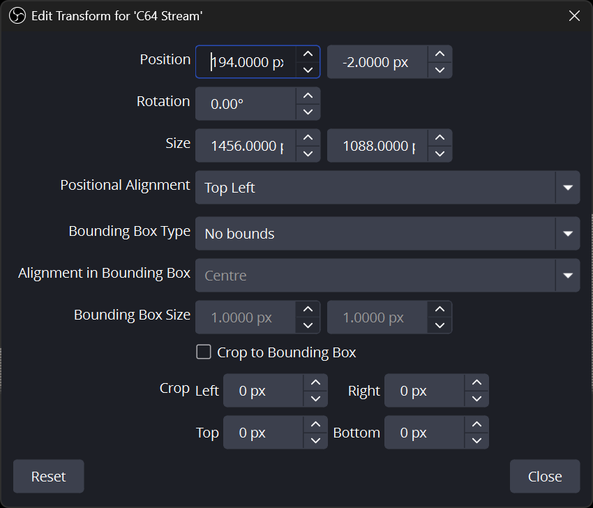
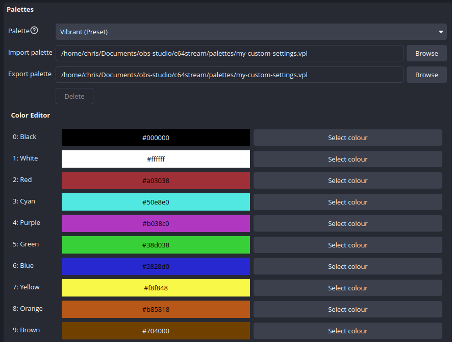

# C64 Stream

[](https://github.com/chrisgleissner/c64stream/actions/workflows/push.yaml)
[](https://github.com/chrisgleissner/c64stream/blob/main/tests/e2e/results/README.md)
[](https://www.gnu.org/licenses/old-licenses/gpl-2.0.en.html)
[](https://github.com/chrisgleissner/c64stream/releases)

Bridge your Commodore 64 Ultimate directly to [OBS Studio](https://obsproject.com/) for seamless streaming and recording over your network connection.


This plugin implements a native OBS source that receives video and audio streams from C64 Ultimate devices (Commodore 64 Ultimate or Ultimate 64) via the Ultimate's built-in data streaming capability.

The plugin connects directly to the Ultimate's network interface, eliminating the need for capture cards or composite video connections.


**Features:**

- Native OBS integration as a standard video source
- Real-time video streaming (PAL 384x272, NTSC 384x240)
- Synchronized audio streaming (16-bit stereo, ~48kHz)
- Network-based connection (UDP/TCP)
- Automatic VIC-II color space conversion
- **Authentic CRT effects** with configurable presets (scan lines, bloom, tint, pixel geometry)
- Built-in recording capabilities (BMP frames, AVI video, WAV audio)

### What You'll Need

- [OBS Studio 32.0.1](https://obsproject.com/download) or above
- [C64 Ultimate](https://www.commodore.net/) or [Ultimate 64](https://ultimate64.com/)
- The Ultimate device must be connected via its Ethernet port. The OBS computer may connect via Wi-Fi if both are on the same network, but using Ethernet all the way to OBS is recommended for the most stable connection and lowest delay. Wi-Fi on the Ultimate itself is [not supported](https://1541u-documentation.readthedocs.io/en/latest/howto/wifi.html#functionality-available-on-wifi).
- For complete and up-to-date hardware and software requirements, please refer to the [OBS Studio System Requirements](https://obsproject.com/kb/system-requirements).

---

## Installation 📦

> [!NOTE]
> The plugin has been **verified to work** on the systems listed below unless mentioned otherwise. Other environments have not been verified, but community contributions are always welcome.
>
> If you use a **firewall**, please make sure to open ports 11000 and 11001 for incoming UDP traffic from the Commodore 64 Ultimate.
>
> In the following instructions, replace `$VERSION` with the latest released version as shown on the [Releases](../../releases) page.

### Windows (Standard Installation)

Applies when OBS Studio is installed normally using the official Windows installer.

#### Windows (64-bit)

Tested on Windows 11.

1. **Close OBS Studio**
   Make sure OBS Studio is completely closed before continuing.
2. **Download the plugin**
   - Open the Releases page.
   - [Download](../../releases) the file named `c64stream-$VERSION-windows-x64.zip`.
   - Windows will usually save this file in your **Downloads** folder: `C:\Users\<YourName>\Downloads`
3. **Install the plugin**
   - Press **Start**, type **Windows PowerShell**, and open it.
   - Copy the command below and paste it into the PowerShell window.
   - Press **Enter**.
   ```powershell
   Expand-Archive -Path "$env:USERPROFILE\Downloads\c64stream-*-windows-*.zip" -DestinationPath "C:\ProgramData\obs-studio\plugins" -Force
   ```
   This extracts the plugin files into the correct OBS plugin folder.
4. **Allow the plugin through Windows Firewall**
   This step allows OBS to receive video and audio from your C64 Ultimate on ports 11000 (video) and 11001 (audio).
   - Copy the command below and paste it into the Powershell window.
   - Replace `192.168.1.64` with the IP address of your C64 Ultimate.
   - Press **Enter**.
   ```powershell
   New-NetFirewallRule -DisplayName "C64 Stream" -Direction Inbound -Protocol UDP -LocalPort 11000,11001 -RemoteAddress 192.168.1.64 -Action Allow
   ```
5. **Start OBS Studio**
   Open OBS Studio again. The plugin is now installed and ready to use.

#### Windows (ARM64 - Experimental)

> [!NOTE]
> Windows on ARM64 support is experimental and has not yet been fully tested.
> If you would like to help with testing, please reach out via the
> *Discussions* tab of this repository.

1. Download and unzip the ARM64 build of OBS Studio:
   https://github.com/obsproject/obs-studio/releases/download/32.0.4/OBS-Studio-32.0.4-Windows-arm64.zip
2. Ensure OBS Studio is closed.
3. [Download](../../releases) the plugin package `c64stream-$VERSION-windows-arm64.zip` to your `Downloads` folder.
4. Install the plugin exactly as described in **Windows (X64)** above.

### Windows (Portable Mode)

> [!IMPORTANT]
> This section applies **only** if OBS Studio is run in [portable mode](https://obsproject.com/kb/portable-mode), for example when `portable_mode.txt` exists in the root directory of OBS.
> If you installed OBS using the Windows installer, use the *Standard Installation* instructions above.

In portable mode, OBS does **not** use `C:\ProgramData\obs-studio\plugins`. Instead, plugins are loaded relative to the OBS installation directory.

1. Download the appropriate plugin ZIP (X64 or ARM64), as described above.
2. Open PowerShell **in the root directory of your portable OBS installation**.
4. Copy/paste the following command into the Powershell window and press **Enter**:
   ```powershell
   $zip=Get-ChildItem "$env:USERPROFILE\Downloads\c64stream-*-windows-*.zip" | Select-Object -First 1;
   Expand-Archive -Path $zip -DestinationPath "$env:TEMP\c64stream" -Force;
   New-Item -ItemType Directory -Force ".\obs-plugins\64bit" | Out-Null;
   Copy-Item "$env:TEMP\c64stream\c64stream\bin\64bit\*" ".\obs-plugins\64bit\" -Recurse -Force;
   New-Item -ItemType Directory -Force ".\data\obs-plugins\c64stream" | Out-Null;
   Copy-Item "$env:TEMP\c64stream\c64stream\data\*" ".\data\obs-plugins\c64stream\" -Recurse -Force
   ```
5. Start OBS Studio.

### macOS

Verified on macOS Sequoia 15.7 and Tahoe 26.0 with Apple Silicon M4 (Intel systems should also work):

1. Close OBS Studio
2. [Download](../../releases) the plugin package with name `c64stream-$VERSION-macos-universal.pkg`. It should now be in your `~/Downloads` directory.
3. Install the plugin to `$HOME/Library/Application Support/obs-studio/plugins/c64stream.plugin` by running the following on the command line:
> [!NOTE]
> These commands are required due to platform packaging constraints on macOS and will be simplified in a future release.
```zsh
cd ~/Downloads && \
xattr -dr com.apple.quarantine c64stream-*-macos-universal.pkg && \
sudo installer -pkg c64stream-*-macos-universal.pkg -target / && \
mkdir -p "$HOME/Library/Application Support/obs-studio/plugins" && \
cp -R "/Library/Application Support/obs-studio/plugins/c64stream.plugin" \
      "$HOME/Library/Application Support/obs-studio/plugins/" && \
chmod -R 755 "$HOME/Library/Application Support/obs-studio/plugins/c64stream.plugin"
```
4. Start OBS Studio

### Linux

Verified on Ubuntu 24.04, Debian 12, Fedora 40 and Arch Linux via automated [end-to-end tests](#end-to-end-tests-) on each build. Other distributions may work but are not officially supported.

#### Ubuntu / Debian (Recommended)

1. Close OBS Studio
2. Install OBS Studio (32.0.1+):
   - **Ubuntu 24.04:**
     ```bash
     sudo add-apt-repository --yes ppa:obsproject/obs-studio
     sudo apt update
     sudo apt install -y obs-studio
     ```
   - **Debian 12:**
     ```bash
     sudo apt update
     sudo apt install -y -t bookworm-backports obs-studio
     ```
3. [Download](../../releases) the plugin: `c64stream-$VERSION-x86_64-linux-gnu.deb`
4. Install the plugin:
   ```bash
   sudo dpkg -i ~/Downloads/c64stream-*-x86_64-linux-gnu.deb
   ```
5. Start OBS Studio

#### Other Distributions (Fedora, Arch, etc.)

For non-Debian-based distributions, you can extract the `.deb` package manually:

1. Close OBS Studio
2. Install OBS Studio using your distro's package manager
3. [Download](../../releases) the plugin: `c64stream-$VERSION-x86_64-linux-gnu.deb`
4. Extract and install manually:
   ```bash
   cd /tmp && ar x ~/Downloads/c64stream-*-x86_64-linux-gnu.deb && tar -xf data.tar.* && \
   sudo cp -r usr/share/obs/obs-plugins/c64stream /usr/share/obs/obs-plugins/ && \
   sudo cp -r usr/lib/obs-plugins/c64stream.so /usr/lib/obs-plugins/ && rm -rf data.tar.* control.tar.* debian-binary usr
   ```
5. Start OBS Studio

> [!NOTE]
> The plugin is built and [E2E tested](#end-to-end-tests-) on Ubuntu 24.04, Debian 12, Fedora 40, and Arch Linux.

**Further Details:**
See the [OBS Plugins Guide](https://obsproject.com/kb/plugins-guide).

---

## Configuration ⚙️

**Getting Your C64 on Stream:**

1. **Add Source:** In OBS, click the "+" icon in the Sources tab. A window of all sources appears. Select "C64 Source":

   

A new window opens. Keep the default settings and click "OK":

   

2. **Open Properties:** Select the "C64 Stream" source in your sources list, then click the "Properties" button to open the configuration dialog


3. **Configure IPs / Host Names:** Configure the host name or IP address of your C64 Ultimate and click "OK".

🎉 **DONE!** Enjoy streaming from your C64 Ultimate.

---

## Plugin Properties

This section provides detailed descriptions of all plugin properties, organized by category.

### General

#### Version
Displays release version, Git commit ID, and build timestamp.

#### Import/Export
- **Import settings:** Load all plugin settings from a previously exported `.ini` file. All current settings will be replaced.
- **Export settings:** Save all current plugin settings to an `.ini` file for backup, sharing, or attaching to bug reports.

### Network 📡

#### DNS Configuration
- **DNS Server IP:** IP address of DNS server for resolving device hostnames (default: `192.168.1.1` for most routers). The plugin uses multiple DNS resolution strategies for maximum compatibility. If router DNS fails, the plugin automatically tries standard DNS servers and FQDN resolution.

#### Device Configuration
- **C64U Host:** Hostname (default: `c64u`) or IP address of your C64 Ultimate device. This enables automatic streaming control from OBS. Set to `0.0.0.0` to skip control commands and accept streams from any device on your network.
- **C64U Password:** Only needed if C64U REST API was secured with a password. By default, no password is set, so this can be left empty.

#### OBS Server Configuration
- **OBS IP:** IP address where C64 Ultimate sends streams. Auto-detected by default.
- **Auto-detect OBS IP:** Automatically detect and use OBS server IP in streaming commands (recommended).

#### Port Configuration
- **Video Port:** UDP port for video stream from C64 Ultimate (default: `11000`).
- **Audio Port:** UDP port for audio stream from C64 Ultimate (default: `11001`).
- **Control Port:** TCP port used to send control commands to C64 Ultimate (default: `64`).

#### Buffer Configuration
- **Buffer Delay (millis):** Network buffer for incoming UDP packets (0–500 ms, default: `10` ms). Compensates for packet loss, reordering, and variable network latency. Larger buffers improve stability under high-latency or congested conditions but increase end-to-end delay.

### Recording 💾

The plugin includes built-in recording capabilities that work independently of OBS Studio's recording system, letting you save raw C64 Ultimate data streams directly to disk.

#### Output Folder
Directory where timestamped session folders will be created. Each session folder contains frames, video, audio, and timing files depending on which recording options are enabled.

#### Recording Options

The plugin offers five independent recording options that can be enabled separately or together:

**📊 Record Network and Streaming Events (CSV):**

- Records detailed timing data for network packets and OBS processing events
- Creates `obs.csv` (OBS processing timeline) and `network.csv` (UDP packet analysis)
- **Minimal Performance Impact:** Lightweight logging with microsecond precision
- **Use Cases:** Debug performance issues, analyze network jitter, validate frame timing
- Files: `session_YYYYMMDD_HHMMSS/obs.csv` and `session_YYYYMMDD_HHMMSS/network.csv`

**🖼️ Record Raw Frames (BMP):**

- Saves individual video frames as uncompressed BMP files in `frames/` subfolder
- Useful for debugging video issues or creating frame-by-frame analysis
- **Performance Impact:** Enabling this feature will reduce streaming performance due to disk I/O
- **Note:** CRT effects (scanlines, bloom, afterglow, etc.) are NOT applied to recorded frames. Palette changes ARE applied.
- Files saved as: `session_YYYYMMDD_HHMMSS/frames/frame_NNNNNN.bmp`

**🎬 Record Raw Video (AVI) and Audio (WAV):**

- Records uncompressed AVI video and separate WAV audio files
- Captures the raw data stream without OBS processing
- **High Disk Usage:** Uncompressed video files are very large (~50MB per minute)
- **Note:** CRT effects (scanlines, bloom, afterglow, etc.) are NOT applied to recorded video. Palette changes ARE applied.
- Video file: `session_YYYYMMDD_HHMMSS/video.avi` (24-bit BGR format)
- Audio file: `session_YYYYMMDD_HHMMSS/audio.wav` (16-bit stereo PCM)

**🔬 Record A/V Sync (CSV):**

- Creates `av-sync.csv` with detailed audio/video synchronization measurements
- Automatically triggers A/V sync test program on Ultimate 64 devices via REST API
- File: `session_YYYYMMDD_HHMMSS/av-sync.csv`

**🐛 Show Debug Messages in OBS Logs:**

- Enable detailed logging for debugging connection issues, DNS resolution, and network problems
- Messages appear in OBS Studio's log files with microsecond-precision timestamps

#### File Organization

All recording files are organized into timestamped session folders in the [recordings directory](#file-system-structure-):

```text
recordings/
├── session_20240929_143052/
│   ├── frames/           # BMP frame files (if "Raw Frames" enabled)
│   ├── network.csv       # Network timings (if "CSV Events" enabled)
│   ├── obs.csv           # OBS timings (if "CSV Events" enabled)
│   ├── av-sync.csv       # A/V sync measurements (if "Record A/V Sync" enabled)
│   ├── video.avi         # Uncompressed video (if "Raw Video" enabled)
│   └── audio.wav         # Uncompressed audio (if "Raw Video" enabled)
└── session_20240929_151234/
    └── ...
```

**Session Management:** A new session folder is automatically created each time recording is enabled. The output folder can be changed via the **Output Folder** property.

#### Usage Notes

- **Independent Operation:** All recording operates independently of OBS Studio's built-in recording
- **Mix and Match:** All recording options can be enabled simultaneously
- **Instant Recording:** Recording starts immediately when a checkbox is checked and continues until unchecked
- **⚠️ Persistent State:** Checkbox states persist across OBS restarts - uncheck to stop recording or risk filling disk space

#### Debug & Analysis CSV Logs 📊

When **"Record Network and Streaming Events (CSV)"** is enabled, the plugin generates detailed CSV logs for debugging OBS performance and analyzing C64 Ultimate network streams. These logs enable bit-accurate recording analysis and precise frame timing measurements.

**Generated CSV Files:**

- `obs.csv` - OBS processing timeline with microsecond precision
- `network.csv` - UDP packet reception log with network timing analysis

Examples from recent automated E2E runs against a 'mocked' (i.e. simulated) Ultimate 64:
- PAL: [`obs.csv`](tests/e2e/results/pal_default/obs.csv), [`network.csv`](tests/e2e/results/pal_default/network.csv)
- NTSC: [`obs.csv`](tests/e2e/results/ntsc_default/obs.csv), [`network.csv`](tests/e2e/results/ntsc_default/network.csv)

**Sample Recording:** See [docs/recordings/session_19700101_024625](docs/recordings/session_19700101_024625) for complete examples with all file types.

---

### Effects ✨

Recreate the authentic look and feel of classic CRT monitors and TVs with configurable visual effects that simulate the characteristics of vintage displays.


#### Presets
One-click configurations for different display types:

- **[Classic CRT](./docs/images/effects/classic-crt.png)** - Balanced scan lines and bloom for general retro appeal
- **[Amber Monitor](./docs/images/effects/amber-monitor.png)** - Warm amber tint reminiscent of early computer monitors
- **[Green Monitor](./docs/images/effects/green-monitor.png)** - Classic green phosphor terminal look with CRT afterglow effect. See the eye-catching tail of the pinball in this short [video](./docs/videos/effects/green-monitor.mp4).
- **[Sharp Pixels](./docs/images/effects/sharp-pixels.png)** - Crisp pixel doubling for arcade-style clarity
- **[Phosphor Glow](./docs/images/effects/phosphor-glow.png)** - Dramatic phosphor persistence trails with extended afterglow. The sample image here was taken from the automated E2E test which shows an afterglow for each moving diagonal line.
- **[Vintage TV](./docs/images/effects/vintage-tv.png)** - Softer look with prominent scan lines for old television feel
- **[Arcade Cabinet](./docs/images/effects/arcade-cabinet.png)** - High-contrast effects for authentic arcade experience

**Reset:** To reset to default values, simply select the "Default" preset. If you have changed individual effects whilst the "Default" preset was active, select any other preset first and then re-select the "Default" preset.

#### Individual Effect Controls

All effects can be customized individually:

**Scan Line Distance:**
Controls the dark gap between each pair of C64 pixel rows, simulating CRT raster lines.
- **None (0%):** No gaps, 4× scaling
- **Tight (25%):** 5× scaling, subtle gaps (4 bright + 1 dark pattern)
- **Normal (50%):** 3× scaling, classic CRT look (2 bright + 1 dark pattern)
- **Wide (100%):** 4× scaling, fills 1080p canvas (2 bright + 2 dark pattern)
- **Extra Wide (200%):** 3× scaling, prominent gaps (1 bright + 2 dark pattern)

See [Perfect Scan Lines](#perfect-scan-lines) section for pixel-perfect configuration details.

**Scan Line Strength:**
How dark the gaps between scan lines appear (0.0 = gaps invisible, 0.7 = recommended, 1.0 = gaps completely black).

**Pixel Width:**
Horizontal pixel size multiplier for authentic C64 pixel aspect ratios.

**Pixel Height:**
Vertical pixel size multiplier for authentic C64 pixel aspect ratios.

**Blur:**
Scaling blur strength (0.0 = precise scaling, 1.0 = very blurry with gaussian blur). GPU multi-sample effect.

**Bloom:**
Bloom effect strength (0.0 = off, 1.0 = maximum). GPU multi-pass effect that makes bright pixels bleed into darker areas.

**Afterglow Duration (ms):**
Phosphor persistence duration in milliseconds (0 = off, max = 250). Simulates CRT phosphor decay trails. High CPU impact: processes every pixel every frame. Disable for best performance.

**Afterglow Curve:**
How quickly the afterglow fades away:
- **Instant Fade (Linear):** Even, linear decay
- **Gradual Fade (Slow Start):** Slow initial fade, then faster
- **Rapid Fade (Fast Start):** Quick initial fade, then slower
- **Long Tail (Exponential):** Dramatic exponential decay with long persistence

**Tint Type:**
Type of monochrome tint to apply. GPU shader effect:
- **None (colour):** Full color output
- **Amber:** Warm amber tint for vintage monitor look
- **Green:** Classic green phosphor terminal appearance
- **Monochrome:** Grayscale conversion

**Tint Strength:**
Strength of tint effect (0.0 = off, 1.0 = full tint). GPU shader effect.

#### Perfect Scan Lines

> [!TIP]
> This section is for users seeking perfect display quality. The techniques described here are mostly required when using effects that include scan lines and/or pixel scaling.

The **Scan Line Distance** setting controls the gap between each pair of adjacent C64 pixel rows, simulating the dark lines between phosphor rows on a CRT monitor. Each mode uses a specific integer scaling factor to ensure perfectly uniform scanlines with zero variance.

To achieve **pixel-perfect scanlines** without any scaling-induced artifacts such as slight blurriness, the source must be scaled to exact dimensions in OBS. Because OBS does not lock aspect ratio for numeric transforms, **both height and width must be set explicitly**.

First, right-click on the C64 Stream source → **Scale Filtering → Point**. This is a one-time setting that tells OBS to use nearest-neighbor scaling.

Then, right-click the C64 Stream source in OBS → **Transform** → **Edit Transform**, then enter the exact values from the table below, assuming you are using a 1920 x 1080 ("Full HD") screen. Adjust the width/height settings as needed if you use a different screen:

| Mode       | Distance | Scale | Pattern           | Output Width | Output Height | Canvas Fit                |
| ---------- | -------- | ----- | ----------------- | ------------ | ------------- | ------------------------- |
| None       | 0%       | 4×    | No gaps           | 1456 px      | 1088 px       | Full (8 px vertical crop) |
| Tight      | 25%      | 5×    | 4 bright + 1 dark | 1820 px      | 1360 px       | Vertical overflow         |
| Normal     | 50%      | 3×    | 2 bright + 1 dark | 1092 px      | 816 px        | Letterboxed               |
| Wide       | 100%     | 4×    | 2 bright + 2 dark | 1456 px      | 1088 px       | Full (8 px vertical crop) |
| Extra Wide | 200%     | 3×    | 1 bright + 2 dark | 1092 px      | 816 px        | Letterboxed               |

The following screenshot assumes you select "Wide" scan line mode, again assuming you use a 1920 x 1080 screen:



---

### Color Palettes 🎨

Customize the VIC-II color palette to match different C64 hardware variants, personal preferences, or artistic styles. The palette system supports both shipped (preset) and user-defined (custom) palettes.



#### Palette Selection
Select a color palette for the C64 video output. Shipped palettes show '(Preset)' suffix. Custom palettes are saved automatically when closing the properties dialog.

**Shipped Palettes:** The plugin includes the following preset palettes:

- **Default** - Standard VIC-II colors matching original C64 hardware
- **Cool** - Blue/cyan color temperature shift
- **Inverted** - RGB color inversion (negative image)
- **Monochrome** - Grayscale conversion
- **Muted** - Reduced saturation with pastel-like tones
- **Neon Blast** - Maximum saturation for high-intensity colors
- **Night** - Red-shifted colors for comfortable late night viewing
- **Vibrant** - Increased color saturation for enhanced visual impact
- **Warm** - Amber/orange color temperature shift

#### Palette Controls

**Import palette:**
Select a `.vpl` palette file to import and apply it. Imported palettes become available in the palette dropdown.

**Export palette:**
Choose a destination path to save the current palette as a `.vpl` file. Exports the currently active palette with any color adjustments you've made.

**Delete:**
Removes the currently selected custom palette. Shipped preset palettes cannot be deleted.

**Color Editor:**
Expand to access 16 color pickers (0-15) for editing individual VIC-II colors. Changes apply immediately to the video output.

#### Auto-Save Behavior

- Custom palettes are automatically saved when you edit them in the color editor
- **Preset modifications:** If you edit a shipped preset palette, a custom copy is automatically created with the same name (the original preset remains unchanged)
- The settings automatically update to use the custom copy, so your changes persist across OBS restarts
- No manual save action is required for palette edits

**VPL Palette Format:**

Palettes use the standard [VICE VPL](https://1541u-documentation.readthedocs.io/en/latest/howto/palette.html) format:

```
# VICE Palette file
#
# Syntax:
# Red Green Blue
#
# TYPE:VICII
# NAME:My Palette
# DESC:Optional description shown as tooltip

00 00 00
FF FF FF
8D 2F 34
...
```

- **NAME:** (optional) Display name shown in the dropdown
- **DESC:** (optional) Description shown as tooltip when hovering over the palette
- First 16 non-comment lines are RGB hex values in `RR GG BB` format (space-separated)
- Files must have exactly 16 color entries

**Storage:** Custom palettes are saved to the [palettes directory](#file-system-structure-). Shipped palettes are bundled with the plugin as read-only defaults.

### Import/Export Configuration

Import and export your complete plugin settings:

- **Import settings:** Click to load settings from a previously exported `.ini` file. All current settings will be replaced
- **Export settings:** Click to save all current settings to a `.ini` file. Use this to backup configurations, share setups, or attach to bug reports

Exported configurations are saved to the [settings directory](#file-system-structure-).

---

### File System Structure 📁

The plugin uses three distinct filesystem locations:

### 1. Plugin

This folder contains OBS plugin binary and loader files.

OBS Studio searches for plugins in multiple locations. The installation location depends on how you installed the plugin:

| Platform    | Package Install (System-Wide)                                       | User Install (Local Development)                                     |
| ----------- | ------------------------------------------------------------------- | -------------------------------------------------------------------- |
| **Windows** | `C:\ProgramData\obs-studio\plugins\c64stream\`                      | N/A (uses system path)                                               |
| **macOS**   | `/Library/Application Support/obs-studio/plugins/c64stream.plugin/` | `~/Library/Application Support/obs-studio/plugins/c64stream.plugin/` |
| **Linux**   | `/usr/lib/obs-plugins/c64stream.so`                                 | `~/.config/obs-studio/plugins/c64stream/bin/64bit/c64stream.so`      |

### 2. Shipped Data

This folder contains read-only defaults bundled with the plugin.

OBS searches in this order:
1. User plugin directory (if it exists)
2. System plugin directory

The data directory contains:
- Effect presets (`effect_presets.ini`)
- Palette presets (`palettes/*.vpl`)
- Default network settings (`properties.ini`)
- Localization files (`locale/*.ini`)

| Platform    | Package Install (System-Wide)                                                          | User Install (Local Development)                                                        |
| ----------- | -------------------------------------------------------------------------------------- | --------------------------------------------------------------------------------------- |
| **Windows** | `C:\ProgramData\obs-studio\plugins\c64stream\data\`                                    | N/A (uses system path)                                                                  |
| **macOS**   | `/Library/Application Support/obs-studio/plugins/c64stream.plugin/Contents/Resources/` | `~/Library/Application Support/obs-studio/plugins/c64stream.plugin/Contents/Resources/` |
| **Linux**   | `/usr/share/obs/obs-plugins/c64stream/`                                                | `~/.config/obs-studio/plugins/c64stream/data/`                                          |

> [!NOTE]
> **Package Install** is for end users who install via `.deb` packages, `.pkg` installers, or `.zip` extraction to system directories.
>
> **User Install** is for local development using VSCode build tasks or `local-build.sh --install`. The E2E tests also use these user install paths.

### 3. User Data

This folder contains your custom content.

For easy access, simple backups, and visibility, it is always stored in `<Documents>/obs-studio/c64stream/`, regardless of how you installed the plugin:

```
<Documents>/obs-studio/c64stream/
├── settings/        # Exported configuration files (.ini)
├── palettes/        # Custom palette files (.vpl)
└── recordings/      # Recording session folders
```

**Sample Locations:**

- **Windows:** `%USERPROFILE%\Documents\obs-studio\c64stream\` (e.g., `C:\Users\YourName\Documents\obs-studio\c64stream\`)
- **macOS:** `~/Documents/obs-studio/c64stream/` (e.g., `/Users/yourname/Documents/obs-studio/c64stream/`)
- **Linux:** `~/Documents/obs-studio/c64stream/` (e.g., `/home/yourname/Documents/obs-studio/c64stream/`)

---

## End-to-end tests 🧪

This project is continuously validated with automated end-to-end (E2E) tests that simulate a C64 Ultimate, drive OBS, and verify the full pipeline from UDP packets to recorded video/audio.

Each test scenario produces a short, self-contained report with packet stats, frame progression information, A/V synch details, as well as the recorded video and a sample frame from that video. Here's an example from the `ntsc_default` scenario with no effects applied:


Here's another one from the `ntsc_green_monitor` scenario. You see how the frame progress counter on the bottom left and the central diagonal moving lines both left behind afterglow trails:


Many recent reports (without videos) are checked into this GitHub repository:
- [Main E2E results](tests/e2e/results/README.md)
- [PAL results](tests/e2e/results/pal_default/README.md)
- [NTSC results](tests/e2e/results/ntsc_default/README.md)

You can download all [Latest E2E results](https://github.com/chrisgleissner/c64stream/actions/workflows/build-project.yaml?query=branch%3Amain+is%3Asuccess) (with videos) as GitHub CI build artifact ZIP.

For more information, see [`doc/testing/e2e.md`](doc/testing/e2e.md).

---

## Network Details

### Hostname vs IP Address 🌐

The plugin supports both **hostnames** and **IP addresses** for the C64 Ultimate Host field with enhanced DNS resolution that works reliably across all platforms:

**Using Hostnames (Recommended):**

- **Default:** `c64u` - The plugin will try to resolve this hostname to an IP address
- **Custom:** `my-c64u` or `retro-pc` - Use any hostname your C64 Ultimate device is known by
- **FQDN Support:** The plugin automatically tries both `hostname` and `hostname.` (with trailing dot) for proper DNS resolution

**Using IP Addresses:**

- **Direct IP:** `192.168.1.64` - Standard IPv4 address format
- **Fallback:** `0.0.0.0` - Accept streams from any C64 Ultimate (no automatic control)

### DNS Resolution

The plugin offers hostname resolution that works reliably on Linux and macOS where system DNS may fail for local device names:

1. **System DNS First:** Tries standard system DNS resolution (works for internet hostnames and properly configured networks)
2. **FQDN Resolution:** Attempts resolution with trailing dot (e.g., `c64u.` for some network configurations)
3. **Direct DNS Queries:** On Linux/macOS, bypasses systemd-resolved by querying DNS servers directly:
   - Uses configured **DNS Server IP** (default: `192.168.1.1`)
   - Falls back to common router IPs: `192.168.0.1`, `10.0.0.1`, `172.16.0.1`

### C64 Ultimate Setup 🎛️

**Automatic Configuration (Recommended):** The OBS plugin automatically controls streaming on the Ultimate device. When you configure the Ultimate's hostname or IP address in the OBS plugin settings, the plugin tells the Ultimate device where to send streams and sends start commands automatically. Thus, no manual streaming adjustments are needed on the Ultimate device.

**Manual Configuration:**

1. Press F2 to access the Ultimate's configuration menu
2. Navigate to "Data Streams" section
3. Set "Stream VIC to" field: `your-obs-ip:11000` (e.g., `192.168.1.100:11000`)
4. Set "Stream Audio to" field: `your-obs-ip:11001` (e.g., `192.168.1.100:11001`)
5. Save configuration changes
6. Manually start streaming from the Ultimate device

For comprehensive configuration details, refer to the [official C64 Ultimate documentation](https://1541u-documentation.readthedocs.io/en/latest/data_streams.html).

---

## Technical Details 🔧

**Specifications:**

- Implements the [C64 Ultimate Data Streams specification](./doc/c64u/c64u-stream-spec.md) for receiving video and audio streams from Ultimate devices over UDP and TCP.
- Implements the [C64 Ultimate REST API specification](./doc/c64u/c64u-rest-api.md) for control and automation use cases, including automated A/V synchronization tests. An [OpenAPI](./doc/c64u/c64u-openapi.yaml) description is provided.

**Supported Platforms:**

- **Windows 10/11 (x64)** – verified on Windows 11. Experimental support for ARM64.
- **Linux (X11 or Wayland)** – verified on Kubuntu 24.04.
- **macOS 11+ (Intel and Apple Silicon)** – verified on macOS Sequoia 15.7 and Tahoe 26.0.

**Software Requirements:**

- [OBS Studio 32.0.1](https://obsproject.com/download) or above

**Hardware Requirements:**

One of:

- [Commodore 64 Ultimate](https://www.commodore.net/)
- [Ultimate 64 Elite](https://ultimate64.com/Ultimate-64-Elite)
- [Ultimate 64 Elite MK2](https://ultimate64.com/Ultimate-64-Elite-MK2)

**Network Requirements:**

- UDP/TCP connectivity to Ultimate device
- Bandwidth: ~22 Mbps total (21.7 Mbps video + 1.4 Mbps audio, uncompressed streams)
- Built-in UDP jitter compensation via configurable frame buffering

**Video Formats:**

- PAL: 384x272 @ 50Hz
- NTSC: 384x240 @ 60Hz
- Color space: VIC-II palette with automatic RGB conversion
- **CRT Effects:** GPU-accelerated shader-based post-processing with configurable presets

**Audio Format:**

- 16-bit stereo PCM
- Sample rate: ~48kHz (device dependent)
- Low-latency streaming

**Recording Formats:**

- BMP frames: 24-bit uncompressed bitmap images
- AVI video: Uncompressed BGR24 format with precise timing
- WAV audio: 16-bit stereo PCM, sample rate matches C64 Ultimate output
- Session organization: Automatic timestamped folder creation

---

## Troubleshooting 🔍

### Plugin missing from OBS?

- Confirm OBS Studio version 32.0.1+
- Verify plugin installed to correct directory
- Check OBS logs for plugin loading errors
- Restart OBS completely after installation

### No video stream? 📺

- Verify that both IP addresses are correct
- Check Ultimate device has data streaming enabled
- Confirm firewall allows UDP traffic on configured ports

### Lost / Repeated Frames? 📺

- May occur when OBS cannot keep up, typically during high CPU or GPU load.
- Reduce or disable filters. The afterglow effect is particularly CPU-intensive. Test the **Default** preset with all filters disabled.
- Lower the output resolution to 1280×720.
- Disable OBS recording and any plugin-side recording.

### Effects not working? 📺

- **No visual change:** Ensure source is active and receiving video data
- **Performance drops:** Complex effects (high bloom/blur) may impact frame rate on older hardware
- **Preset not applying:** Try manually adjusting individual effect settings

### Audio sync issues? 🔊

- Check audio port configuration (default 11001)
- Verify OBS audio monitoring settings
- **Buffer delay changes:** If you first increase the network buffer delay (e.g., to 500ms) and then decrease it (e.g., to 200ms), audio may become delayed relative to video. **Workaround:** Remove and re-add the C64 Stream source, or restart OBS Studio to reset the audio timing reference. For best results, set your desired buffer delay when initially configuring the source.

### Connection acting up? 📡

- Network latency should be <100ms for optimal performance
- Check for network congestion or WiFi interference
- Consider wired Ethernet connection for stability

### Hostname not resolving? 🌐

If the plugin can't resolve your C64 Ultimate hostname (e.g., `c64u`), try these solutions:

*Quick Fix:*

1. **Use IP Address:** Instead of `c64u`, enter the device's IP address directly (e.g., `192.168.1.64`)
2. **Check DNS Server IP:** Verify the DNS Server IP setting matches your router's IP address
   - Common router IPs: `192.168.1.1`, `192.168.0.1`, `10.0.0.1`
   - Find your router IP: Run `ip route | grep default` (Linux) or `ipconfig` (Windows)

*Advanced Troubleshooting:*

1. **Test DNS Resolution Manually:**

   ```bash
   # Linux/macOS - Test if router can resolve the hostname
   dig @192.168.1.1 c64u

   # Windows - Test DNS resolution
   nslookup c64u 192.168.1.1
   ```

2. **Platform-Specific Issues:**
   - **Linux:** systemd-resolved may not forward local hostnames to router DNS
   - **macOS:** Similar DNS forwarding issues with local device names
   - **Windows:** System DNS typically works without issues

3. **Configure Custom DNS Server:**
   - Set **DNS Server IP** to your router's IP address (usually `192.168.1.1`)
   - Try alternative common router IPs: `192.168.0.1`, `10.0.0.1`
   - Check your router's DHCP settings for the correct DNS server IP

4. **Enable Debug Logging:**
   - Check "Debug Logging" in plugin properties
   - Look for DNS resolution messages in OBS logs
   - Messages show which DNS resolution method succeeded

*Alternative Solutions:*

- **Static DNS Entry:** Add `192.168.1.64 c64u` to your system's hosts file
- **mDNS/Bonjour:** Use `.local` suffix (e.g., `c64u.local`) if your network supports it
- **Router Configuration:** Ensure your router's DNS server has the device hostname registered

### Recording troubles? 💾

- **Files not created:** Verify output folder path exists and is writable
- **Performance drops with BMP saving:** Frame saving impacts performance significantly; disable if not needed
- **Large disk usage:** AVI recording creates uncompressed files (~50MB/minute); monitor disk space
- **Recording stops unexpectedly:** Check disk space and folder permissions

## For Developers 🔧

See the [Developer Documentation](doc/developer.md) for build instructions, testing procedures, and contribution guidelines.

## License

This project is licensed under the GPL v2 License - see the [LICENSE](LICENSE) file for details.
