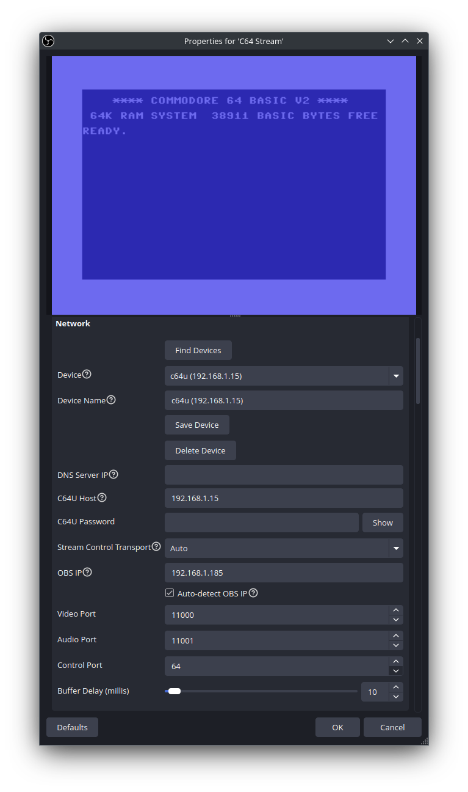

# C64 Stream

[](https://github.com/chrisgleissner/c64stream/actions/workflows/push.yaml)
[](https://github.com/chrisgleissner/c64stream/blob/main/tests/e2e/results/README.md)
[](https://www.gnu.org/licenses/old-licenses/gpl-2.0.en.html)
[](https://github.com/chrisgleissner/c64stream/releases)

Bridge your Commodore 64 Ultimate directly to [OBS Studio](https://obsproject.com/) for seamless streaming and recording over your network connection.


This plugin implements a native OBS source that receives video and audio streams from C64 Ultimate devices (Commodore 64 Ultimate or Ultimate 64) via the Ultimate's built-in data streaming capability.

The plugin connects directly to the Ultimate's network interface, eliminating the need for capture cards or composite video connections.


**Features:**

- Native OBS integration as a standard video source
- Real-time video streaming (PAL 384x272, NTSC 384x240)
- Synchronized audio streaming (16-bit stereo, ~48kHz)
- Network-based connection (UDP/TCP)
- Automatic VIC-II color space conversion
- **Authentic CRT effects** with configurable presets (scan lines, bloom, tint, pixel geometry)
- Built-in recording capabilities (BMP frames, AVI video, WAV audio)

## Configuration

The plugin uses a `properties.ini` file to provide default settings for connecting to your C64 Ultimate device. This file is automatically installed with the plugin and contains the standard C64 Ultimate network settings:

- **Hostname**: `c64u` (the default C64 Ultimate hostname)
- **Control Port**: `64` (the standard C64 Ultimate control port)
- **DNS Server**: `192.168.1.1` (common router DNS)
- **Video/Audio Ports**: `11000`/`11001` (C64 Ultimate streaming ports)

These settings work out-of-the-box with most C64 Ultimate setups. You can override any of these settings directly in the OBS source properties if your setup differs.

## Quick Start

### What You'll Need

- [OBS Studio 32.0.1](https://obsproject.com/download) or above
- [C64 Ultimate](https://www.commodore.net/) or [Ultimate 64](https://ultimate64.com/)
- Ethernet connection between your OBS computer and Ultimate device. Wifi is [not supported](https://1541u-documentation.readthedocs.io/en/latest/howto/wifi.html#functionality-available-on-wifi).
- For complete and up-to-date hardware and software requirements, please refer to the [OBS Studio System Requirements](https://obsproject.com/kb/system-requirements).

> [!NOTE]
> The plugin has been **verified to work** on the systems listed below. Other environments have not been verified and are not supported explicitly, but community contributions are always welcome.

### Easy Installation 📦

In the following instructions, replace `$VERSION` with the latest released version as shown on the [Releases](../../releases) page.

#### Windows

Verified on Windows 11:

1. Close OBS Studio
2. [Download](../../releases) the plugin package with name `c64stream-$VERSION-windows-x64.zip`. It should now be in your `Downloads` folder (typically `C:\Users\<YourName>\Downloads`).
3. Install the plugin to `C:\ProgramData\obs-studio\plugins` by either extracting the ZIP with a tool of your choice or by running the following in Powershell:
```powershell
Expand-Archive -Path "$env:USERPROFILE\Downloads\c64stream-*-windows-x64.zip" -DestinationPath "C:\ProgramData\obs-studio\plugins" -Force
```
4. Start OBS Studio

If you are using Windows Firewall and block all incoming connections, you may have to setup an exclusion to allow for incoming UDP connections to port 11000 (Video) and 11001 (Audio) from the C64 Ultimate a follows. Be sure to adjust the `RemoteAddress` from `192.168.1.64` to the IP of your C64 Ultimate before you run this in Powershell:
```powershell
New-NetFirewallRule -DisplayName "C64 Stream" -Direction Inbound -Protocol UDP -LocalPort 11000,11001 -RemoteAddress 192.168.1.64 -Action Allow
```

#### macOS

Verified on macOS Sequoia 15.7 and Tahoe 26.0 with Apple Silicon M4 (Intel systems should also work):

1. Close OBS Studio
2. [Download](../../releases) the plugin package with name `c64stream-$VERSION-macos-universal.pkg`. It should now be in your `~/Downloads` directory.
3. Install the plugin to `$HOME/Library/Application Support/obs-studio/plugins/c64stream.plugin` by running the following on the command line:
> [!NOTE]
> These commands are required due to platform packaging constraints on macOS and will be simplified in a future release.
```zsh
cd ~/Downloads && \
xattr -dr com.apple.quarantine c64stream-*-macos-universal.pkg && \
sudo installer -pkg c64stream-*-macos-universal.pkg -target / && \
mkdir -p "$HOME/Library/Application Support/obs-studio/plugins" && \
cp -R "/Library/Application Support/obs-studio/plugins/c64stream.plugin" \
      "$HOME/Library/Application Support/obs-studio/plugins/" && \
chmod -R 755 "$HOME/Library/Application Support/obs-studio/plugins/c64stream.plugin"
```
4. Start OBS Studio

#### Linux

Verified on Ubuntu 24.04 and Debian 12. Other distributions may work but are not officially supported.

##### Ubuntu / Debian (Recommended)

1. Close OBS Studio
2. Install OBS Studio (32.0.1+):
   - **Ubuntu 24.04:**
     ```bash
     sudo add-apt-repository --yes ppa:obsproject/obs-studio
     sudo apt update
     sudo apt install -y obs-studio
     ```
   - **Debian 12:**
     ```bash
     sudo apt update
     sudo apt install -y -t bookworm-backports obs-studio
     ```
3. [Download](../../releases) the plugin: `c64stream-$VERSION-x86_64-linux-gnu.deb`
4. Install the plugin:
   ```bash
   sudo dpkg -i ~/Downloads/c64stream-*-x86_64-linux-gnu.deb
   ```
5. Start OBS Studio

##### Other Distributions (Fedora, Arch, etc.)

For non-Debian-based distributions, you can extract the `.deb` package manually:

1. Close OBS Studio
2. Install OBS Studio using your distro's package manager
3. [Download](../../releases) the plugin: `c64stream-$VERSION-x86_64-linux-gnu.deb`
4. Extract and install manually:
   ```bash
   cd /tmp && ar x ~/Downloads/c64stream-*-x86_64-linux-gnu.deb && tar -xf data.tar.* && \
   sudo cp -r usr/share/obs/obs-plugins/c64stream /usr/share/obs/obs-plugins/ && \
   sudo cp -r usr/lib/obs-plugins/c64stream.so /usr/lib/obs-plugins/ && rm -rf data.tar.* control.tar.* debian-binary usr
   ```
5. Start OBS Studio

> [!NOTE]
> The plugin is built and [E2E tested](#end-to-end-tests-) on Ubuntu 24.04, Debian 12, Fedora 40, and Arch Linux.

**Further Details:**
See the [OBS Plugins Guide](https://obsproject.com/kb/plugins-guide).

### Configuration ⚙️

**Getting Your C64 on Stream:**

1. **Add Source:** In OBS, click the "+" icon in the Sources tab. A window of all sources appears. Select "C64 Source":

   

A new window opens. Keep the default settings and click "OK":

   

2. **Open Properties:** Select the "C64 Stream" source in your sources list, then click the "Properties" button to open the configuration dialog



3. **Configure IPs / Host Names:** Configure the host name or IP address of your C64 Ultimate and click "OK".

🎉 **DONE!** Enjoy streaming from your C64 Ultimate.

## Plugin Setup

### General

- **Version:** Information about release version, Git ID, and build time
- **Debug Logging:** Check this to see debug logs

### Import/Export Configuration

Save and restore your complete plugin settings:

- **Export:** Click to save all current settings to a `.ini` file. Use this to backup configurations, share setups, or attach to bug reports
- **Import:** Click to load settings from a previously exported `.ini` file. All current settings will be replaced

### Network

- **DNS Resolution Details:**

- **Default:** `192.168.1.1` (most common home router DNS server)
- **Fallback:** If router DNS fails, the plugin tries standard DNS servers
- **Enhanced Resolution:** The plugin uses multiple resolution strategies for maximum compatibility
- **C64 Ultimate Host:** Enter your Ultimate device's hostname (default: `c64u`) or IP address to enable automatic streaming control from OBS (recommended for convenience), or set to `0.0.0.0` to accept streams from any C64 Ultimate on your network (requires manual control from the device)
- **OBS Server IP:** IP address where C64 Ultimate sends streams (auto-detected by default)
- **Auto-detect OBS IP:** Automatically detect and use OBS server IP in streaming commands (recommended)
- **Configure Ports** Use the default ports (video: 11000, audio: 11001) unless network conflicts require different values
- **Buffer Delay:** Sets the network buffer for incoming UDP packets arriving from the C64 Ultimate (0–500 ms, default 10 ms). The buffer size is expressed in milliseconds to represent the time-based delay it introduces, compensating for packet loss, reordering, and variable network latency. Larger buffers improve stability under high-latency or congested conditions but increase end-to-end delay.

### CRT Effects 📺

Recreate the authentic look and feel of classic CRT monitors and TVs with configurable visual effects that simulate the characteristics of vintage displays.


**Presets:** One-click configurations for different display types

- **[Classic CRT](./docs/images/effects/classic-crt.png)** - Balanced scan lines and bloom for general retro appeal
- **[Amber Monitor](./docs/images/effects/amber-monitor.png)** - Warm amber tint reminiscent of early computer monitors
- **[Green Monitor](./docs/images/effects/green-monitor.png)** - Classic green phosphor terminal look
- **[Sharp Pixels](./docs/images/effects/sharp-pixels.png)** - Crisp pixel doubling for arcade-style clarity
- **[Phosphor Glow](./tests/e2e/results/ntsc_phosphor_glow/c64_recording_still.png)** - Dramatic phosphor persistence trails with extended afterglow
- **[Vintage TV](./docs/images/effects/vintage-tv.png)** - Softer look with prominent scan lines for old television feel
- **[Arcade Cabinet](./docs/images/effects/arcade-cabinet.png)** - High-contrast effects for authentic arcade experience

**Customizable Effects:**

- **Scan Lines:** CRT raster line simulation with precise control (see table below)
- **Bloom:** Glow effect that makes bright pixels bleed into darker areas
- **Pixel Geometry:** Independent width/height scaling for authentic pixel aspect ratios
- **Blur Control:** Fine-tune between crisp pixels and soft scaling
- **Afterglow:** CRT phosphor persistence effect (0-250ms) with configurable decay curves
- **Screen Tint:** Amber, green, or monochrome overlays for period-accurate monitor simulation

**Usage:** Access via the **Effects** group in plugin properties. Select a preset for instant results, or customize individual settings to create your perfect retro display aesthetic.

**Pixel-Perfect Display:** For crisp pixels and perfectly even scanlines, right-click on the C64 Stream source → **Scale Filtering → Point**. This is a one-time setting that tells OBS to use nearest-neighbor scaling. The plugin automatically sizes the source to the correct integer multiple based on your scanline settings.

#### Scan Line Settings

The **Scan Line Distance** setting controls the gap between each pair of adjacent C64 pixel rows, simulating the dark lines between phosphor rows on a CRT monitor. Each mode uses a specific integer scaling factor to ensure perfectly uniform scanlines with zero variance:

| Mode | Distance | Scale | Pattern | Output Height | Canvas Fit |
|------|----------|-------|---------|---------------|------------|
| None | 0% | 4× | No gaps | 1088px | Full (8px crop) |
| Tight | 25% | 5× | 4 bright + 1 dark | 1360px | Overflow |
| Normal | 50% | 3× | 2 bright + 1 dark | 816px | Letterboxed |
| Wide | 100% | 4× | 2 bright + 2 dark | 1088px | Full (8px crop) |
| Extra Wide | 200% | 3× | 1 bright + 2 dark | 816px | Letterboxed |

**Recommended:** Use **Wide (100%)** for full 1080p canvas coverage with minimal border cropping, or **Normal (50%)** for a classic CRT look with black bars.

The **Scan Line Strength** slider (0.0–1.0) controls how dark the gaps appear. At 0.0, gaps are invisible; at 1.0, they are completely black.

**Reset:** To reset to default values, simply select the "Default" preset. If you have changed individual effects whilst the "Default" preset was active, select any other preset first and then re-select the "Default" preset.

#### Effect Performance Impact

Each CRT effect has a different impact on system performance. The CPU-based effects process every pixel every frame, while GPU-based effects leverage shader hardware for minimal CPU overhead.

| Effect | Processing | Impact | Notes |
|--------|------------|--------|-------|
| **Scan Lines** | GPU Shader | Low | Per-pixel shader calculation |
| **Bloom** | GPU Shader | Medium | Multi-pass blur + blend |
| **Blur** | GPU Shader | Medium | Gaussian sampling |
| **Pixel Geometry** | GPU Shader | Low | Simple UV transform |
| **Screen Tint** | GPU Shader | Low | Color matrix multiply |
| **Afterglow** | CPU | **High** | Per-pixel persistence (~92k pixels/frame) |

**Performance Recommendations:**

- **For best CPU performance:** Use presets without afterglow (Sharp Pixels, Classic CRT, Arcade Cabinet)
- **For authentic phosphor glow:** Enable afterglow only when needed (Green/Amber Monitor, Phosphor Glow, Vintage TV)
- **Afterglow disabled = zero CPU overhead:** When `Afterglow Duration (ms) = 0`, the CPU loop is bypassed entirely

**Why Afterglow Uses CPU:**

OBS recordings capture async video frames *before* GPU shaders run. To ensure afterglow appears correctly in recordings (not just the preview), the effect must be computed on the CPU before the frame is submitted to OBS. GPU-only afterglow would be invisible in recordings.

### Recording Features 📹

The plugin includes built-in recording capabilities that work independently of OBS Studio's recording system, letting you save raw C64 Ultimate data streams directly to disk.

### Recording Options

The plugin offers three independent recording options that can be enabled separately or together:

**📊 Network and Streaming Events (CSV):**

- Records detailed timing data for network packets and OBS processing events
- Creates `obs.csv` (OBS processing timeline) and `network.csv` (UDP packet analysis)
- **Minimal Performance Impact:** Lightweight logging with microsecond precision
- **Use Cases:** Debug performance issues, analyze network jitter, validate frame timing
- Files: `session_YYYYMMDD_HHMMSS/obs.csv` and `session_YYYYMMDD_HHMMSS/network.csv`

**🖼️ Raw Frames (BMP):**

- Saves individual video frames as uncompressed BMP files
- Useful for debugging video issues or creating frame-by-frame analysis
- **Performance Impact:** Enabling this feature will reduce streaming performance due to disk I/O
- Files saved as: `session_YYYYMMDD_HHMMSS/frames/frame_NNNNNN.bmp`

**🎬 Raw Video and Audio (AVI + WAV):**

- Records uncompressed AVI video and separate WAV audio files
- Captures the raw data stream without OBS processing
- **High Disk Usage:** Uncompressed video files are very large (~50MB per minute)
- Video file: `session_YYYYMMDD_HHMMSS/video.avi` (24-bit BGR format)
- Audio file: `session_YYYYMMDD_HHMMSS/audio.wav` (16-bit stereo PCM)

#### File Organization

All recording files are organized into session folders with timestamps:

```text
~/Documents/obs-studio/c64stream/recordings/
├── session_20240929_143052/
│   ├── frames/           # BMP frame files (if "Raw Frames" enabled)
│   ├── network.csv       # Network timings (if "CSV Events" enabled)
│   ├── obs.csv           # OBS timings (if "CSV Events" enabled)
│   ├── video.avi         # Uncompressed video (if "Raw Video" enabled)
│   └── audio.wav         # Uncompressed audio (if "Raw Video" enabled)
└── session_20240929_151234/
    └── ...
```

#### Recording Configuration

- **Output Folder Defaults:**
  - **Windows:** `%USERPROFILE%\Documents\obs-studio\c64stream\recordings`
  - **macOS:** `~/Documents/obs-studio/c64stream/recordings`
  - **Linux:** `~/Documents/obs-studio/c64stream/recordings`
- **Automatic Session Management:** New session folder created each time recording is enabled
- **Cross-Platform Compatibility:** Works on Windows, macOS, and Linux

#### Usage Notes

- **Independent Operation:** All recording operates independently of OBS Studio's built-in recording
- **Mix and Match:** All three recording options can be enabled simultaneously
- **Instant Recording:** Recording starts immediately when a checkbox is checked and continues until unchecked
- **⚠️ Persistent State:** Checkbox states persist across OBS restarts - uncheck to stop recording or risk filling disk space
- **Real-Time Writing:** Files are written in real-time as data is received from the C64 Ultimate
- **Auto-Organization:** Session folders are created automatically with proper directory structure
- **Recommended:** Enable **CSV recording** for debugging and **disable** BMP/AVI recording for normal streaming

#### Debug & Analysis CSV Logs 📊

When **"Network and Streaming Events (CSV)"** recording is enabled, the plugin generates detailed CSV logs for debugging OBS performance and analyzing C64 Ultimate network streams. These logs enable bit-accurate recording analysis and precise frame timing measurements.

**Generated CSV Files:**

- `obs.csv` - OBS processing timeline with microsecond precision
- `network.csv` - UDP packet reception log with network timing analysis

Examples from recent automated E2E runs against a 'mocked' (i.e. simulated) Ultimate 64:
- PAL: [`obs.csv`](tests/e2e/results/pal_default/obs.csv), [`network.csv`](tests/e2e/results/pal_default/network.csv)
- NTSC: [`obs.csv`](tests/e2e/results/ntsc_default/obs.csv), [`network.csv`](tests/e2e/results/ntsc_default/network.csv)

**Sample OBS Timeline (obs.csv):**

```csv
event_type,frame_num,elapsed_us,calculated_timestamp_ms,actual_timestamp_ms,data_size_bytes,fps
video,0,1443,6385631,6385625,368640,59.826
audio,0,15234,6385646,6385640,1536,48000
```

**Sample Network Analysis (network.csv):**

```csv
packet_type,elapsed_us,sequence_num,frame_num,line_num,packet_size,jitter_us
video,225,1510,7671,8,780,0
audio,2341,847,0,0,192,125
```

**Use Cases:**

- **Debug OBS Performance:** Analyze frame processing delays and audio sync issues
- **Network Stream Analysis:** Monitor UDP packet timing, jitter, and sequence errors
- **Bit-Accurate Recordings:** Capture every frame with precise timing for forensic analysis
- **C64 Ultimate Diagnostics:** Validate device streaming performance and network stability

**Sample Recording:** See [docs/recordings/session_19700101_024625](docs/recordings/session_19700101_024625) for complete examples with all file types.

**Activation:** Enable the **"Network and Streaming Events (CSV)"** checkbox in the Recording properties. CSV files are generated only when this option is explicitly enabled.

## End-to-end tests 🧪

This project is continuously validated with automated end-to-end (E2E) tests that simulate a C64 Ultimate, drive OBS, and verify the full pipeline from UDP packets to recorded video/audio.

- What you get: a short, self-contained report with packet stats, recording links, and an A/V “Pop synchronization” summary (timing precision 0.1 ms)
- Where to see it: the latest reports are published to the repository under
  - [Main E2E results](tests/e2e/results/README.md)
  - [PAL results](tests/e2e/results/pal_default/README.md)
  - [NTSC results](tests/e2e/results/ntsc_default/README.md)
- How to run locally (Linux): `./local-build.sh linux --e2e-scenarios --install` (produces the report above)
- Learn more: see the in-depth guide in [`doc/e2e.md`](doc/e2e.md)

### Latest recordings

The following recordings were produced by the latest E2E test runs for PAL and NTSC formats.

#### PAL

- [Video](tests/e2e/results/pal_default/c64_recording.mp4)
- [Sample frame](tests/e2e/results/pal_default/c64_recording_still.png)

---

#### NTSC

- [Video](tests/e2e/results/ntsc_default/c64_recording.mp4)
- [Sample frame](tests/e2e/results/ntsc_default/c64_recording_still.png)


## Network Details

### Hostname vs IP Address 🌐

The plugin supports both **hostnames** and **IP addresses** for the C64 Ultimate Host field with enhanced DNS resolution that works reliably across all platforms:

**Using Hostnames (Recommended):**

- **Default:** `c64u` - The plugin will try to resolve this hostname to an IP address
- **Custom:** `my-c64u` or `retro-pc` - Use any hostname your C64 Ultimate device is known by
- **FQDN Support:** The plugin automatically tries both `hostname` and `hostname.` (with trailing dot) for proper DNS resolution

**Using IP Addresses:**

- **Direct IP:** `192.168.1.64` - Standard IPv4 address format
- **Fallback:** `0.0.0.0` - Accept streams from any C64 Ultimate (no automatic control)

### DNS Resolution

The plugin offers hostname resolution that works reliably on Linux and macOS where system DNS may fail for local device names:

1. **System DNS First:** Tries standard system DNS resolution (works for internet hostnames and properly configured networks)
2. **FQDN Resolution:** Attempts resolution with trailing dot (e.g., `c64u.` for some network configurations)
3. **Direct DNS Queries:** On Linux/macOS, bypasses systemd-resolved by querying DNS servers directly:
   - Uses configured **DNS Server IP** (default: `192.168.1.1`)
   - Falls back to common router IPs: `192.168.0.1`, `10.0.0.1`, `172.16.0.1`
4. **Cross-Platform:** Windows uses system DNS (which works reliably), Linux/macOS use enhanced resolution

**DNS Server Configuration:**

- **Default:** `192.168.1.1` (most common home router DNS server)
- **Custom:** Set to your router's IP or a specific DNS server (e.g., `192.168.0.1`, `10.0.0.1`)
- **Automatic Fallback:** If the configured DNS server fails, tries other common router IPs
- **Why This Helps:** Solves Linux/macOS issues where `c64u` hostname doesn't resolve through system DNS but works via direct router queries

**Examples:**

- `c64u` → resolves to `192.168.1.64` via enhanced DNS resolution
- `192.168.1.64` → used directly as IP address
- `retro-basement.local` → resolves via mDNS/Bonjour or direct DNS
- `ultimate64` → tries system DNS first, then direct router DNS queries

**Platform-Specific Behavior:**

- **Windows:** Uses system DNS (typically works without issues)
- **Linux/macOS:** Uses enhanced DNS resolution to bypass systemd-resolved limitations
- **All Platforms:** Support both hostname and IP address formats seamlessly

### C64 Ultimate Setup 🎛️

**Automatic Configuration (Recommended):** The OBS plugin automatically controls streaming on the Ultimate device. When you configure the Ultimate's hostname or IP address in the OBS plugin settings, the plugin tells the Ultimate device where to send streams and sends start commands automatically. Thus, no manual streaming adjustments are needed on the Ultimate device.

**Manual Configuration:**

1. Press F2 to access the Ultimate's configuration menu
2. Navigate to "Data Streams" section
3. Set "Stream VIC to" field: `your-obs-ip:11000` (e.g., `192.168.1.100:11000`)
4. Set "Stream Audio to" field: `your-obs-ip:11001` (e.g., `192.168.1.100:11001`)
5. Save configuration changes
6. Manually start streaming from the Ultimate device

For comprehensive configuration details, refer to the [official C64 Ultimate documentation](https://1541u-documentation.readthedocs.io/en/latest/data_streams.html).

## Technical Details 🔧

This plugin implements the [C64 Ultimate Data Streams specification](./doc/c64-stream-spec.md) to receive video and audio streams from Ultimate devices via UDP/TCP network protocols.

**Supported Platforms:**

- Windows 10/11 (x64) - verified on Windows 11
- Linux with X window system or Wayland - verified on Kubuntu 24.04
- macOS 11+ (Intel/Apple Silicon) - verified on macOS Sequoia 15.7 and Tahoe 26.0

**Software Requirements:**

- [OBS Studio 32.0.1](https://obsproject.com/download) or above

**Hardware Requirements:**

One of:

- [Commodore 64 Ultimate](https://www.commodore.net/)
- [Ultimate 64 Elite](https://ultimate64.com/Ultimate-64-Elite)
- [Ultimate 64 Elite MK2](https://ultimate64.com/Ultimate-64-Elite-MK2)

**Video Formats:**

- PAL: 384x272 @ 50Hz
- NTSC: 384x240 @ 60Hz
- Color space: VIC-II palette with automatic RGB conversion
- **CRT Effects:** GPU-accelerated shader-based post-processing with configurable presets

**Audio Format:**

- 16-bit stereo PCM
- Sample rate: ~48kHz (device dependent)
- Low-latency streaming

**Network Requirements:**

- UDP/TCP connectivity to Ultimate device
- Bandwidth: ~22 Mbps total (21.7 Mbps video + 1.4 Mbps audio, uncompressed streams)
- Built-in UDP jitter compensation via configurable frame buffering

**DNS Resolution:**

- **Cross-platform hostname support:** Works reliably on Windows, Linux, and macOS
- **Enhanced Linux/macOS resolution:** Bypasses systemd-resolved limitations using direct DNS queries
- **Configurable DNS server:** Set custom DNS server IP for hostname resolution (default: 192.168.1.1)
- **Automatic fallbacks:** Falls back to common router IPs (192.168.0.1, 10.0.0.1, etc.) if configured DNS fails
- **FQDN support:** Tries both standard hostname and FQDN (with trailing dot) resolution

**Recording Formats:**

- BMP frames: 24-bit uncompressed bitmap images
- AVI video: Uncompressed BGR24 format with precise timing
- WAV audio: 16-bit stereo PCM, sample rate matches C64 Ultimate output
- Session organization: Automatic timestamped folder creation

## Troubleshooting 🔍

### No video stream? 📺**

- Verify that both IP addresses are correct
- Check Ultimate device has data streaming enabled
- Confirm firewall allows UDP traffic on configured ports

### Audio sync issues? 🔊

- Check audio port configuration (default 11001)
- Verify OBS audio monitoring settings
- **Buffer delay changes:** If you first increase the network buffer delay (e.g., to 500ms) and then decrease it (e.g., to 200ms), audio may become delayed relative to video. **Workaround:** Remove and re-add the C64 Stream source, or restart OBS Studio to reset the audio timing reference. For best results, set your desired buffer delay when initially configuring the source.

### Plugin missing from OBS? 🤔

- Confirm OBS Studio version 32.0.1+
- Verify plugin installed to correct directory
- Check OBS logs for plugin loading errors
- Restart OBS completely after installation

### Connection acting up? 📡

- Network latency should be <100ms for optimal performance
- Check for network congestion or WiFi interference
- Consider wired Ethernet connection for stability

### Hostname not resolving? 🌐

If the plugin can't resolve your C64 Ultimate hostname (e.g., `c64u`), try these solutions:

*Quick Fix:*

1. **Use IP Address:** Instead of `c64u`, enter the device's IP address directly (e.g., `192.168.1.64`)
2. **Check DNS Server IP:** Verify the DNS Server IP setting matches your router's IP address
   - Common router IPs: `192.168.1.1`, `192.168.0.1`, `10.0.0.1`
   - Find your router IP: Run `ip route | grep default` (Linux) or `ipconfig` (Windows)

*Advanced Troubleshooting:*

1. **Test DNS Resolution Manually:**

   ```bash
   # Linux/macOS - Test if router can resolve the hostname
   dig @192.168.1.1 c64u

   # Windows - Test DNS resolution
   nslookup c64u 192.168.1.1
   ```

2. **Platform-Specific Issues:**
   - **Linux:** systemd-resolved may not forward local hostnames to router DNS
   - **macOS:** Similar DNS forwarding issues with local device names
   - **Windows:** System DNS typically works without issues

3. **Configure Custom DNS Server:**
   - Set **DNS Server IP** to your router's IP address (usually `192.168.1.1`)
   - Try alternative common router IPs: `192.168.0.1`, `10.0.0.1`
   - Check your router's DHCP settings for the correct DNS server IP

4. **Enable Debug Logging:**
   - Check "Debug Logging" in plugin properties
   - Look for DNS resolution messages in OBS logs
   - Messages show which DNS resolution method succeeded

*Alternative Solutions:*

- **Static DNS Entry:** Add `192.168.1.64 c64u` to your system's hosts file
- **mDNS/Bonjour:** Use `.local` suffix (e.g., `c64u.local`) if your network supports it
- **Router Configuration:** Ensure your router's DNS server has the device hostname registered

### Effects not working? 📺

- **No visual change:** Ensure source is active and receiving video data
- **Performance drops:** Complex effects (high bloom/blur) may impact frame rate on older hardware
- **Preset not applying:** Try manually adjusting individual effect settings

### Recording troubles? 💾

- **Files not created:** Verify output folder path exists and is writable
- **Performance drops with BMP saving:** Frame saving impacts performance significantly; disable if not needed
- **Large disk usage:** AVI recording creates uncompressed files (~50MB/minute); monitor disk space
- **Recording stops unexpectedly:** Check disk space and folder permissions

## For Developers 🔧

See the [Developer Documentation](doc/developer.md) for build instructions, testing procedures, and contribution guidelines.

## License

This project is licensed under the GPL v2 License - see the [LICENSE](LICENSE) file for details.
