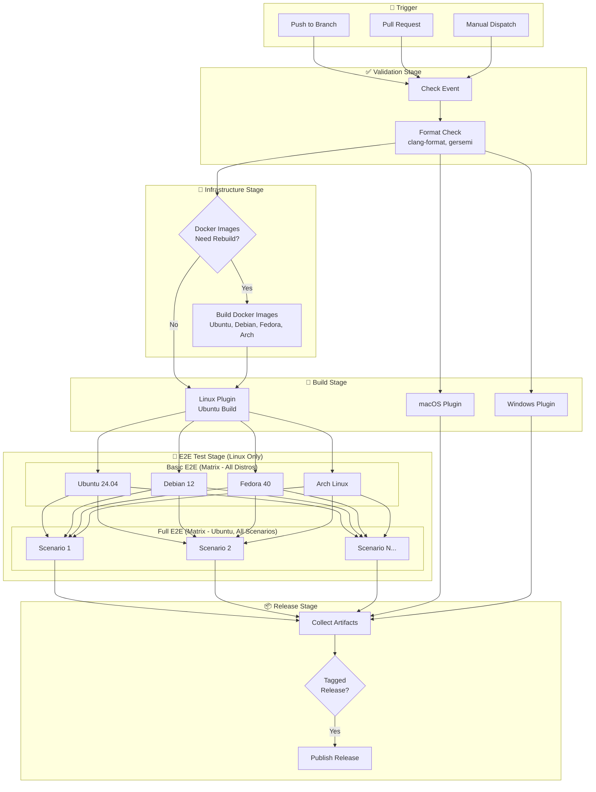
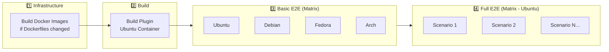

# CI Build Architecture

This document describes the CI/CD pipeline structure for c64stream.

## Pipeline Overview

## Linux Pipeline Detail

## Stage Descriptions

### 1. Validation Stage
- **Check Event**: Determine commit hash, branch, and whether to run subsequent stages
- **Format Check**: Validate code formatting (clang-format 21+, gersemi for CMake)

### 2. Infrastructure Stage
- **Docker Images**: Rebuild only if Dockerfiles changed
- Images cached in GitHub Container Registry (GHCR)

### 3. Build Stage
- **Single plugin per OS**: Linux (.so), macOS (.dylib), Windows (.dll)
- Linux plugin built on Ubuntu (works across all distros)

### 4. E2E Test Stage (Linux Only)
- **Basic E2E (Matrix)**: Runs on all 4 distros in parallel - validates OBS compatibility
- **Full E2E (Matrix)**: Runs all scenarios in parallel on Ubuntu after basic E2E passes
- Each scenario gets its own dedicated runner VM (no CPU contention)
- Tests include A/V sync validation with PulseAudio

### 5. Release Stage
- Collect artifacts from all platforms
- On tagged releases, publish to GitHub Releases

## Key Principles

1. **Fail Fast**: Format checks run first to catch simple issues early
2. **Build Once**: Single Linux plugin artifact used across all distros
3. **Test Broadly**: E2E on multiple distros catches OBS version differences
4. **Test Deeply**: Full scenarios only need to run once (Ubuntu)
5. **Caching**: Docker images cached for fast builds
