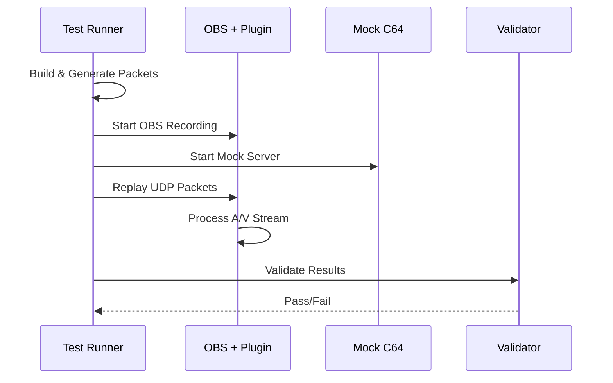

# End-to-End Testing

Automated validation of C64 Stream plugin functionality using mock C64 Ultimate streams.

## Purpose

Validates complete UDP packet reception, video processing, audio synchronization, and OBS integration. Tests the full pipeline from network packets to recorded output.

## Quick Start

```bash
cd tests/e2e
./e2e.sh              # 5-second NTSC test
./e2e.sh --format PAL --frames 299 --verbose  # 5-second PAL test
```

## What It Does

1. **Builds** plugin and test tools
2. **Generates** deterministic test packets (PAL/NTSC formats)
3. **Starts** OBS with C64 Stream source
4. **Replays** packets via UDP at precise timing
5. **Records** video and CSV data
6. **Validates** packet reception and synchronization

## Architecture

### System Overview


### Test Flow



### Key Components

- **`e2e.sh`** - Main orchestrator, handles dependencies and build process
- **`e2e.py`** - Python test runner with OBS integration and validation
- **`generate_packets.py`** - Creates deterministic test packets with visual markers
- **`udp_replay`** - High-performance C utility for precise UDP packet transmission
- **Mock TCP Server** - Simulates C64 Ultimate control protocol handshake

## Test Data

**Video Packets** (780 bytes):

- Header: sequence, frame, line numbers
- Payload: 384×4 pixels, 4-bit VIC-II colors
- Content: Animated raster bars with binary frame markers

**Audio Packets** (770 bytes):

- Header: sequence number
- Payload: 192 stereo samples, 440Hz carrier with heartbeat markers

## Validation

- **Network CSV**: Packet reception timestamps and metadata
- **OBS CSV**: Frame processing statistics
- **Video Recording**: Visual verification of raster bar animation
- **Audio Sync**: Heartbeat alignment with visual cues

## Performance

- **Packet Rate**: 18,239 packets in 5 seconds (3,648 pps)
- **Bandwidth**: ~23 Mbps (matches real C64 Ultimate)
- **Test Duration**: ~30 seconds including setup
- **Output**: 8MB+ video recording, CSV logs

## Future Enhancements

- **Bouncing Raster Bars**: Visual verification with animated rainbow bars and physics simulation
- **Binary Frame Markers**: Embedded metadata for precise frame tracking
- **Audio Sync Testing**: Heartbeat patterns aligned with visual cues
- **Extended Duration**: Configurable test lengths for stress testing
- **Cross-Platform**: Windows and macOS compatibility
- **Performance Profiling**: Latency and jitter analysis
