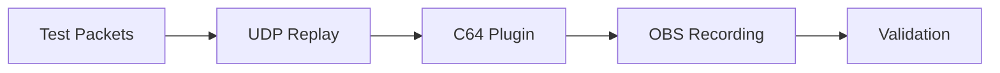
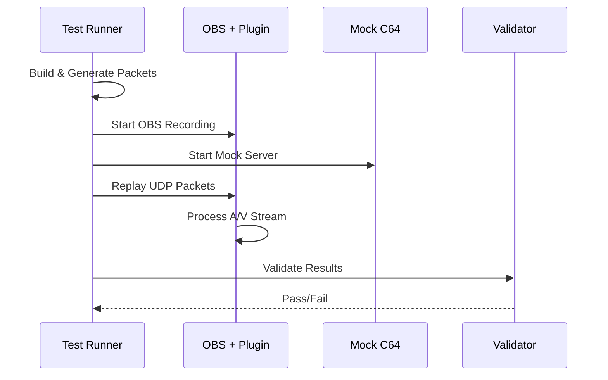

# End-to-End Testing

Automated validation of C64 Stream plugin functionality using mock C64 Ultimate streams.

## Purpose

Validates complete UDP packet reception, video processing, audio synchronization, and OBS integration. Tests the full pipeline from network packets to recorded output.

## Quick Start

```bash
cd tests/e2e
./e2e.sh              # 5-second NTSC test
./e2e.sh --format PAL --duration 5 --verbose  # 5-second PAL test
```

Or via convenience script (Linux):

```bash
./local-build.sh linux --e2e --install
```

## What It Does

1. **Builds** plugin and test tools
2. **Generates** deterministic test packets (PAL/NTSC formats)
3. **Starts** OBS with C64 Stream source
4. **Replays** packets via UDP at precise timing
5. **Records** video and CSV data
6. **Validates** packet reception and synchronization

Artifacts are written to `tests/e2e/test_output/`:

- `README.md` — human-readable report with packet stats, recording link, and Pop synchronization summary
- `validation_results.json` — machine-readable results including `av_sync_details`
- Recording file — `.mkv` or `.mp4` (normalized to constant frame rate)
- Optional: `network.csv`, `obs.csv`

## Architecture

### System Overview



### Test Flow



### Key Components

- **`e2e.sh`** - Main orchestrator, handles dependencies and build process
- **`e2e.py`** - Python test runner with OBS integration and validation
- **`generate_packets.py`** - Creates deterministic test packets with visual markers
- **`udp_replay`** - High-performance C utility for precise UDP packet transmission
- **Mock TCP Server** - Simulates C64 Ultimate control protocol handshake

Notes on timing and FPS:

- PAL uses OBS Common FPS label: `FPSCommon = "50 PAL"` with `FPSInt = 30` and `FPSNum = 30`
- NTSC uses `FPSCommon = "60"`
- Final compressed output is forced to constant frame rate (CFR: 50 or 60) to preserve frames and avoid 30 fps artifacts

## Test Data

**Video Packets** (780 bytes):

- Header: sequence, frame, line numbers
- Payload: 384×4 pixels, 4-bit VIC-II colors
- Content: Animated raster bars with binary frame markers

**Audio Packets** (770 bytes):

- Header: sequence number
- Payload: 192 stereo samples, 440Hz carrier with heartbeat markers

## Scenarios

E2E tests can be run with named scenarios that configure specific effect presets and test configurations.

### Listing Scenarios

```bash
./e2e.sh --list-scenarios
```

Available scenarios include:

| Scenario             | Format | Description                          |
| -------------------- | ------ | ------------------------------------ |
| ntsc_default         | NTSC   | Default preset (no effects)          |
| ntsc_classic_crt     | NTSC   | Classic CRT with scanlines and blur  |
| ntsc_amber_monitor   | NTSC   | Amber monochrome tint                |
| ntsc_green_monitor   | NTSC   | Green monochrome tint                |
| ntsc_sharp_pixels    | NTSC   | Sharp pixel scaling                  |
| ntsc_phosphor_glow   | NTSC   | Afterglow and bloom effects          |
| ntsc_vintage_tv      | NTSC   | Vintage TV simulation                |
| ntsc_arcade_cabinet  | NTSC   | Strong scanlines for arcade look     |
| pal_sharp_pixels     | PAL    | PAL format with sharp pixels         |
| scanlines            | PAL    | Scanline uniformity test             |

### Running a Scenario

```bash
# Run specific scenario
./e2e.sh --scenario ntsc_amber_monitor --verbose

# Scenario auto-sets format; override if needed
./e2e.sh --scenario pal_sharp_pixels --frames 300
```

### Scenario Structure

Each scenario is a **concise YAML file** referencing a preset from `data/effect_presets.ini`:

```
scenarios/ntsc_amber_monitor/
├── scenario.yaml              # ~10 lines - name, format, preset, assertions
└── generated/                 # Auto-generated at runtime
    └── basic/scenes/C64StreamTest.json
```

The `scenario.yaml` file:

```yaml
name: NTSC Amber Monitor
format: NTSC
preset: Amber Monitor
overrides:
  afterglow_duration_ms: 100  # Optional effect tweaks for E2E
assertions:
  - video_quality
  - audio
  - tint
  - afterglow
  - scanlines
```

Effect settings are loaded from `data/effect_presets.ini`, with optional per-scenario overrides. The OBS scene JSON is generated dynamically from a base template at test time.

## Assertion Framework

The assertion framework (`assertion_framework.py`) validates E2E recordings against expected effect behaviors.

### Usage

```bash
# Verify recording against scenario (preferred)
python3 assertion_framework.py \
    --mp4 test_output/c64_recording.mp4 \
    --scenario ntsc_amber_monitor \
    --verbose

# Verify against a named preset
python3 assertion_framework.py \
    --mp4 recording.mp4 \
    --preset "Arcade Cabinet" \
    --verbose

# List available presets
python3 assertion_framework.py --list-presets
```

### Assertion Types

| Assertion      | Description                                               |
| -------------- | --------------------------------------------------------- |
| VideoQuality   | Resolution, duration, non-black frame ratio               |
| Audio          | Sample rate, channel count                                |
| Tint           | Amber/Green color verification via dominant channel ratio |
| Afterglow      | Persistence decay detection in pop ROI                    |
| Scanlines      | Line uniformity analysis                                  |

### Per-Preset Assertions

The framework automatically selects assertions based on the effect preset:

- **Default/Sharp Pixels**: VideoQuality, Audio (no effects to verify)
- **Amber/Green Monitor**: VideoQuality, Audio, Tint
- **Phosphor Glow**: VideoQuality, Audio, Afterglow
- **Classic CRT/Vintage TV/Arcade Cabinet**: VideoQuality, Audio, Scanlines

## Validation

- **Network CSV**: Packet reception timestamps and metadata
- **OBS CSV**: Frame processing statistics
- **Video Recording**: Visual verification of raster bar animation
- **Audio Sync**: Heartbeat alignment with visual cues

### Pop synchronization

The harness detects audio and video “pop” markers and pairs them to measure A/V offset. Results are included in `validation_results.json` under `av_sync_details` and summarized in the report.

- Output includes: overall sync accuracy %, average/max offset, per-pop traffic lights, and channel alternation verdict
- Per-pop details list channel (L/R/B), audio/video times, and difference; times are formatted with 0.1 ms precision

## Performance

- **Packet Rate**: 18,239 packets in 5 seconds (3,648 pps)
- **Bandwidth**: ~23 Mbps (matches real C64 Ultimate)
- **Test Duration**: ~30 seconds including setup
- **Output**: 8MB+ video recording, CSV logs

## CI usage

E2E tests run in CI on Ubuntu runners (and optionally Debian, Fedora, Arch). The harness adapts to headless environments using Xvfb and enforces CFR in compression. Artifacts and the Markdown report are uploaded for inspection.

### Running Scenarios in CI

The CI workflow supports running specific scenarios via the `e2e_scenario` input:

```yaml
# Single scenario
inputs:
  run_e2e: true
  e2e_scenario: "ntsc_amber_monitor"

# Default (baseline test without scenario)
inputs:
  run_e2e: true
```

### Multi-Distro Matrix

By default, E2E tests run on 4 Linux distributions:

- Ubuntu 24.04
- Debian 12
- Fedora 40
- Arch Linux

This ensures the plugin builds and functions correctly across different package ecosystems.

## Troubleshooting

- If OBS is not available, the harness runs in validation-only mode and skips recording steps
- Ensure `jq` is installed to render the Pop synchronization section in the report
- If output video reports 30 fps, verify CFR post-processing is enabled; the harness script enforces 50/60 fps

## Future Enhancements

- **Bouncing Raster Bars**: Visual verification with animated rainbow bars and physics simulation
- **Binary Frame Markers**: Embedded metadata for precise frame tracking
- **Audio Sync Testing**: Heartbeat patterns aligned with visual cues
- **Extended Duration**: Configurable test lengths for stress testing
- **Cross-Platform**: Windows and macOS compatibility
- **Performance Profiling**: Latency and jitter analysis
