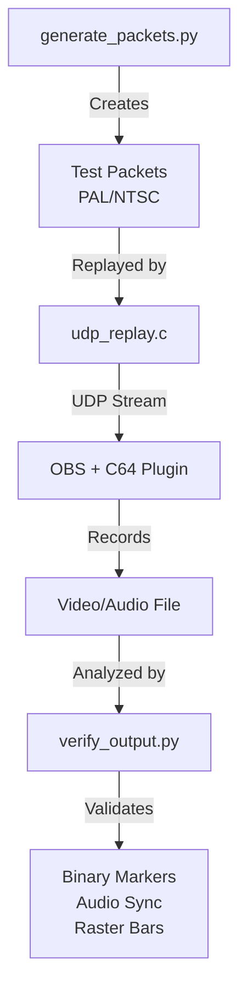

# C64 Stream End-to-End Testing

Automated end-to-end (E2E) tests for the C64 Stream OBS plugin. These tests validate that the plugin correctly receives, processes, and renders C64 Ultimate video and audio streams according to the [C64 Ultimate Data Stream Specification](c64-stream-spec.md).

## Overview

The E2E test system provides:

- **Visual Verification**: Animated raster bars for human inspection of smooth playback
- **Automated Validation**: Binary frame markers and audio patterns for programmatic verification
- **A/V Sync Testing**: Heartbeat sound synchronized with visual bouncing
- **CI Integration**: Automated tests on GitHub Actions with artifact collection
- **Local Testing**: One-command execution with automatic dependency management

## Architecture



## Components

1. **Packet Generator** (`generate_packets.py`) - Creates deterministic test packets with visual effects
2. **UDP Replay Tool** (`udp_replay.c`) - High-performance packet transmission (70,000+ pps)
3. **Test Orchestrator** (`run_e2e_test.py`) - Coordinates OBS and packet replay
4. **Output Verifier** (`verify_output.py`) - Validates recorded output

## Visual Elements

### Raster Bars

Animated rainbow-colored bars that bounce vertically:

- **Appearance**: Full-width horizontal bars (~50 pixels tall) with all 16 VIC-II colors
- **3D Effect**: Simulated cylindrical tube with lighting (brightest 30% from top)
- **Physics**: Realistic bouncing between floor and ceiling with gravity
- **Frequency**: One bounce per 100 frames (~2 seconds on PAL)
- **Background**: Black with 1-pixel light gray border

### Binary Metadata Encoding

Top-left corner (8×7 pixels) encodes frame metadata:

- **Format**: `[32-bit sequence][8 zero bits][16-bit frame]` = 56 bits
- **Encoding**: Black pixel = 0, White pixel = 1
- **Purpose**: Precise frame identification and dropped frame detection

### Audio Synchronization

- **Carrier**: 440Hz sine wave with subtle amplitude modulation
- **Heartbeat**: 60Hz sawtooth (300ms duration) when raster bars hit floor
- **Sync**: Pixel-perfect alignment with visual bounce
- **Purpose**: Human A/V sync judgment + automated verification

## Test Duration

- **CI**: 5 seconds (~250 PAL frames, ~299 NTSC frames)
- **Local**: Configurable up to 60+ seconds for stress testing
- **Bandwidth**: Matches real C64 Ultimate (21-24 Mbps)

## Building

```bash
cd build_x86_64
cmake --build . --target udp_replay
```

## Usage

### Local Testing

```bash
# Quick test with auto-dependency installation
cd tests/e2e
./run_e2e_local.sh

# Specify test parameters
./run_e2e_local.sh --format PAL --frames 100 --verbose

# Development mode - preserve artifacts for debugging
./run_e2e_local.sh --skip-build --no-cleanup --verbose
```

### CI/GitHub Actions

E2E tests run automatically on:

- Pull requests to main branch
- Manual workflow dispatch
- After successful build completion

Test artifacts (recordings, logs, reports) are automatically collected and available for download from the GitHub Actions UI.

### Manual Component Testing

#### Generate Packets

```bash
./generate_packets.py --frames 250 --format PAL --output test_packets
```

#### Run UDP Replay

```bash
../../build_x86_64/tests/e2e/udp_replay test_packets/video/PAL 127.0.0.1 11000 780
```

#### Verify Output

```bash
./verify_output.py recording_PAL.mkv --format PAL --frames 250
```

## Packet Format

### Video (780 bytes)

**Header (12 bytes):**

```text
- Sequence number (16-bit LE)
- Frame number (16-bit LE)
- Line number (16-bit LE, bit 15 = last packet flag)
- Pixels per line = 384
- Lines per packet = 4
- Bits per pixel = 4
- Encoding = 0 (uncompressed)
```

**Payload (768 bytes):**

- 4 lines × 384 pixels, 4-bit VIC colors
- Raster bars + binary markers + border

### Audio (770 bytes)

**Header (2 bytes):**

```text
- Sequence number (16-bit LE)
```

**Payload (768 bytes):**

- 192 stereo samples (16-bit signed LE)
- 440Hz carrier + frame marker + heartbeat

## Verification

### Automated Checks

`verify_output.py` validates:

1. Frame dimensions (384×272 PAL / 384×240 NTSC)
2. Frame count (±2% tolerance)
3. Binary markers (sequence/frame numbers)
4. Frame sequence (no drops/duplicates)
5. Audio markers (envelope timing)
6. A/V sync (heartbeat alignment)
7. Raster bar motion (smoothness)

### Manual Inspection

Review recording for:

- Smooth raster bar animation
- Correct bounce physics
- Audio/visual synchronization
- Visual quality and color accuracy

## CI Integration

GitHub Actions workflow (`e2e-test.yaml`):

1. Build plugin + UDP replay tool
2. Generate 5-second test packets
3. Start OBS with C64 Stream source
4. Record stream playback
5. Verify binary markers and A/V sync
6. Upload artifacts

## Performance

**GitHub Actions runners:**

- UDP replay: 70,000+ pps (no delay)
- UDP replay: 3,500+ pps (300μs delay)
- Packet generation: <500ms for 250 frames
- Total test: ~30 seconds

## Troubleshooting

### OBS Issues

```bash
# Verify OBS
obs --version

# Check plugin
ls ~/.config/obs-studio/plugins/c64stream.so

# View logs
tail -f ~/.config/obs-studio/logs/*.txt
```

### UDP Packet Loss

```bash
# Increase buffer
sudo sysctl -w net.core.rmem_max=8388608

# Reduce rate
./generate_packets.py --delay-factor 1.2
```

### Marker Verification Fails

- Check ffmpeg/PIL installation
- Use lossless/high-quality recording
- Inspect frame manually: `ffmpeg -i recording.mkv -vframes 1 frame.png`

## Implementation Details

### Raster Bar Physics

```python
velocity = initial_velocity
for frame in frames:
    position += velocity
    velocity += gravity
    if position >= floor:
        velocity = -velocity * restitution
```

### Binary Encoding

```python
bits = [(metadata >> i) & 1 for i in range(55, -1, -1)]
for i, bit in enumerate(bits):
    x, y = i % 8, i // 8
    frame[y, x] = 0x0 if bit == 0 else 0xF
```

### Audio Heartbeat

```python
t = np.linspace(0, 0.3, int(0.3 * sample_rate))
heartbeat = (1 - t/0.3) * np.sin(2*np.pi*60*t)
```

## Current Status (October 14, 2025)

### ✅ Completed Components

1. **E2E Test Framework**: Fully functional with mock C64 Ultimate TCP server
2. **UDP Packet Replay**: Auto-building `udp_replay` tool with microsecond-precise transmission (3450 packets/test)
3. **Plugin Communication**: Successful TCP control channel communication with stream configuration
4. **Video Recording**: 19MB MP4 recordings generated successfully
5. **Properties Loading**: Fixed `obs_data_set_bool` vs `obs_data_set_default_bool` bug for CSV recording activation
6. **CSV Session Creation**: Plugin correctly creates session directories and CSV files

### 🚨 Critical Issue - UDP Packet Reception

**Status**: E2E test shows **3450 packets sent, 0 packets logged** in CSV files

**Symptoms**:

- Mock TCP server receives multiple START commands (stream setup working)
- `udp_replay` successfully sends 3450 packets (3400 video + 50 audio)
- CSV files created with proper headers but **zero data rows**
- OBS logs show "Crash or unclean shutdown detected"
- Plugin likely crashes during UDP packet processing

**Evidence**:

```bash
# CSV files exist but empty
$ wc -l tests/e2e/test_output/network.csv
1 tests/e2e/test_output/network.csv  # Only header line

# UDP replay successful
[TEST] ✅ Packet replay complete: 3450 packets sent, 0 failed in 996.1ms

# Plugin creates session
[TEST] ✅ Found network.csv: .../session_19700101_013441/network.csv (177 bytes)
```

### 🔧 Immediate Next Steps

1. **Debug Plugin Crash During Packet Reception**

   ```bash
   # Check for core dumps
   ls -la /tmp/core* /var/crash/
   
   # Run with GDB debugging
   gdb --args obs --profile C64StreamTest
   
   # Enable detailed UDP logging
   # Add C64_LOG_DEBUG to c64_network_receive_packet() function
   ```

2. **Validate UDP Socket Binding**

   ```bash
   # Check if plugin binds to correct ports during test
   ss -ulnp | grep -E ":(11000|11001)"
   
   # Monitor packet arrival with tcpdump
   sudo tcpdump -i lo -n port 11000 or port 11001
   ```

3. **Fix Packet Processing Logic**
   - Review `c64_network_receive_packet()` for crash conditions
   - Check buffer overflow protection in packet validation
   - Verify thread safety in UDP receive handlers
   - Add defensive programming for malformed packets

4. **Validate Packet Format Compatibility**

   ```bash
   # Examine generated packet structure
   hexdump -C tests/e2e/test_packets/video/PAL/frame_0000_pkt_000.bin | head -3
   
   # Expected format: [2B seq][2B frame][2B line][768B payload] = 780 bytes
   # Check against plugin's packet parsing expectations
   ```

### 🎯 Expected Final Outcome

When complete, the E2E test will:

- ✅ Generate and replay 3450 precisely-timed UDP packets
- ⚠️ Create 19MB+ video recording with C64 content (currently records but content unknown)
- ❌ Produce CSV logs: `network.csv` (packet reception) and `obs.csv` (frame processing) - **BLOCKING ISSUE**
- ⚠️ Validate audio/video synchronization and content accuracy (pending CSV fix)

### 🔍 Debug Commands for Current Issues

```bash
# Run E2E test with maximum debugging
cd tests/e2e
python3 run_e2e_test.py --verbose --frames 5

# Monitor UDP packet arrival during test
sudo tcpdump -i lo -w packets.pcap port 11000 or port 11001 &
python3 run_e2e_test.py --frames 5
sudo pkill tcpdump
tcpdump -r packets.pcap -c 20

# Check for plugin crashes
dmesg | tail -20
ls -la /tmp/core* /var/crash/ 2>/dev/null

# Examine OBS logs for crash details  
tail -50 ~/.config/obs-studio/logs/*.txt | grep -E "(error|crash|abort|segfault)"

# Verify packet format matches plugin expectations
hexdump -C tests/e2e/test_packets/video/PAL/frame_0000_pkt_000.bin | head -3
# Should show: [2B seq][2B frame][2B line][768B payload] = 780 total bytes

# Test manual CSV session creation (should work)
mkdir -p ~/Documents/obs-studio/c64stream/recordings/session_test
echo "test" > ~/Documents/obs-studio/c64stream/recordings/session_test/obs.csv
ls -la ~/Documents/obs-studio/c64stream/recordings/session_test/
```

## Future Enhancements

1. Multi-format testing (PAL→NTSC switching)
2. Extended stress testing (60+ seconds)
3. OpenCV-based raster bar tracking
4. FFT-based heartbeat detection
5. Performance profiling (latency/jitter)
6. **Automated CSV validation** (packet loss detection, timing analysis)
7. **Cross-platform testing** (Windows/macOS compatibility)

## References

- [C64 Ultimate Data Stream Specification](c64-stream-spec.md)
- [OBS Studio Documentation](https://obsproject.com/docs/)
- [VIC-II Color Palette](https://www.c64-wiki.com/wiki/Color)
