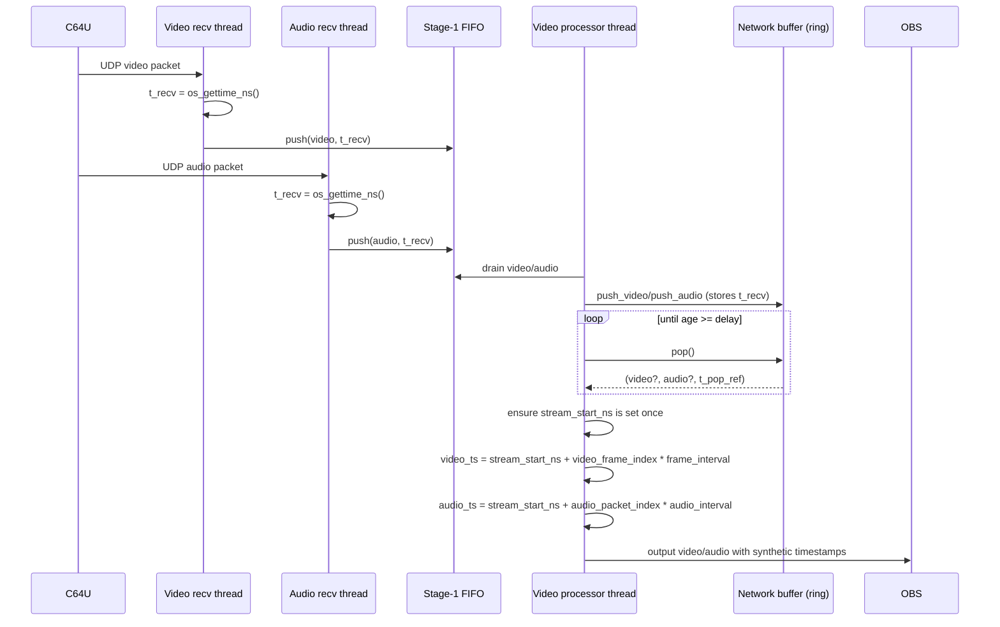

# Packet Flow and A/V Sync (c64stream)

This document describes how C64 Ultimate (C64U) UDP packets flow through the plugin’s buffering stages and how the plugin maintains a single synthetic A/V timeline for OBS.

## Overview

There are two parallel streams:

- **Video**: fixed-size UDP packets (780 bytes), assembled into frames and output as `obs_source_frame`.
- **Audio**: fixed-size UDP packets (770 bytes), output as `obs_source_audio`.

The plugin uses a two-stage ingest pipeline:

1. **Stage-1 (UDP recv threads)**: minimal work; timestamp each received packet and push it into a lock-free FIFO.
2. **Stage-2 (video processor thread)**: drain FIFOs, optionally reorder/delay via a ring buffer, then process packets and output to OBS.

## Packet headers (what we use)

### Video packet header (first 10 bytes)

The packet header fields used in buffering/ordering/validation are:

- `seq` (uint16, little-endian) at offset `0` (2 bytes)
- `frame_num` (uint16, little-endian) at offset `2` (2 bytes)
- `line_num` (uint16, little-endian) at offset `4` (2 bytes)
  - last-packet bit is masked (`line_num &= 0x7FFF`) in the network buffer
- `pixels_per_line` (uint16, little-endian) at offset `6` (2 bytes)
- `lines_per_packet` (uint8) at offset `8` (1 byte)
- `bits_per_pixel` (uint8) at offset `9` (1 byte)

Video ordering inside the network buffer is primarily **by `frame_num` then `line_num`**.

### Audio packet header

- `seq` (uint16, little-endian) at offset `0` (2 bytes)
- then 192 stereo samples (`768` bytes): 16-bit signed little-endian, interleaved L/R

Audio ordering inside the network buffer is **by `seq`**.

## Stage-1: UDP receive → FIFO

Both the video receiver thread and the audio receiver thread do:

- `packet_time_ns = os_gettime_ns()` (receipt time)
- call `c64_try_init_stream_start_ns(context, packet_time_ns, ...)` (one-time)
- push packet + `packet_time_ns` into a **single-producer / single-consumer FIFO**:
  - `c64_network_fifo_push(&context->video_fifo, ...)`
  - `c64_network_fifo_push(&context->audio_fifo, ...)`

FIFO properties (`src/c64-network-fifo.h`):

- preallocated fixed-size entries
- no ordering logic
- no blocking (drops when full)

## Stage-2: FIFO → optional network buffer → processing

The video processor thread (`c64_video_processor_thread_func`) drains both FIFOs:

- `c64_stage2_drain_video_fifo()` (high rate)
- `c64_stage2_drain_audio_fifo()` (lower rate)

Then either:

- **Direct mode (buffer disabled)**: process immediately using the packet’s receipt timestamp.
- **Buffered mode (buffer enabled)**: push into a unified “network buffer” (separate video+audio ring buffers), then pop ready packets after the configured delay.

### Buffered mode details

`struct c64_network_buffer` contains two ring buffers:

- video ring buffer: stores metadata + payload, ordered by `(frame_num, line_num)`
- audio ring buffer: stores metadata + payload, ordered by `seq`

Push path:

- `c64_network_buffer_push_video(..., timestamp_ns)`
- `c64_network_buffer_push_audio(..., timestamp_ns)`

Internally the buffer stores `timestamp_us = timestamp_ns / 1000` and maintains bounded insertion-sort to correct reordering without unbounded CPU cost.

Pop path:

- `c64_network_buffer_pop(..., &timestamp_us)` returns packets only when their age exceeds the configured delay.
- the pop timestamp is the buffer’s “playback time reference” (derived from the stored receipt timestamps).

Additional behavior that matters for real-time A/V:

- **Video-driven pacing**: `c64_network_buffer_pop()` requires a ready **video** packet; audio is opportunistic (returned if
  an audio packet is also ready).
- **Returned time reference**: when both are present, `timestamp_us` is the earlier of the two stored timestamps (min of
  audio/video); otherwise it is the video timestamp.
- **Delay gating**: readiness is checked against *the oldest* packet in each ring (“age >= delay”), preserving FIFO
  semantics even when packets were inserted out-of-order.

### Hot-path notes (performance and ordering)

- **No blocking on ingest**:
  - Stage-1 FIFO drops when full (`dropped_full`) rather than stalling the recv thread.
  - The network buffer drops incoming packets when its ring is full (producer must not advance the consumer-owned tail).
- **Bounded reordering cost**: the network buffer uses a bounded insertion-sort window (different limits for audio/video) to
  correct common reorder patterns without pathological $O(n)$ shifts.
- **Single-threaded frame assembly in buffered mode**: in buffered mode, `c64_process_video_packet_direct()` is only called
  by the video processor thread after `c64_network_buffer_pop()`, so it can safely skip the `assembly_mutex`.

### Packet validation and drops

- Video packet format validation (Stage-2) verifies `lines_per_packet`, `pixels_per_line`, and `bits_per_pixel` before
  buffering/processing; invalid packets are dropped early.
- FIFO and network buffer both favor forward progress over completeness: they drop rather than stall.

## One synthetic timeline for both audio and video

The plugin maintains a **single shared synthetic origin** and derives both audio and video timestamps from it.

### Shared origin: `stream_start_ns`

- Stored in `context->stream_start_ns` and guarded by `context->stream_start_set`.
- Set exactly once per “stream lifetime” in `c64_try_init_stream_start_ns()`.
- Triggered by the first arriving packet (audio or video), in either recv or pop paths.

When the unified network buffer is enabled, initialization shifts the origin forward by the configured delay:

- `stream_start_ns = packet_time_ns + buffer_delay_ms * 1,000,000`

This prevents a systematic “timestamps are always in the past” offset when the pipeline intentionally delays packets.

### Receipt timestamps vs. OBS timestamps

The code carries a “receipt-ish” timestamp (`timestamp_ns`) through the pipeline for:

- initializing `stream_start_ns` (one-time)
- diagnostics (pipeline latency, spot checks)
- buffering delay decisions (network buffer stores `timestamp_us` and checks “age >= delay”)
- video frame assembly bookkeeping (`current_frame.last_packet_time`)

But **OBS output timestamps** are always synthetic and derived from the shared origin plus a monotonic index.

### Video synthetic timestamps

Video output timestamps are generated in `c64_calculate_ideal_timestamp()`:

- Maintain `video_frame_index` (monotonic), derived from 16-bit `frame_num` (wrap-aware)
- Compute:

  `video_ts = stream_start_ns + video_frame_index * frame_interval_ns`

Rules used for monotonicity:

- If frames are dropped: advance by the number of missing frames.
- If a frame is duplicate/out-of-order: still advance by 1 to avoid timestamp reuse.

### Audio synthetic timestamps

Audio output timestamps are generated in `generate_monotonic_audio_timestamp()`:

- Maintain `audio_packet_index` (monotonic), derived from 16-bit audio `seq` (wrap-aware)
- Compute:

  `audio_ts = stream_start_ns + audio_packet_index * audio_interval_ns`

Rules used for monotonicity:

- If sequence advances normally: advance `audio_packet_index` by the positive seq delta.
- If duplicate/out-of-order: still advance by 1 to avoid timestamp reuse.

This ensures the audio timeline advances with **packet sequence progression** (not “packets processed”), so missing packets still advance media time.

## Why this preserves A/V sync under loss/reorder

Key properties:

- **Single origin**: both streams share the exact same `stream_start_ns`.
- **Monotonic indices**:
  - video uses observed `frame_num` → `video_frame_index`
  - audio uses observed packet `seq` → `audio_packet_index`
- **Drops don’t compress time**: missing audio packets still advance `audio_packet_index` via seq delta.
- **Buffer delay is accounted for**: when enabled, the synthetic origin is shifted so both streams remain aligned to the delayed playback schedule.

## Mermaid diagrams

### High-level dataflow

```mermaid
flowchart LR
  C64U[C64 Ultimate] -->|UDP video packets| VSOCK[Video UDP socket]
  C64U -->|UDP audio packets| ASOCK[Audio UDP socket]

  VSOCK -->|os_gettime_ns + FIFO push| VFIFO[Stage-1 FIFO (video)]
  ASOCK -->|os_gettime_ns + FIFO push| AFIFO[Stage-1 FIFO (audio)]

  VFIFO -->|drain| ST2[Stage-2: video processor thread]
  AFIFO -->|drain| ST2

  ST2 -->|buffer disabled| VPROC[Video packet processing]
  ST2 -->|buffer disabled| APROC[Audio packet processing]

  ST2 -->|buffer enabled| NBUF["Unified network buffer<br/>(video+audio ring buffers)"]
  NBUF -->|delayed pop| VPROC
  NBUF -->|delayed pop| APROC

  VPROC -->|obs_source_output_video| OBS[OBS]
  APROC -->|obs_source_output_audio| OBS
```

### Buffered mode packet lifetime



## Pointers into the code

- Stage-1 FIFO: `src/c64-network-fifo.h`
- Network buffer: `src/c64-network-buffer.c/h`
- Stage-2 drain + pop loop: `src/c64-video.c` (`c64_stage2_drain_*`, `c64_video_processor_thread_func`)
- Shared origin reset/init: `src/c64-source.c` (`c64_try_init_stream_start_ns`)
- Audio timestamping: `src/c64-audio.c` (`generate_monotonic_audio_timestamp`)
- Video timestamping: `src/c64-video.c` (`c64_calculate_ideal_timestamp`)
