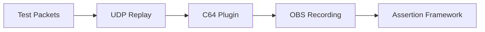
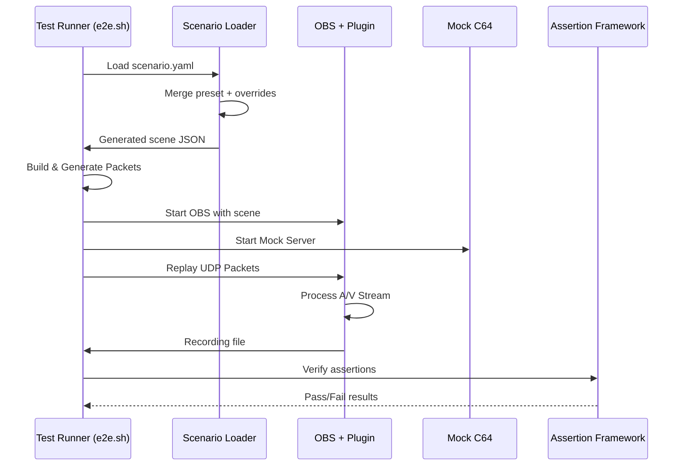
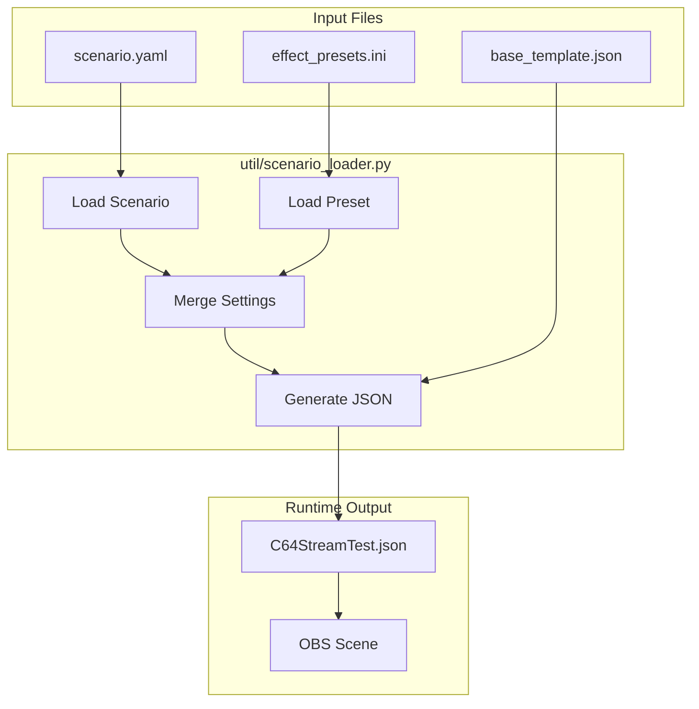
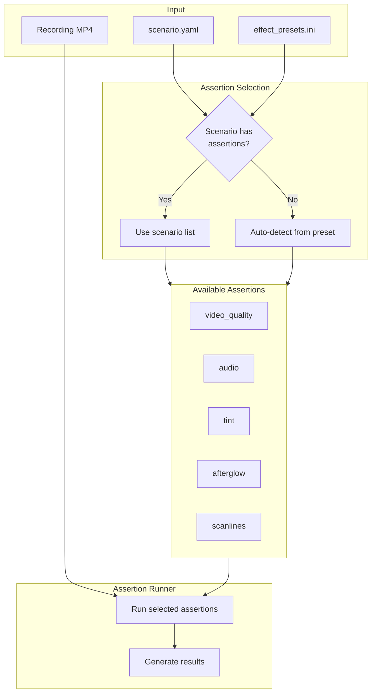
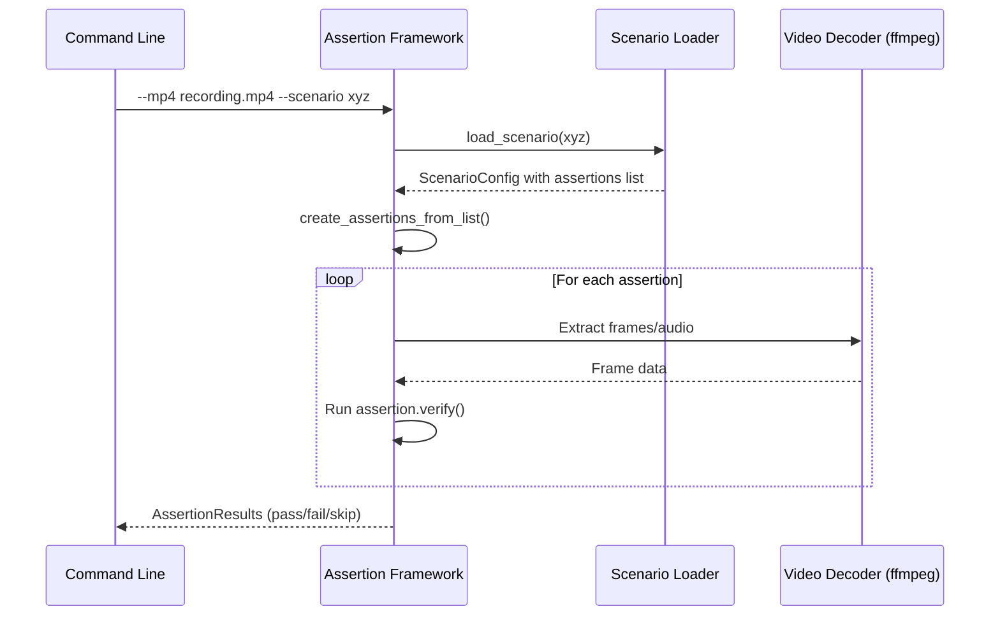

# End-to-End Testing

Automated validation of C64 Stream plugin functionality using mock C64 Ultimate streams.

## Purpose

Validates complete UDP packet reception, video processing, audio synchronization, and OBS integration. Tests the full pipeline from network packets to recorded output, including CRT effect verification.

## Quick Start

```bash
cd tests/e2e
./e2e.sh              # 8-second NTSC test (default scenario)
./e2e.sh --all        # Run ALL scenarios in sequence
./e2e.sh --format PAL --duration 5 --verbose  # 5-second PAL test
./e2e.sh --scenario ntsc_amber_monitor --verbose  # Named scenario with assertions
```

Or via convenience script (Linux):

```bash
./local-build.sh linux --e2e --install           # Single scenario (ntsc_default)
./local-build.sh linux --e2e-scenarios --install  # ALL scenarios
```

## Real Device A/V Sync Test (LOCAL ONLY)

This is a separate, hardware-backed flow that runs `av-sync-auto.prg` on a real C64U via REST, records 10 seconds
in OBS, and checks A/V pop delta from CSV/log artifacts. It is fully automated once the user starts the script.

```bash
./tests/e2e/real-device-av-sync.sh --host 192.168.1.13

# Analyze existing artifacts only
./tests/e2e/real-device-av-sync.sh --analyze-only /path/to/results/session_YYYYmmdd_HHMMSS
```

See `doc/real-device-av-sync.md` for full setup and Linux/Windows (WSL2) instructions.

Notes:
- Requires a real C64 Ultimate and a working GUI environment for OBS.
- CSVs are authoritative when present; OBS log parsing is a fallback only.

## Settling Period (Frame Progression)

Frame progression checks may show transient anomalies immediately after OBS starts (e.g., shader compilation / pipeline stabilization). The E2E framework supports a settling period that is **ignored for pass/fail** in the frame progression assertion.

- Settling affects only pass/fail gating and the Frame Progression report section.
- Raw artifacts (recording and CSV files) are unchanged.

Use `--settling-seconds` to adjust the ignored window (default: 0 seconds).

## Interpreting playback.csv (Important)

The E2E harness generates `playback.csv` by aligning detected **content frames** in the recording with the expected slot progression.

- `content_s` is only populated while the assertion framework can confidently detect content and match it to expected slots ("content bounds").
- The `repeated=1` / `skipped=1` markers are derived from this content alignment.

Implication:

- The **end of the recording may appear jitter-free** even if the system was jittery earlier, because after content ends there are no content-derived slot markers to emit repeated/skipped rows.
- Always interpret jitter clusters and repeated/skipped windows **relative to the detected content bounds**, not relative to total recording duration.

## CLI Options

Key options for `e2e.sh`:

| Option                   | Default | Description                                              |
| ------------------------ | ------- | -------------------------------------------------------- |
| `--all`                  | off     | Run ALL scenarios in sequence                            |
| `--format FORMAT`        | NTSC    | Video format (PAL or NTSC)                               |
| `--duration SECONDS`     | 8       | Test duration in seconds                                 |
| `--frames FRAMES`        | 300     | Number of frames (overridden by --duration)              |
| `--scenario NAME`        | -       | Named scenario from scenarios/ directory                 |
| `--list-scenarios`       | -       | List all available scenarios                             |
| `--verbose`              | off     | Enable detailed logging                                  |
| `--settling-seconds SEC` | 0       | Ignore frame progression errors during first SEC seconds |

## Default Duration

The default E2E run duration is **8 seconds** (override with `--duration`).

## CSV Trimming (Committed Artifacts)

By default, the harness truncates large CSV artifacts (e.g. `network.csv`, `obs.csv`) to **at most 3000 total lines** (including the header) via `--csv-max-rows`.
Use `--csv-max-rows 0` to disable truncation.
| `--csv-max-duration MS` | 1000 | Truncate CSV files to first N ms (0=disable) |
| `--output-dir DIR` | results | Output directory for test artifacts |
| `--skip-build` | off | Skip building plugin and tools |
| `--no-cleanup` | off | Keep temporary files after test |

### CSV Truncation

By default, CSV diagnostic files (`network.csv`, `obs.csv`) are truncated to the first 1000ms of events. This keeps file sizes manageable while preserving the critical startup data for debugging.

To disable truncation and keep full CSV files:
```bash
./e2e.sh --scenario ntsc_default --csv-max-duration 0
```

## What It Does

1. **Builds** plugin and test tools
2. **Generates** deterministic test packets (PAL/NTSC formats)
3. **Loads scenario** configuration and generates OBS scene JSON
4. **Starts** OBS with C64 Stream source
5. **Replays** packets via UDP at precise timing
6. **Records** video and CSV data
7. **Validates** packet reception and effect assertions

Artifacts are written to `tests/e2e/test_output/`:

- `README.md` — human-readable report with packet stats, recording link, and Pop synchronization summary
- `validation_results.json` — machine-readable results including `av_sync_details`
- Recording file — `.mkv` or `.mp4` (normalized to constant frame rate)
- Optional: `network.csv`, `obs.csv`, `resource.csv`, `resource.json`

## Architecture

### System Overview



### Test Flow



### Key Components

- **`e2e.sh`** - Main orchestrator, handles dependencies and build process
- **`util/scenario_loader.py`** - Loads scenarios and generates OBS scene JSON
- **`assertions/`** - Assertion package for validating recordings
- **`e2e.py`** - Python test runner with OBS integration and validation
- **`util/generate_packets.py`** - Creates deterministic test packets with visual markers
- **`udp_replay`** - High-performance C utility for precise UDP packet transmission
- **Mock TCP Server** - Simulates C64 Ultimate control protocol handshake

Notes on timing and FPS:

- PAL uses OBS Common FPS label: `FPSCommon = "50 PAL"` with `FPSInt = 30` and `FPSNum = 30`
- NTSC uses `FPSCommon = "60"`
- Final compressed output is forced to constant frame rate (CFR: 50 or 60) to preserve frames and avoid 30 fps artifacts

## Test Data

**Video Packets** (780 bytes):

- Header: sequence, frame, line numbers
- Payload: 384×4 pixels, 4-bit VIC-II colors
- Content: Animated raster bars with binary frame markers

**Audio Packets** (770 bytes):

- Header: sequence number
- Payload: 192 stereo samples, 440Hz carrier with heartbeat markers

## Scenarios

E2E tests can be run with named scenarios that configure specific effect presets and test configurations.

### Scenario Architecture



### Listing Scenarios

```bash
./e2e.sh --list-scenarios
```

Available scenarios include:

| Scenario                       | Format | Description                                        |
| ------------------------------ | ------ | -------------------------------------------------- |
| ntsc_amber_monitor             | NTSC   | Amber monochrome tint                              |
| ntsc_arcade_cabinet            | NTSC   | Strong scanlines for arcade look                   |
| ntsc_classic_crt               | NTSC   | Classic CRT with scanlines and blur                |
| ntsc_default                   | NTSC   | Default preset (no effects)                        |
| ntsc_default_720p              | NTSC   | 720p, 59.826 Hz (standard HD)                      |
| ntsc_default_record            | NTSC   | Default preset + recording enabled                 |
| ntsc_delay_buffer500           | NTSC   | 500ms buffer delay test                            |
| ntsc_delay_buffer500_jitter10  | NTSC   | 500ms buffer + jitter simulation (10ms)            |
| ntsc_delay_buffer500_jitter100 | NTSC   | 500ms buffer + jitter simulation (see scenario)    |
| ntsc_green_monitor             | NTSC   | Green monochrome tint                              |
| ntsc_palette_muted             | NTSC   | Default preset with 'Muted' palette (no effects)   |
| ntsc_palette_vibrant           | NTSC   | Default preset with 'Vibrant' palette (no effects) |
| ntsc_phosphor_glow             | NTSC   | Afterglow and bloom effects                        |
| ntsc_sharp_pixels              | NTSC   | Sharp pixel scaling                                |
| ntsc_sharp_scan_lines          | NTSC   | Pixel-perfect scanline rendering                   |
| ntsc_vintage_tv                | NTSC   | Vintage TV simulation                              |
| pal_default                    | PAL    | Default preset (no effects)                        |
| pal_default_720p               | PAL    | 720p, 50.125 Hz (standard HD)                      |

### Running a Scenario

```bash
# Run specific scenario
./e2e.sh --scenario ntsc_amber_monitor --verbose

# Scenario auto-sets format; override if needed
./e2e.sh --scenario pal_default --frames 300
```

### Scenario Structure

Each scenario is a **concise YAML file** referencing a preset from `data/effect_presets.ini`:

```
scenarios/ntsc_amber_monitor/
├── scenario.yaml              # ~10 lines - name, format, preset, assertions
└── generated/                 # Auto-generated at runtime
    └── basic/scenes/C64StreamTest.json
```

The `scenario.yaml` file:

```yaml
name: NTSC Amber Monitor
format: NTSC
preset: Amber Monitor
overrides:
  afterglow_duration_ms: 50  # Optional effect tweaks for E2E
assertions:
  - video_quality
  - audio
  - tint
  - afterglow
  - scanlines
```

Effect settings are loaded from `data/effect_presets.ini`, with optional per-scenario overrides. The OBS scene JSON is generated dynamically from `base_template.json` at test time.

## Assertion Framework

The `assertions/` package validates E2E recordings against expected effect behaviors.

### How Assertions Are Configured

Assertions can be configured in two ways:

1. **Scenario-driven (preferred)**: Listed explicitly in `scenario.yaml`
2. **Auto-detected**: Inferred from preset effect settings



#### Scenario-Driven Assertions

When using `--scenario`, assertions are read from the `assertions` array in `scenario.yaml`:

```yaml
# scenarios/ntsc_amber_monitor/scenario.yaml
assertions:
  - video_quality    # Always recommended
  - audio            # Always recommended
  - tint             # Verifies amber/green color dominance
  - afterglow        # Verifies phosphor persistence decay
  - scanlines        # Verifies scanline uniformity
```

If `assertions` is omitted, defaults to `["video_quality", "audio"]`.

#### Auto-Detection from Preset

When using `--preset` or `--scene-json` (without `--scenario`), assertions are auto-detected based on effect settings:

| Preset Setting                                        | Assertion Added          |
| ----------------------------------------------------- | ------------------------ |
| Always                                                | `video_quality`, `audio` |
| `tint_mode > 0` and `tint_strength > 0`               | `tint`                   |
| `afterglow_duration_ms > 0`                           | `afterglow`              |
| `scan_line_distance > 0` and `scan_line_strength > 0` | `scanlines`              |

### Usage

```bash
# Verify recording against scenario (preferred)
python3 -m assertions \
    --mp4 test_output/c64_recording.mp4 \
    --scenario ntsc_amber_monitor \
    --verbose

# Verify against a named preset (auto-detect assertions)
python3 -m assertions \
    --mp4 recording.mp4 \
    --preset "Arcade Cabinet" \
    --verbose

# Verify against OBS scene JSON
python3 -m assertions \
    --mp4 recording.mp4 \
    --scene-json C64StreamTest.json \
    --verbose

# List available presets
python3 -m assertions --list-presets
```

### Assertion Types

| Assertion       | Description                                                       |
| --------------- | ----------------------------------------------------------------- |
| `video_quality` | Resolution (1920×1080), duration, non-black frame ratio (≥50%)    |
| `audio`         | Sample rate (48kHz), channel count                                |
| `tint`          | Amber/Green color verification via dominant channel ratio (≥1.2×) |
| `afterglow`     | Persistence decay detection using A/V pop ROI analysis            |
| `scanlines`     | Line uniformity analysis (variance <0.5%)                         |

### Assertion Flow



### Per-Preset Assertion Examples

The framework's auto-detection selects assertions based on the effect preset:

- **Default/Sharp Pixels**: `video_quality`, `audio` (no effects to verify)
- **Amber/Green Monitor**: `video_quality`, `audio`, `tint`
- **Phosphor Glow**: `video_quality`, `audio`, `afterglow`, `scanlines`
- **Classic CRT/Vintage TV**: `video_quality`, `audio`, `afterglow`, `scanlines`
- **Arcade Cabinet**: `video_quality`, `audio`, `scanlines`

## Validation

The E2E framework generates several CSV files for detailed analysis:

### CSV Files

| File           | Description                                  |
| -------------- | -------------------------------------------- |
| `network.csv`  | UDP packet reception timestamps and metadata |
| `obs.csv`      | Frame/audio events submitted to OBS          |
| `playback.csv` | Decoded frame analysis with anomaly markers  |

### obs.csv Format

Records every video frame and audio chunk submitted to OBS:

| Column                   | Description                          |
| ------------------------ | ------------------------------------ |
| `event_type`             | "video" or "audio"                   |
| `frame_num`              | Frame counter from the stream        |
| `elapsed_us`             | Microseconds since recording started |
| `data_size_bytes`        | Size of the frame/audio data         |
| `fps`                    | Current measured FPS                 |
| `audio_samples_total`    | Cumulative audio samples processed   |
| `video_packets_received` | Cumulative video packets             |
| `audio_packets_received` | Cumulative audio packets             |
| `sequence_errors`        | Cumulative sequence errors           |

When Debug logging is enabled in the C64 Stream source, `obs.csv` appends two optional columns:
`is_all_white` (1 if the submitted frame is all white) and `has_signal` (1 if the audio buffer contains any
non-silent samples). These columns are omitted when Debug is disabled.

### playback.csv Format

Authoritative source for skipped/repeated frame analysis. Each row = one displayed frame (1:1 with recording).

| Column                 | Description                                                               |
| ---------------------- | ------------------------------------------------------------------------- |
| `playback_frame_index` | Absolute frame index in recording (0-based)                               |
| `frame_num`            | C64U stream frame number from obs.csv (empty for logo frames)             |
| `frame_slot`           | Detected slot (0-7) from bottom-left progress bar (empty if not detected) |
| `video_s`              | Position in video file (seconds since recording start)                    |
| `video_ssff`           | Position in SS:FF format (seconds:frames) for tools like Shotcut          |
| `content_s`            | Time since C64U content started streaming (empty for logo/post-stream)    |
| `repeated`             | If start of run: times shown; empty otherwise                             |
| `skipped`              | Frames lost before this; empty if none                                    |
| `event`                | Human-readable: "repeated", "skipped", "repeated+skipped", or empty       |
| `video_pop`            | "video_pop" if video pop (frame sync marker) detected at this frame       |
| `audio_pop`            | "audio_pop" if audio pop detected within this frame's time window         |

**Frame Number Mapping:**

The `frame_num` column uses detected video slots as ground truth:
1. Content bounds detection identifies first/last content frames via frame-difference analysis
2. For each content frame, the bottom-left progress bar slot (0-7) is detected
3. Slots are matched to obs.csv entries where `frame_num % 8` equals the slot
4. Validation ensures playback reflects actual displayed content

**Semantics:**

- **`repeated`**: Source didn't deliver a new frame in time. Count only on first frame of run.
- **`skipped`**: Frames permanently missing (frame counter jumped). Count = frames lost before this one.
- Both can occur on same frame (rare).
- **`video_s`**: Absolute position in the recording file. Starts at 0.0 when recording begins.
- **`video_ssff`**: Same as `video_s` but in SS:FF format (e.g., `08:39` = second 8, frame 39). Matches Shotcut's timeline display.
- **`content_s`**: Relative time since C64U content started. Empty during logo display and post-stream frames. Useful for comparing runs that have different logo durations.

**Example:**

```csv
playback_frame_index,frame_num,frame_slot,video_s,video_ssff,content_s,repeated,skipped,event,video_pop,audio_pop
462,,,7.7,07:42,,,,,,
463,,,7.717,07:43,,,,,,
464,1,1,7.733,07:44,0.0,,,,,
465,2,2,7.75,07:45,0.017,,,,,
524,60,4,8.733,08:44,1.0,,,,,
525,60,4,8.75,08:45,1.017,3,,repeated,,
526,60,4,8.767,08:46,1.033,,,,,
527,61,5,8.783,08:47,1.05,,,,,
528,63,7,8.8,08:48,1.067,,1,skipped,,
540,75,3,9.0,09:00,1.267,2,3,repeated+skipped,video_pop,audio_pop
```

### Other Validation

### Pop synchronization

The harness detects audio and video “pop” markers and pairs them to measure A/V offset. Results are included in `validation_results.json` under `av_sync_details` and summarized in the report.

- Output includes: overall sync accuracy %, average/max offset, per-pop traffic lights, and channel alternation verdict
- Per-pop details list channel (L/R/B), audio/video times, and difference; times are formatted with 0.1 ms precision

## Performance

- **Packet Rate**: 18,239 packets in 5 seconds (3,648 pps)
- **Bandwidth**: ~23 Mbps (matches real C64 Ultimate)
- **Test Duration**: ~30 seconds including setup
- **Output**: 8MB+ video recording, CSV logs

## CI Usage

E2E tests run in CI on Ubuntu runners (and optionally Debian, Fedora, Arch). The harness adapts to headless environments using Xvfb and enforces CFR in compression. Artifacts and the Markdown report are uploaded for inspection.

### Running Scenarios in CI

The CI workflow supports running specific scenarios via the `e2e_scenario` input:

```yaml
# Single scenario
inputs:
  run_e2e: true
  e2e_scenario: "ntsc_amber_monitor"

# Default (baseline test without scenario)
inputs:
  run_e2e: true
```

### Multi-Distro Matrix

By default, E2E tests run on 4 Linux distributions:

- Ubuntu 24.04
- Debian 12
- Fedora 40
- Arch Linux

This ensures the plugin builds and functions correctly across different package ecosystems.

## Adding New Scenarios

1. Create directory: `tests/e2e/scenarios/{format}_{effect_name}/`
2. Create `scenario.yaml` with the following fields:

```yaml
name: Human-readable scenario name
format: PAL or NTSC
preset: Preset name from data/effect_presets.ini
overrides:                    # Optional: tweak effect values
  afterglow_duration_ms: 75  # Boost for E2E detection
assertions:                   # What to verify
  - video_quality
  - audio
  - scanlines
```

3. Test locally:

```bash
./e2e.sh --scenario {scenario_name} --verbose
```

## Troubleshooting

- If OBS is not available, the harness runs in validation-only mode and skips recording steps
- Ensure `jq` is installed to render the Pop synchronization section in the report
- If output video reports 30 fps, verify CFR post-processing is enabled; the harness script enforces 50/60 fps
- If assertions fail, run with `--verbose` to see detailed analysis output
- Check that `effect_presets.ini` contains the preset referenced in your scenario

## File Reference

| File                           | Purpose                                     |
| ------------------------------ | ------------------------------------------- |
| `e2e.sh`                       | Main test orchestrator                      |
| `util/scenario_loader.py`      | Loads scenarios, generates OBS scene JSON   |
| `assertions/`                  | Assertion package for validating recordings |
| `scenarios/base_template.json` | Common OBS scene structure                  |
| `scenarios/*/scenario.yaml`    | Per-scenario configuration                  |
| `data/effect_presets.ini`      | Effect preset definitions                   |

## Future Enhancements

A checked box indicates that the enhancement has been added.

- [x] **Binary Frame Markers**: Embedded metadata for precise frame tracking
- [x] **Audio Sync Testing**: Heartbeat patterns aligned with visual cues
- [x] **Extended Duration**: Configurable test lengths for stress testing
- [x] **Performance Profiling**: Latency and jitter analysis
- [ ] **Cross-Platform**: Windows and macOS compatibility
