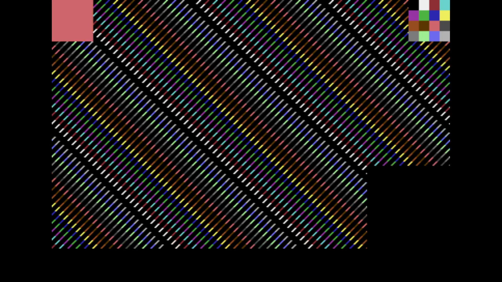

# C64 Stream E2E Test Report

Generated: 2025-10-18 16:52:12 UTC

## Test configuration

- Format: NTSC
- Frames: 300
- Duration: 5.0 seconds
- Video Port: 11000
- Audio Port: 11001
- OBS Enabled: true

## Build information

- Project: c64stream
- Version: 0.8.0

## Test results

Overview:
- ✅ Packet Generation: 18000 video, 1252 audio packets
- ✅ UDP Replay: Completed successfully
- Events: [network.csv](network.csv), [obs.csv](obs.csv)

### A/V Sync

- ✅ Good synchronization (100.0%): avg offset 4.2ms, max 16.7ms

#### Sync Details

- 🟢 Pop #1 [L]: audio=7500.0ms, video=7483.3ms (frame 449), diff=16.7ms
- 🟢 Pop #2 [R]: audio=8500.0ms, video=8500.0ms (frame 510), diff=0.0ms
- 🟢 Pop #3 [L]: audio=9500.0ms, video=9500.0ms (frame 570), diff=0.0ms
- 🟢 Pop #4 [R]: audio=10500.0ms, video=10500.0ms (frame 630), diff=0.0ms

- Channels: LRLR
- 🔁 Channel alternation: OK (alternating, starts with L)

### Video

- Download: [c64_recording.mp4](./c64_recording.mp4)

### Sample Frame

Top-left shows frame progression. Center shows slow C64 colour bars for smooth playback and colour rendering checks. Bottom-right flashes with the pop sound for A/V sync.
Taken from frame 449 at 00:07.5 of the video above.
