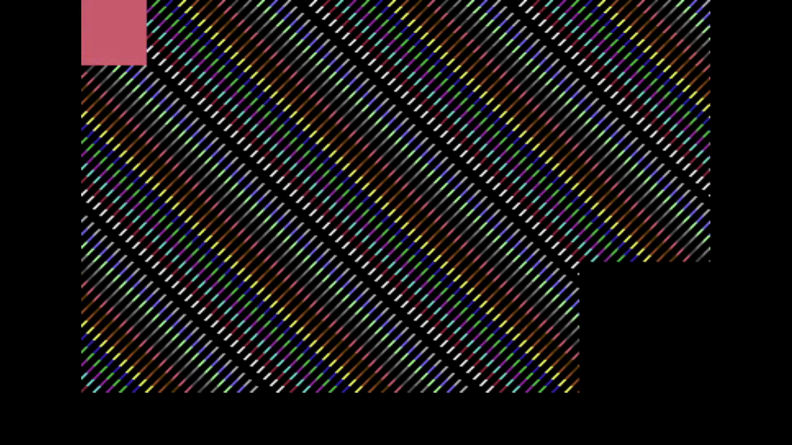

# C64 Stream E2E Test Report

Generated: 2025-10-18 12:14:37 UTC

## Test configuration

- Format: NTSC
- Frames: 300
- Duration: 5.0 seconds
- Video Port: 11000
- Audio Port: 11001
- OBS Enabled: true

## Build information

- Project: c64stream
- Version: 0.8.0

## Test results
- ✅ Packet Generation: 18000 video, 1252 audio packets
- ✅ UDP Replay: Completed successfully

### Recording

- Download: [c64_recording.mp4](c64_recording.mp4)

### Data

- Network CSV: [network.csv](network.csv)
- OBS CSV: [obs.csv](obs.csv)

### Pop synchronization

*Figure: Video POP frame extracted at ~7.47s.*

- Top-left: sequence marker (frame ID overlay) for test traceability.
- Center band: full C64 palette sweep moving horizontally across the field.
- Bottom-right: POP check region used to confirm precise A/V sync.
- The POP (white flash) coincides with the audio pop to validate sync.

- ✅ Good synchronization (100.0%): avg offset 10.8ms, max 13.3ms
- ⬜ Detected video pop(s): [7466.7, 8466.7, 9483.3, 10483.3] ms

#### Per-pop synchronization

- 🟢 Pop #1 [L]: audio=7480.0ms, video=7466.7ms, diff=13.3ms
- 🟢 Pop #2 [R]: audio=8480.0ms, video=8466.7ms, diff=13.3ms
- 🟢 Pop #3 [L]: audio=9480.0ms, video=9483.3ms, diff=3.3ms
- 🟢 Pop #4 [R]: audio=10470.0ms, video=10483.3ms, diff=13.3ms

- Channels: LRLR
- 🔁 Channel alternation: OK (alternating, starts with L)
