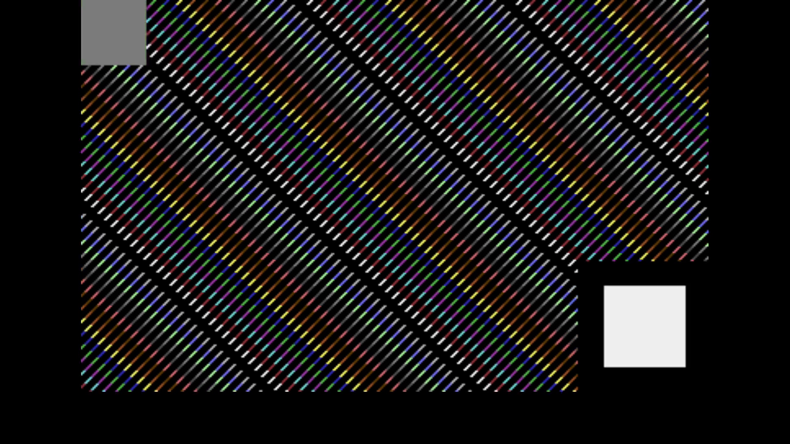

# C64 Stream E2E Test Report

Generated: 2025-10-19 14:43:00 UTC

## Test configuration

- Format: NTSC
- Frames: 300
- Duration: 5.0 seconds
- Video Port: 11000
- Audio Port: 11001
- OBS Enabled: true

## Build information

- Project: c64stream
- Version: 0.8.1

## Test results

- ✅ Packet Generation: 18000 video, 1252 audio packets
- ✅ UDP Replay: Completed successfully
- Events: [network.csv](network.csv), [obs.csv](obs.csv)

### A/V Sync

- ✅ Good synchronization (100.0%): avg offset 7.5ms, max 16.7ms

#### Sync Details

- 🟢 Pop #1 [L]: audio=7520.0ms, video=7516.7ms (frame 451), diff=3.3ms
- 🟢 Pop #2 [R]: audio=8520.0ms, video=8516.7ms (frame 511), diff=3.3ms
- 🟢 Pop #3 [L]: audio=9550.0ms, video=9533.3ms (frame 572), diff=16.7ms
- 🟢 Pop #4 [R]: audio=10540.0ms, video=10533.3ms (frame 632), diff=6.7ms

- Channels: LRLR
- 🔁 Channel alternation: OK (alternating, starts with L)

### Video

- Download: [c64_recording.mp4](c64_recording.mp4)
- Duration: 18.7 s

### Sample Frame

- Top-left cycles through all C64 colours to check frame progression. Center shows scrolling colour bars. Bottom-right flashes with a pop sound for A/V sync checks.
- Taken from frame 451 at 00:07.5 of the 18.7 s video above.
