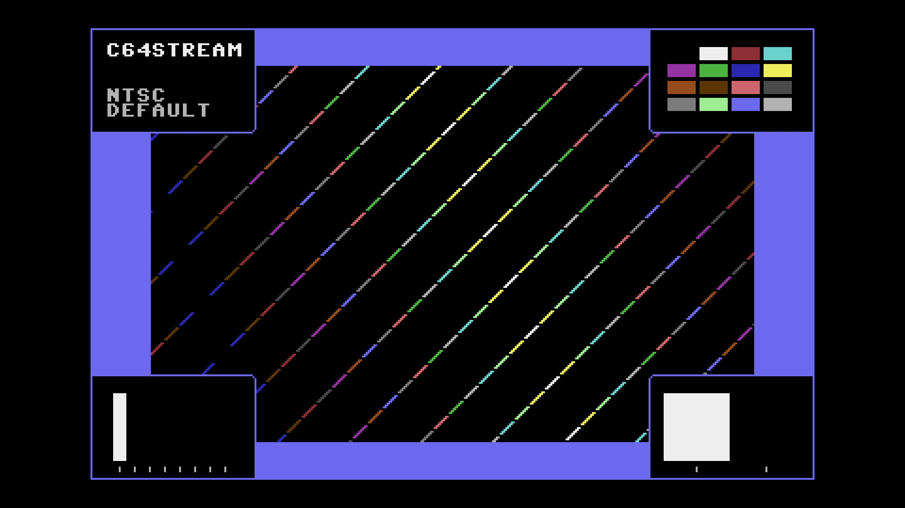

# C64 Stream E2E Test Report

## Scenario: NTSC Default

Generated: 2026-01-01 18:19:20 UTC

## Test configuration

- Format: NTSC
- Frames: 480
- Duration: 8.0 seconds
- Video Port: 21000
- Audio Port: 21001
- OBS Enabled: true

## Build information

- Project: c64stream
- Version: 1.0.0

## System information

- OS: Ubuntu 24.04.3 LTS (kernel 6.14.0-37-generic)
- OBS: 32.0.2
- CPU: Intel(R) Core(TM) i7-6700K CPU @ 4.00GHz (8 cores)
- RAM: 31Gi total, 23Gi available
- Disk (/): 1.8T total, 1.1T available

## Test results

### Validation Summary

- ✅ UDP Packet Reception: 30803/30803 packets (28800 video, 2003 audio)
- ⚠️ Network Timing: span=8023.5ms, video_mean=278.6us, audio_mean=4005.1us
- ✅ Frame Processing: 2481 frames processed
- ✅ Video Recording: 10.9 MB
- ✅ Content Integrity: 22.1s duration

### Resource Usage

During the test's processing window (7.6s, 16 of 49 samples) (8 cores):

| Metric | Min | Median | Mean | Max |
|--------|-----|--------|------|-----|
| CPU | 56.6% | 59.85% | 63.69% | 91.6% |
| RAM | 6658.93 MB | 6706.01 MB | 6700.63 MB | 6725.97 MB |
| GPU | 27.23% | 39.24% | 38.39% | 47.69% |

Details: [resource.csv](resource.csv) | [resource.json](resource.json)

### Packet & Network Data

- ✅ Packet Generation: 28800 video, 2003 audio packets
- ✅ UDP Replay: Completed successfully
- Events: [network.csv](network.csv), [obs.csv](obs.csv), [playback.csv](playback.csv)

#### Network Quality (Measured)

- Packet span (first→last): 8023.537 ms
- Total packets analyzed: 30800

| Stream | Packets | Spacing (min) | Spacing (mean) | Spacing (max) | CV | Burst <0.5×P50 | Gaps >2×P50 | P99/P50 |
|--------|---------|---------------|----------------|---------------|----|--------------|------------|--------|
| All | 30800 | 0.001 ms | 0.521 ms | 12.091 ms | 213.60% | 0.30% | 31.66% | 1212.000 |
| Video | 28799 | 0.001 ms | 0.279 ms | 12.091 ms | 211.35% | 0.32% | 26.93% | 615.000 |
| Audio | 2001 | 0.004 ms | 4.005 ms | 10.017 ms | 25.77% | 2.30% | 0.25% | 1.600 |

| Stream | Packets | Jitter (median) | Jitter (max) | Out-of-Order |
|--------|---------|-----------------|--------------|--------------|
| Video | 28799 | 0.001 ms | 12.087 ms | 0 |
| Audio | 2001 | 0.601 ms | 5.772 ms | 0 |

Details: [network.json](network.json)

### A/V Sync

- ✅ Good synchronization (100.0%): avg offset 101.4ms, max 763.8ms

#### Sync Details

- 🟢 Pop #1 [L]: audio=11004.0ms, video=10981.8ms (frame 657), diff=22.2ms
- • Pop #2 [R]: audio=11806.0ms, video=12569.8ms (frame 752), diff=763.8ms
- 🟢 Pop #3 [L]: audio=12606.0ms, video=12586.5ms (frame 753), diff=19.5ms
- 🟢 Pop #4 [R]: audio=13409.0ms, video=13388.8ms (frame 801), diff=20.2ms
- 🟢 Pop #5 [L]: audio=14209.0ms, video=14191.2ms (frame 849), diff=17.8ms
- 🟢 Pop #6 [R]: audio=15012.0ms, video=14993.5ms (frame 897), diff=18.5ms
- 🟢 Pop #7 [L]: audio=15814.0ms, video=15795.8ms (frame 945), diff=18.2ms
- 🟢 Pop #8 [R]: audio=16614.0ms, video=16598.1ms (frame 993), diff=15.9ms
- 🟢 Pop #9 [L]: audio=17417.0ms, video=17400.5ms (frame 1041), diff=16.5ms

- Channels: LRLRLRLRL
- 🔁 Channel alternation: OK (alternating, starts with L)

### Frame Progression

- 🟢 Frame sequence verified (455 frames analyzed, 0 colors)

- Settling: 4.0s (pass/fail uses post-settling only)

| Window | Stuck runs (count/min/med/max) | Skips (count/min/med/max) | Back steps | Severe steps |
|--------|------------------------------:|--------------------------:|-----------:|-------------:|
| During settling | 0/0/0/0 | 5/1/1/3 | 0 | 0 |
| After settling | 0/0/0/0 | 12/1/1/2 | 0 | 0 |

See [playback.csv](playback.csv) for frame-by-frame playback timeline with anomaly markers.

#### Playback Jitter Clusters (post-settling)

- Definition: rows with repeated=1 or skipped=1 in playback.csv; clustering uses max gap 0.5s
- Note: this is independent from the Frame Progression (frame-box) check above
- Note: repeated/skipped markers only exist while content is detected (video_s 10.597–21.596).
  The jitter-free tail after content ends is expected and does not indicate steady-state performance.

| # | Events | Center (s) | Std dev (s) | Span (s) | Window (s) |
|---|--------|------------|-------------|----------|------------|
| 1 | 8 | 17.461 | 0.309 | 1.053 | 16.932–17.985 |
| 2 | 4 | 11.826 | 0.056 | 0.150 | 11.751–11.901 |
| 3 | 3 | 15.913 | 0.250 | 0.568 | 15.562–16.130 |

### Video

- Download: [c64_recording.mp4](c64_recording.mp4) (Available from local runs or CI build artifacts.)
- Duration: 22.1 s

### Sample Frame

- **Top-left**: Text box with scenario name
- **Top-right**: VIC-II palette reference grid of all C64 colors
- **Center**: Diagonal pattern cycling through all C64 colors
- **Bottom-left**: Frame progression indicator (8-slot moving bar, cycles every 8 frames)
- **Bottom-right**: A/V pop indicator (pops every 48 frames, split left/right for audio channels)
- Taken from frame 657 at 00:11.0 of the 22.1 s video above.
