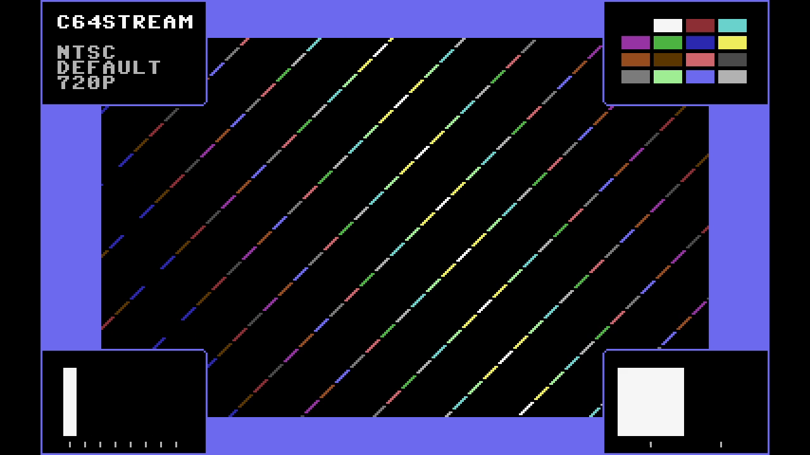

# C64 Stream E2E Test Report

## Scenario: NTSC Default 720p

Generated: 2026-01-01 09:21:30 UTC

## Test configuration

- Format: NTSC
- Frames: 300
- Duration: 5.0 seconds
- Video Port: 21000
- Audio Port: 21001
- OBS Enabled: true

## Build information

- Project: c64stream
- Version: 1.0.0

## System information

- OS: Ubuntu 24.04.3 LTS (kernel 6.14.0-37-generic)
- OBS: 32.0.2
- CPU: Intel(R) Core(TM) i7-6700K CPU @ 4.00GHz (8 cores)
- RAM: 31Gi total, 24Gi available
- Disk (/): 1.8T total, 1.1T available

## Test results

### Resource Usage

During the test's processing window (4.6s, 10 of 27 samples) (8 cores):

| Metric | Min | Median | Mean | Max |
|--------|-----|--------|------|-----|
| CPU | 40.7% | 44.85% | 45.12% | 53.8% |
| RAM | 5206.35 MB | 5223.36 MB | 5224.38 MB | 5244.66 MB |
| GPU | 33.33% | 41.16% | 39.98% | 43.59% |

Details: [resource.csv](resource.csv) | [resource.json](resource.json)

### Packet & Network Data

- ✅ Packet Generation: 18000 video, 1252 audio packets
- ✅ UDP Replay: Completed successfully
- Events: [network.csv](network.csv), [obs.csv](obs.csv), [playback.csv](playback.csv)

#### Network Quality

| Stream | Packets | Jitter (median) | Jitter (max) |
|--------|---------|-----------------|--------------|
| Video | 17999 | 0.001 ms | 33.155 ms |
| Audio | 1249 | 0.337 ms | 26.832 ms |

Details: [network.json](network.json)

### A/V Sync

- ✅ Good synchronization (100.0%): avg offset 21.0ms, max 49.8ms

#### Sync Details

- 🟢 Pop #1 [L]: audio=2833.0ms, video=2824.9ms (frame 169), diff=8.1ms
- 🟢 Pop #2 [R]: audio=3636.0ms, video=3643.9ms (frame 218), diff=7.9ms
- 🟢 Pop #3 [L]: audio=4436.0ms, video=4429.5ms (frame 265), diff=6.5ms
- 🟢 Pop #4 [R]: audio=5281.0ms, video=5248.6ms (frame 314), diff=32.4ms
- 🟡 Pop #5 [L]: audio=6084.0ms, video=6034.2ms (frame 361), diff=49.8ms

- Channels: LRLRL
- 🔁 Channel alternation: OK (alternating, starts with L)

### Frame Progression

- 🟢 Frame sequence verified (478 frames analyzed, 0 colors)

- Settling: 4.0s (pass/fail uses post-settling only)

| Window | Stuck runs (count/min/med/max) | Skips (count/min/med/max) | Back steps | Severe steps |
|--------|------------------------------:|--------------------------:|-----------:|-------------:|
| During settling | 6/2/2/2 | 7/1/1/1 | 0 | 0 |
| After settling | 0/0/0/0 | 1/5/5/5 | 0 | 0 |

See [playback.csv](playback.csv) for frame-by-frame playback timeline with anomaly markers.

#### Playback Jitter Clusters (post-settling)

- Definition: rows with repeated=1 or skipped=1 in playback.csv; clustering uses max gap 0.5s
- Note: this is independent from the Frame Progression (frame-box) check above
- Note: repeated/skipped markers only exist while content is detected (video_s 2.457–10.430).
  The jitter-free tail after content ends is expected and does not indicate steady-state performance.

| # | Events | Center (s) | Std dev (s) | Span (s) | Window (s) |
|---|--------|------------|-------------|----------|------------|
| 1 | 9 | 5.631 | 0.138 | 0.418 | 5.449–5.867 |
| 2 | 1 | 4.597 | 0.000 | 0.000 | 4.597–4.597 |
| 3 | 1 | 10.430 | 0.000 | 0.000 | 10.430–10.430 |

### Video

- Download: [c64_recording.mp4](c64_recording.mp4) (Available from local runs or CI build artifacts.)
- Duration: 10.9 s

### Sample Frame

- **Top-left**: Text box with scenario name
- **Top-right**: VIC-II palette reference grid of all C64 colors
- **Center**: Diagonal pattern cycling through all C64 colors
- **Bottom-left**: Frame progression indicator (8-slot moving bar, cycles every 8 frames)
- **Bottom-right**: A/V pop indicator (pops every 48 frames, split left/right for audio channels)
- Taken from frame 170 at 00:02.8 of the 10.9 s video above.
