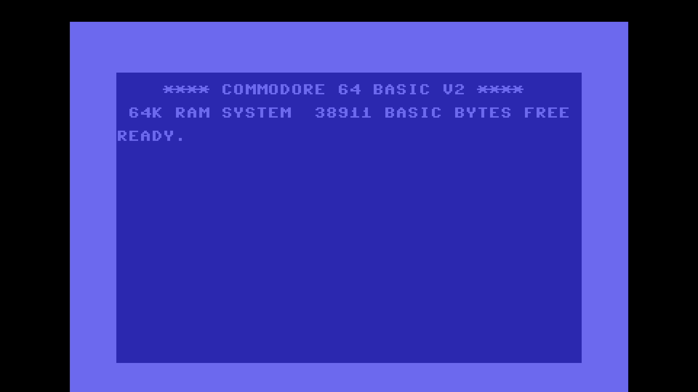

# C64 Stream E2E Test Report

## Scenario: NTSC Default Debug

Generated: 2026-01-09 07:52:27 UTC

## Test configuration

- Format: NTSC
- Frames: 600
- Duration: 10.0 seconds
- Video Port: 21000
- Audio Port: 21001
- OBS Enabled: true

## Build information

- Project: c64stream
- Version: 1.0.2

## System information

- OS: Ubuntu 24.04.3 LTS (kernel 6.14.0-37-generic)
- OBS: 32.0.2
- CPU: Intel(R) Core(TM) i7-6700K CPU @ 4.00GHz (8 cores)
- RAM: 31Gi total, 24Gi available
- Disk (/): 1.8T total, 1.1T available

## Test results

### Validation Summary

- ⚠️ UDP Packet Reception: 16142/38504 packets (15016 video, 1080 audio, major loss)
- ❌ Network Timing: span=4414.6ms, video_mean=293.4us, audio_mean=3993.2us
- ✅ Frame Processing: 1013 frames processed
- ✅ Video Recording: 19.9 MB
- ✅ Content Integrity: 40.1s duration

### Resource Usage

During the test's processing window (3.1s, 7 of 63 samples) (8 cores):

| Metric | Min | Median | Mean | Max |
|--------|-----|--------|------|-----|
| CPU | 57.3% | 75.5% | 76.4% | 93.8% |
| RAM | 6127.99 MB | 6190.66 MB | 6184.4 MB | 6217.34 MB |
| GPU | 30.9% | 33.05% | 32.68% | 35.12% |

Details: [resource.csv](resource.csv) | [resource.json](resource.json)

### Packet & Network Data

- ✅ Packet Generation: 36000 video, 2504 audio packets
- ✅ UDP Replay: Completed successfully
- Events: [network.csv](network.csv), [obs.csv](obs.csv)

#### Network Quality (Measured)

- Packet span (first→last): 4414.551 ms
- Total packets analyzed: 16096

| Stream | Packets | Spacing (min) | Spacing (mean) | Spacing (max) | CV | Burst <0.5×P50 | Gaps >2×P50 | P99/P50 |
|--------|---------|---------------|----------------|---------------|----|--------------|------------|--------|
| All | 16096 | 0.001 ms | 0.541 ms | 8.473 ms | 211.46% | 8.48% | 31.81% | 940.600 |
| Video | 15014 | 0.001 ms | 0.293 ms | 7.447 ms | 221.35% | 0.13% | 29.19% | 795.250 |
| Audio | 1079 | 0.031 ms | 3.993 ms | 8.473 ms | 24.01% | 2.50% | 0.09% | 1.625 |

| Stream | Packets | Jitter (median) | Jitter (max) | Out-of-Order |
|--------|---------|-----------------|--------------|--------------|
| Video | 15014 | 0.001 ms | 7.443 ms | 0 |
| Audio | 1079 | 0.477 ms | 4.254 ms | 0 |

Details: [network.json](network.json)

### Video

- Download: [c64_recording.mp4](c64_recording.mp4) (Available from local runs or CI build artifacts.)
- Duration: 40.1 s

### Sample Frame

- **Top-left**: Text box with scenario name
- **Top-right**: VIC-II palette reference grid of all C64 colors
- **Center**: Diagonal pattern cycling through all C64 colors
- **Bottom-left**: Frame progression indicator (8-slot moving bar, cycles every 8 frames)
- **Bottom-right**: A/V pop indicator (pops every 48 frames, split left/right for audio channels)
- Taken from 00:20.1 of the 40.1 s video above.
