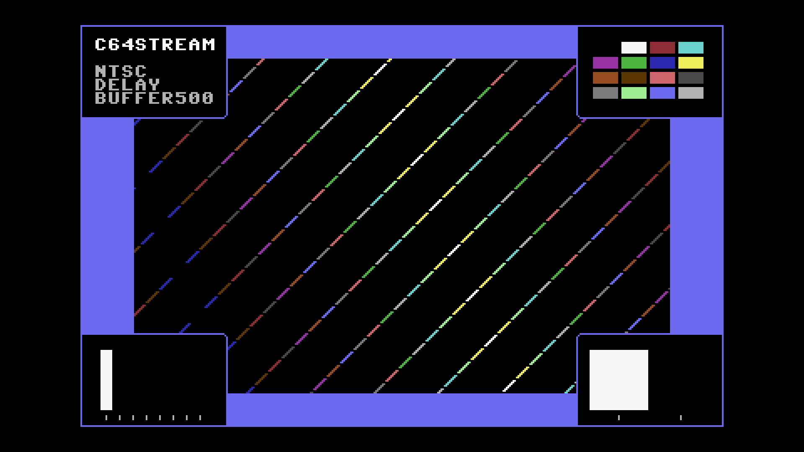

# C64 Stream E2E Test Report

## Scenario: NTSC 500ms Buffer + 0ms Jitter

- Generated: 2026-01-23 12:36:38 UTC
- Git Branch: doc/improvements
- Git ID: bd15461
- Environment: local

## Test configuration

- Format: NTSC
- Frames: 480
- Duration: 8.0 seconds
- Video Port: 21000
- Audio Port: 21001
- OBS Enabled: true

## Build information

- Project: c64stream
- Version: 1.0.3

## System information

- OS: Ubuntu 24.04.3 LTS (kernel 6.14.0-37-generic)
- OBS: 32.0.2
- CPU: Intel(R) Core(TM) i7-6700K CPU @ 4.00GHz (8 cores)
- RAM: 31Gi total, 26Gi available
- Disk (/): 1.8T total, 962G available

## Test results

### Validation Summary

- ✅ UDP Packet Reception: Expected 30803, Received 30749, Missing 54 (0.18%)
- ✅ Network Timing: span=8010.1ms, video_mean=335.1us, audio_mean=4005.0us
- ✅ Frame Processing: 478 frames processed
- ✅ Video Recording: 10.6 MB
- ✅ Content Integrity: Verified

### Resource Usage

During the test's processing window (18.2s, 35 samples) (8 cores):

| Metric | Min | Median | Mean | Max |
|--------|-----|--------|------|-----|
| CPU | 47.5% | 52.8% | 51.94% | 63.4% |
| RAM | 4692.43 MB | 4788.15 MB | 4779.86 MB | 4843.12 MB |
| GPU | 0% | 10% | 14.43% | 46% |

Details: [resource.csv](resource.csv) | [resource.json](resource.json)

### Packet & Network Data

- ✅ Packet Generation: 28800 video, 2003 audio packets
- ✅ UDP Replay: Completed successfully
- Events: [network.csv](network.csv), [obs.csv](obs.csv), [playback.csv](playback.csv)

#### Network Quality (Measured)

- Packet span (first→last): 8010.094 ms
- Total packets analyzed: 25899

| Stream | Packets | Spacing (min) | Spacing (mean) | Spacing (max) | CV | Burst <0.5×P50 | Gaps >2×P50 | P99/P50 |
|--------|---------|---------------|----------------|---------------|----|--------------|------------|--------|
| All | 25899 | 0.001 ms | 0.618 ms | 6.320 ms | 169.49% | 9.02% | 15.14% | 16.231 |
| Video | 23900 | 0.001 ms | 0.335 ms | 3.223 ms | 100.16% | 9.77% | 8.08% | 7.961 |
| Audio | 1999 | 1.704 ms | 4.005 ms | 6.320 ms | 16.90% | 0.80% | 0.00% | 1.500 |

| Stream | Packets | Jitter (median) | Jitter (max) | Out-of-Order |
|--------|---------|-----------------|--------------|--------------|
| Video | 23900 | 0.015 ms | 2.944 ms | 0 |
| Audio | 1999 | 0.079 ms | 2.320 ms | 0 |

Details: [network.json](network.json)

### A/V Sync

- ✅ Good synchronization (100.0%): avg offset 20.4ms, max 22.7ms

#### Sync Details

- 🟢 Pop #1 [L]: audio=10367.0ms, video=10346.7ms (frame 619), diff=20.3ms
- 🟢 Pop #2 [R]: audio=11167.0ms, video=11149.0ms (frame 667), diff=18.0ms
- 🟢 Pop #3 [L]: audio=11972.0ms, video=11951.3ms (frame 715), diff=20.7ms
- 🟢 Pop #4 [R]: audio=12775.0ms, video=12753.7ms (frame 763), diff=21.3ms
- 🟢 Pop #5 [L]: audio=13575.0ms, video=13556.0ms (frame 811), diff=19.0ms
- 🟢 Pop #6 [R]: audio=14380.0ms, video=14358.3ms (frame 859), diff=21.7ms
- 🟢 Pop #7 [L]: audio=15180.0ms, video=15160.6ms (frame 907), diff=19.4ms
- 🟢 Pop #8 [R]: audio=15983.0ms, video=15963.0ms (frame 955), diff=20.0ms
- 🟢 Pop #9 [L]: audio=16788.0ms, video=16765.3ms (frame 1003), diff=22.7ms

- Channels: LRLRLRLRL
- 🔁 Channel alternation: OK (alternating, starts with L)

### Frame Progression

- 🟢 Frame sequence verified (478 frames analyzed, 0 colors)

- Settling: 4.0s (pass/fail uses post-settling only)

| Window | Stuck runs (count/min/med/max) | Skips (count/min/med/max) | Back steps | Severe steps |
|--------|------------------------------:|--------------------------:|-----------:|-------------:|
| During settling | 1/3/3/3 | 1/2/2/2 | 0 | 0 |
| After settling | 1/2/2/2 | 1/1/1/1 | 0 | 0 |

See [playback.csv](playback.csv) for frame-by-frame playback timeline with anomaly markers.

#### Playback Jitter Clusters (post-settling)

- Definition: rows with repeated=1 or skipped=1 in playback.csv; clustering uses max gap 0.5s
- Note: this is independent from the Frame Progression (frame-box) check above
- Note: repeated/skipped markers only exist while content is detected (video_s 9.962–20.961).
  The jitter-free tail after content ends is expected and does not indicate steady-state performance.

| # | Events | Center (s) | Std dev (s) | Span (s) | Window (s) |
|---|--------|------------|-------------|----------|------------|
| 1 | 2 | 11.250 | 0.016 | 0.033 | 11.233–11.266 |
| 2 | 1 | 16.264 | 0.000 | 0.000 | 16.264–16.264 |

### Video

- Download: [c64_recording.mp4](c64_recording.mp4) (Available from local runs or CI build artifacts.)
- Duration: 21.5 s

### Sample Frame

- **Top-left**: Text box with scenario name
- **Top-right**: VIC-II palette reference grid of all C64 colors
- **Center**: Diagonal pattern cycling through all C64 colors
- **Bottom-left**: Frame progression indicator (8-slot moving bar, cycles every 8 frames)
- **Bottom-right**: A/V pop indicator (pops every 48 frames, split left/right for audio channels)
- Taken from frame 619 at 00:10.3 of the 21.5 s video above.
