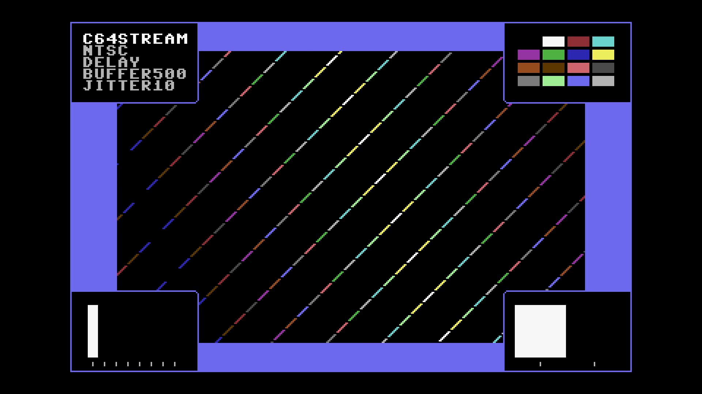

# C64 Stream E2E Test Report

## Scenario: NTSC 500ms Buffer + 10ms Jitter

- Generated: 2026-01-23 12:37:54 UTC
- Git Branch: doc/improvements
- Git ID: bd15461
- Environment: local

## Test configuration

- Format: NTSC
- Frames: 480
- Duration: 8.0 seconds
- Video Port: 21000
- Audio Port: 21001
- OBS Enabled: true

## Build information

- Project: c64stream
- Version: 1.0.3

## System information

- OS: Ubuntu 24.04.3 LTS (kernel 6.14.0-37-generic)
- OBS: 32.0.2
- CPU: Intel(R) Core(TM) i7-6700K CPU @ 4.00GHz (8 cores)
- RAM: 31Gi total, 26Gi available
- Disk (/): 1.8T total, 962G available

## Test results

### Validation Summary

- ✅ UDP Packet Reception: Expected 30803, Received 30743, Missing 60 (0.19%)
- ✅ Network Timing: span=8012.8ms, video_mean=405.4us, audio_mean=4006.0us
- ✅ Frame Processing: 478 frames processed
- ✅ Video Recording: 10.7 MB
- ✅ Content Integrity: Verified

### Resource Usage

During the test's processing window (18.3s, 35 samples) (8 cores):

| Metric | Min | Median | Mean | Max |
|--------|-----|--------|------|-----|
| CPU | 47.6% | 62.6% | 60.11% | 74.1% |
| RAM | 4671.7 MB | 4834.29 MB | 4817.1 MB | 4888.65 MB |
| GPU | 0% | 10% | 13.54% | 53% |

Details: [resource.csv](resource.csv) | [resource.json](resource.json)

### Packet & Network Data

- ✅ Packet Generation: 28800 video, 2003 audio packets
- ✅ UDP Replay: Completed successfully
- Events: [network.csv](network.csv), [obs.csv](obs.csv), [playback.csv](playback.csv)

#### Network Quality (Measured)

- Packet span (first→last): 8012.760 ms
- Total packets analyzed: 21762

| Stream | Packets | Spacing (min) | Spacing (mean) | Spacing (max) | CV | Burst <0.5×P50 | Gaps >2×P50 | P99/P50 |
|--------|---------|---------------|----------------|---------------|----|--------------|------------|--------|
| All | 21762 | 0.001 ms | 0.736 ms | 14.612 ms | 199.24% | 32.08% | 29.80% | 31.568 |
| Video | 19764 | 0.001 ms | 0.405 ms | 4.263 ms | 129.55% | 28.13% | 26.68% | 11.682 |
| Audio | 1998 | 0.001 ms | 4.006 ms | 14.612 ms | 74.55% | 27.03% | 17.82% | 3.382 |

| Stream | Packets | Jitter (median) | Jitter (max) | Out-of-Order |
|--------|---------|-----------------|--------------|--------------|
| Video | 19764 | 0.172 ms | 4.030 ms | 9113 (46.1%) |
| Audio | 1998 | 2.106 ms | 11.111 ms | 346 (17.3%) |

Details: [network.json](network.json)

### A/V Sync

- ✅ Good synchronization (100.0%): avg offset 10.4ms, max 12.7ms

#### Sync Details

- 🟢 Pop #1 [L]: audio=10356.0ms, video=10346.7ms (frame 619), diff=9.3ms
- 🟢 Pop #2 [R]: audio=11158.0ms, video=11149.0ms (frame 667), diff=9.0ms
- 🟢 Pop #3 [L]: audio=11963.0ms, video=11951.3ms (frame 715), diff=11.7ms
- 🟢 Pop #4 [R]: audio=12764.0ms, video=12753.7ms (frame 763), diff=10.3ms
- 🟢 Pop #5 [L]: audio=13566.0ms, video=13556.0ms (frame 811), diff=10.0ms
- 🟢 Pop #6 [R]: audio=14369.0ms, video=14358.3ms (frame 859), diff=10.7ms
- 🟢 Pop #7 [L]: audio=15171.0ms, video=15160.6ms (frame 907), diff=10.4ms
- 🟢 Pop #8 [R]: audio=15972.0ms, video=15963.0ms (frame 955), diff=9.0ms
- 🟢 Pop #9 [L]: audio=16778.0ms, video=16765.3ms (frame 1003), diff=12.7ms

- Channels: LRLRLRLRL
- 🔁 Channel alternation: OK (alternating, starts with L)

### Frame Progression

- 🟢 Frame sequence verified (478 frames analyzed, 0 colors)

- Settling: 4.0s (pass/fail uses post-settling only)

| Window | Stuck runs (count/min/med/max) | Skips (count/min/med/max) | Back steps | Severe steps |
|--------|------------------------------:|--------------------------:|-----------:|-------------:|
| During settling | 1/3/3/3 | 1/2/2/2 | 0 | 0 |
| After settling | 0/0/0/0 | 0/0/0/0 | 0 | 0 |

See [playback.csv](playback.csv) for frame-by-frame playback timeline with anomaly markers.

#### Playback Jitter Clusters (post-settling)

- Definition: rows with repeated=1 or skipped=1 in playback.csv; clustering uses max gap 0.5s
- Note: this is independent from the Frame Progression (frame-box) check above
- Note: repeated/skipped markers only exist while content is detected (video_s 9.962–20.961).
  The jitter-free tail after content ends is expected and does not indicate steady-state performance.

| # | Events | Center (s) | Std dev (s) | Span (s) | Window (s) |
|---|--------|------------|-------------|----------|------------|
| 1 | 2 | 10.029 | 0.017 | 0.034 | 10.012–10.046 |

### Video

- Download: [c64_recording.mp4](c64_recording.mp4) (Available from local runs or CI build artifacts.)
- Duration: 21.5 s

### Sample Frame

- **Top-left**: Text box with scenario name
- **Top-right**: VIC-II palette reference grid of all C64 colors
- **Center**: Diagonal pattern cycling through all C64 colors
- **Bottom-left**: Frame progression indicator (8-slot moving bar, cycles every 8 frames)
- **Bottom-right**: A/V pop indicator (pops every 48 frames, split left/right for audio channels)
- Taken from frame 619 at 00:10.3 of the 21.5 s video above.
