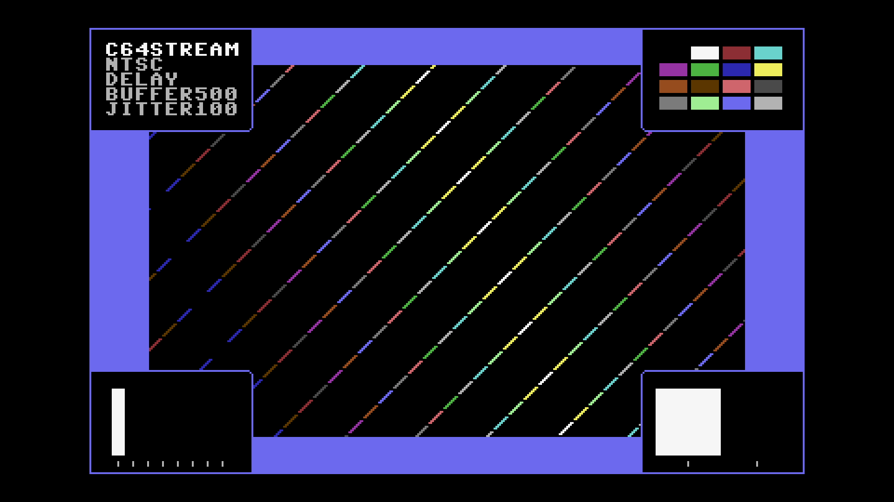

# C64 Stream E2E Test Report

## Scenario: NTSC 500ms Buffer + 100ms Jitter

- Generated: 2026-01-23 12:39:09 UTC
- Git Branch: doc/improvements
- Git ID: bd15461
- Environment: local

## Test configuration

- Format: NTSC
- Frames: 480
- Duration: 8.0 seconds
- Video Port: 21000
- Audio Port: 21001
- OBS Enabled: true

## Build information

- Project: c64stream
- Version: 1.0.3

## System information

- OS: Ubuntu 24.04.3 LTS (kernel 6.14.0-37-generic)
- OBS: 32.0.2
- CPU: Intel(R) Core(TM) i7-6700K CPU @ 4.00GHz (8 cores)
- RAM: 31Gi total, 26Gi available
- Disk (/): 1.8T total, 962G available

## Test results

### Validation Summary

- ✅ UDP Packet Reception: Expected 30803, Received 30745, Missing 58 (0.19%)
- ✅ Network Timing: span=8068.1ms, video_mean=412.3us, audio_mean=4011.5us
- ✅ Frame Processing: 478 frames processed
- ✅ Video Recording: 10.7 MB
- ✅ Content Integrity: Verified

### Resource Usage

During the test's processing window (18.3s, 35 samples) (8 cores):

| Metric | Min | Median | Mean | Max |
|--------|-----|--------|------|-----|
| CPU | 48% | 66.1% | 61.53% | 74% |
| RAM | 4735.48 MB | 4845.57 MB | 4840.91 MB | 4877.86 MB |
| GPU | 0% | 0% | 6% | 52% |

Details: [resource.csv](resource.csv) | [resource.json](resource.json)

### Packet & Network Data

- ✅ Packet Generation: 28800 video, 2003 audio packets
- ✅ UDP Replay: Completed successfully
- Events: [network.csv](network.csv), [obs.csv](obs.csv), [playback.csv](playback.csv)

#### Network Quality (Measured)

- Packet span (first→last): 8068.132 ms
- Total packets analyzed: 21570

| Stream | Packets | Spacing (min) | Spacing (mean) | Spacing (max) | CV | Burst <0.5×P50 | Gaps >2×P50 | P99/P50 |
|--------|---------|---------------|----------------|---------------|----|--------------|------------|--------|
| All | 21570 | 0.001 ms | 0.746 ms | 28.769 ms | 222.07% | 32.35% | 30.46% | 36.825 |
| Video | 19570 | 0.001 ms | 0.412 ms | 8.361 ms | 132.63% | 28.13% | 27.09% | 11.655 |
| Audio | 2000 | 0.001 ms | 4.012 ms | 28.769 ms | 96.29% | 30.45% | 26.25% | 5.809 |

| Stream | Packets | Jitter (median) | Jitter (max) | Out-of-Order |
|--------|---------|-----------------|--------------|--------------|
| Video | 19570 | 0.171 ms | 8.129 ms | 9707 (49.6%) |
| Audio | 2000 | 2.061 ms | 25.973 ms | 943 (47.1%) |

Details: [network.json](network.json)

### A/V Sync

- ✅ Good synchronization (100.0%): avg offset 44.0ms, max 45.7ms

#### Sync Details

- 🟡 Pop #1 [L]: audio=10436.0ms, video=10480.4ms (frame 627), diff=44.4ms
- 🟡 Pop #2 [R]: audio=11237.0ms, video=11282.7ms (frame 675), diff=45.7ms
- 🟡 Pop #3 [L]: audio=12042.0ms, video=12085.0ms (frame 723), diff=43.0ms
- 🟡 Pop #4 [R]: audio=12844.0ms, video=12887.4ms (frame 771), diff=43.4ms
- 🟡 Pop #5 [L]: audio=13644.0ms, video=13689.7ms (frame 819), diff=45.7ms
- 🟡 Pop #6 [R]: audio=14449.0ms, video=14492.0ms (frame 867), diff=43.0ms
- 🟡 Pop #7 [L]: audio=15250.0ms, video=15294.4ms (frame 915), diff=44.4ms
- 🟡 Pop #8 [R]: audio=16052.0ms, video=16096.7ms (frame 963), diff=44.7ms
- 🟡 Pop #9 [L]: audio=16857.0ms, video=16899.0ms (frame 1011), diff=42.0ms

- Channels: LRLRLRLRL
- 🔁 Channel alternation: OK (alternating, starts with L)

### Frame Progression

- 🟢 Frame sequence verified (478 frames analyzed, 0 colors)

- Settling: 4.0s (pass/fail uses post-settling only)

| Window | Stuck runs (count/min/med/max) | Skips (count/min/med/max) | Back steps | Severe steps |
|--------|------------------------------:|--------------------------:|-----------:|-------------:|
| During settling | 5/2/2/2 | 5/1/1/1 | 0 | 0 |
| After settling | 1/2/2/2 | 2/1/1/1 | 0 | 0 |

See [playback.csv](playback.csv) for frame-by-frame playback timeline with anomaly markers.

#### Playback Jitter Clusters (post-settling)

- Definition: rows with repeated=1 or skipped=1 in playback.csv; clustering uses max gap 0.5s
- Note: this is independent from the Frame Progression (frame-box) check above
- Note: repeated/skipped markers only exist while content is detected (video_s 10.163–21.095).
  The jitter-free tail after content ends is expected and does not indicate steady-state performance.

| # | Events | Center (s) | Std dev (s) | Span (s) | Window (s) |
|---|--------|------------|-------------|----------|------------|
| 1 | 6 | 10.740 | 0.099 | 0.251 | 10.631–10.882 |
| 2 | 4 | 13.623 | 0.126 | 0.268 | 13.489–13.757 |
| 3 | 2 | 17.041 | 0.008 | 0.016 | 17.033–17.049 |

### Video

- Download: [c64_recording.mp4](c64_recording.mp4) (Available from local runs or CI build artifacts.)
- Duration: 21.5 s

### Sample Frame

- **Top-left**: Text box with scenario name
- **Top-right**: VIC-II palette reference grid of all C64 colors
- **Center**: Diagonal pattern cycling through all C64 colors
- **Bottom-left**: Frame progression indicator (8-slot moving bar, cycles every 8 frames)
- **Bottom-right**: A/V pop indicator (pops every 48 frames, split left/right for audio channels)
- Taken from frame 628 at 00:10.5 of the 21.5 s video above.
