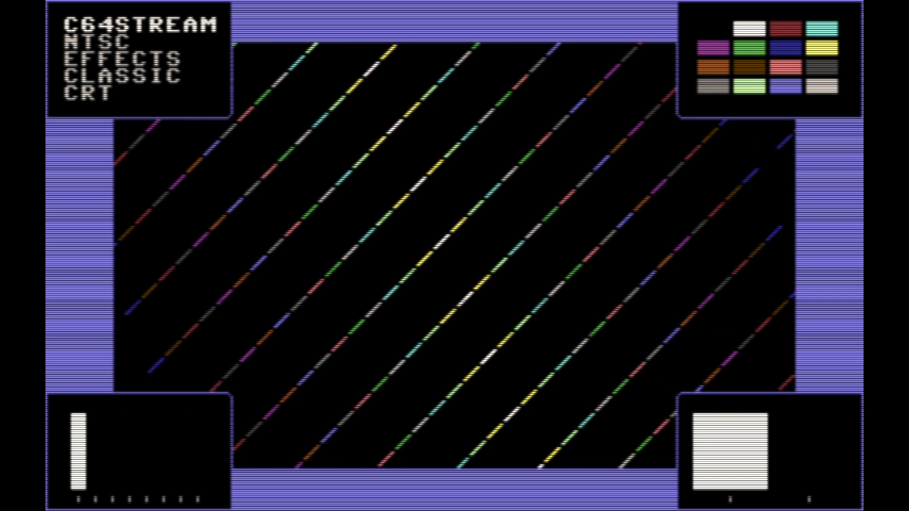

# C64 Stream E2E Test Report

## Scenario: NTSC Effects Classic CRT

- Generated: 2026-01-23 14:44:33 UTC
- Git Branch: test/update-e2e-results
- Git ID: 4e129b1
- Environment: local

## Test configuration

- Format: NTSC
- Frames: 480
- Duration: 8.0 seconds
- Video Port: 21000
- Audio Port: 21001
- OBS Enabled: true

## Build information

- Project: c64stream
- Version: 1.0.3

## System information

- OS: Ubuntu 24.04.3 LTS (kernel 6.14.0-37-generic)
- OBS: 32.0.2
- CPU: Intel(R) Core(TM) i7-6700K CPU @ 4.00GHz (8 cores)
- RAM: 31Gi total, 25Gi available
- Disk (/): 1.8T total, 962G available

## Test results

### Validation Summary

- ❓ UDP Packet Reception: Media source (no UDP)
- ❓ Network Timing: Media source (no UDP)
- ✅ Frame Processing: 476 frames processed
- ✅ Video Recording: 8.9 MB
- ❓ Content Integrity: Media source (no UDP)

### Resource Usage

During the test's processing window (14.9s, 28 samples) (8 cores):

| Metric | Min | Median | Mean | Max |
|--------|-----|--------|------|-----|
| CPU | 57.3% | 95.45% | 84.31% | 96.8% |
| RAM | 5004.74 MB | 5125.27 MB | 5118.32 MB | 5174.25 MB |
| GPU | 16% | 33% | 30% | 44% |

Details: [resource.csv](resource.csv) | [resource.json](resource.json)

### Packet & Network Data

- ✅ Packet Generation: 28800 video, 2003 audio packets
- ✅ UDP Replay: Completed successfully
- Events: [network.csv](network.csv), [obs.csv](obs.csv), [playback.csv](playback.csv)

#### Network Quality (Measured)

- Packet span (first→last): 7979.790 ms
- Total packets analyzed: 26186

| Stream | Packets | Spacing (min) | Spacing (mean) | Spacing (max) | CV | Burst <0.5×P50 | Gaps >2×P50 | P99/P50 |
|--------|---------|---------------|----------------|---------------|----|--------------|------------|--------|
| All | 26186 | 0.001 ms | 0.609 ms | 6.398 ms | 167.48% | 9.91% | 12.86% | 14.276 |
| Video | 24193 | 0.001 ms | 0.330 ms | 3.147 ms | 86.07% | 10.65% | 5.79% | 5.906 |
| Audio | 1993 | 1.999 ms | 4.001 ms | 6.398 ms | 12.47% | 0.05% | 0.00% | 1.391 |

| Stream | Packets | Jitter (median) | Jitter (max) | Out-of-Order |
|--------|---------|-----------------|--------------|--------------|
| Video | 24193 | 0.032 ms | 2.848 ms | 0 |
| Audio | 1993 | 0.051 ms | 2.399 ms | 0 |

Details: [network.json](network.json)

### A/V Sync

- ✅ Good synchronization (100.0%): avg offset 797.8ms, max 1598.9ms

#### Sync Details

- • Pop #1 [L]: audio=3255.0ms, video=4847.4ms (frame 290), diff=1592.4ms
- • Pop #2 [R]: audio=4055.0ms, video=4847.4ms (frame 290), diff=792.4ms
- 🟢 Pop #3 [L]: audio=4861.0ms, video=4864.1ms (frame 291), diff=3.1ms
- • Pop #4 [R]: audio=5661.0ms, video=4864.1ms (frame 291), diff=796.9ms
- • Pop #5 [L]: audio=6463.0ms, video=4864.1ms (frame 291), diff=1598.9ms
- • Pop #6 [R]: audio=7266.0ms, video=8859.0ms (frame 530), diff=1593.0ms
- • Pop #7 [L]: audio=8067.0ms, video=8859.0ms (frame 530), diff=792.0ms
- 🟢 Pop #8 [R]: audio=8867.0ms, video=8859.0ms (frame 530), diff=8.0ms
- 🟢 Pop #9 [L]: audio=9675.0ms, video=9678.1ms (frame 579), diff=3.1ms

- Channels: LRLRLRLRL
- 🔁 Channel alternation: OK (alternating, starts with L)

### Frame Progression

- 🟡 Frame sequence OK with jitter (skips=137, back_steps=1) (post-settling)

- Settling: 4.0s (pass/fail uses post-settling only)

| Window | Stuck runs (count/min/med/max) | Skips (count/min/med/max) | Back steps | Severe steps |
|--------|------------------------------:|--------------------------:|-----------:|-------------:|
| During settling | 98/2/2/4 | 90/1/1/3 | 0 | 0 |
| After settling | 0/0/0/0 | 94/1/1/3 | 1 | 0 |

See [playback.csv](playback.csv) for frame-by-frame playback timeline with anomaly markers.

#### Playback Jitter Clusters (post-settling)

- Definition: rows with repeated=1 or skipped=1 in playback.csv; clustering uses max gap 0.5s
- Note: this is independent from the Frame Progression (frame-box) check above
- Note: repeated/skipped markers only exist while content is detected (video_s 2.875–10.848).
  The jitter-free tail after content ends is expected and does not indicate steady-state performance.

| # | Events | Center (s) | Std dev (s) | Span (s) | Window (s) |
|---|--------|------------|-------------|----------|------------|
| 1 | 198 | 7.062 | 1.942 | 6.787 | 4.028–10.815 |

### Video

- Download: [c64_recording.mp4](c64_recording.mp4) (Available from local runs or CI build artifacts.)
- Duration: 18.0 s

### Sample Frame

- **Top-left**: Text box with scenario name
- **Top-right**: VIC-II palette reference grid of all C64 colors
- **Center**: Diagonal pattern cycling through all C64 colors
- **Bottom-left**: Frame progression indicator (8-slot moving bar, cycles every 8 frames)
- **Bottom-right**: A/V pop indicator (pops every 48 frames, split left/right for audio channels)
- Taken from frame 291 at 00:04.9 of the 18.0 s video above.
