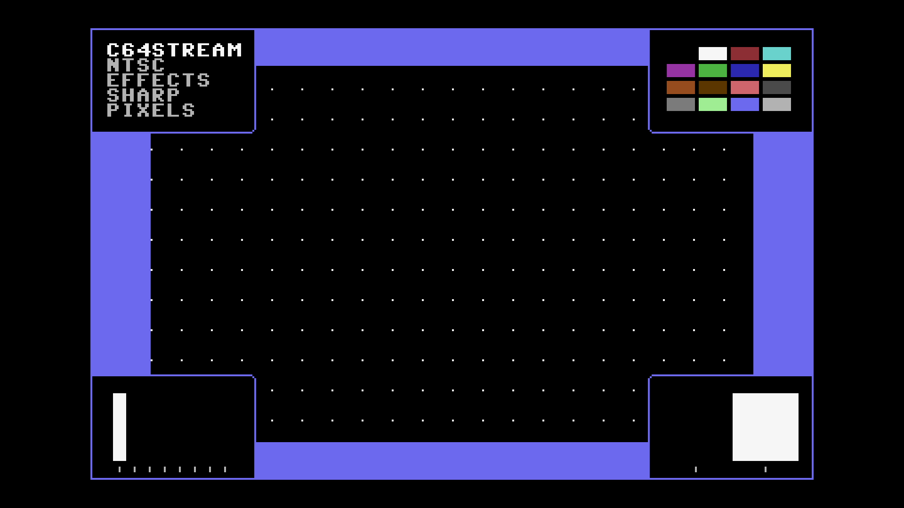

# C64 Stream E2E Test Report

## Scenario: NTSC Effects Sharp Pixels

- Generated: 2026-01-23 14:42:44 UTC
- Git Branch: test/update-e2e-results
- Git ID: 4e129b1
- Environment: local

## Test configuration

- Format: NTSC
- Frames: 480
- Duration: 8.0 seconds
- Video Port: 21000
- Audio Port: 21001
- OBS Enabled: true

## Build information

- Project: c64stream
- Version: 1.0.3

## System information

- OS: Ubuntu 24.04.3 LTS (kernel 6.14.0-37-generic)
- OBS: 32.0.2
- CPU: Intel(R) Core(TM) i7-6700K CPU @ 4.00GHz (8 cores)
- RAM: 31Gi total, 25Gi available
- Disk (/): 1.8T total, 962G available

## Test results

### Validation Summary

- ❓ UDP Packet Reception: Media source (no UDP)
- ❓ Network Timing: Media source (no UDP)
- ✅ Frame Processing: 477 frames processed
- ✅ Video Recording: 8.9 MB
- ❓ Content Integrity: Media source (no UDP)

### Resource Usage

During the test's processing window (14.8s, 28 samples) (8 cores):

| Metric | Min | Median | Mean | Max |
|--------|-----|--------|------|-----|
| CPU | 88.2% | 90.25% | 90.55% | 94.8% |
| RAM | 3862.82 MB | 3917.38 MB | 3921.05 MB | 4039.57 MB |
| GPU | 15% | 19% | 27.32% | 44% |

Details: [resource.csv](resource.csv) | [resource.json](resource.json)

### Packet & Network Data

- ✅ Packet Generation: 28800 video, 2003 audio packets
- ✅ UDP Replay: Completed successfully
- Events: [network.csv](network.csv), [obs.csv](obs.csv), [playback.csv](playback.csv)

#### Network Quality (Measured)

- Packet span (first→last): 7979.790 ms
- Total packets analyzed: 26186

| Stream | Packets | Spacing (min) | Spacing (mean) | Spacing (max) | CV | Burst <0.5×P50 | Gaps >2×P50 | P99/P50 |
|--------|---------|---------------|----------------|---------------|----|--------------|------------|--------|
| All | 26186 | 0.001 ms | 0.609 ms | 6.398 ms | 167.48% | 9.91% | 12.86% | 14.276 |
| Video | 24193 | 0.001 ms | 0.330 ms | 3.147 ms | 86.07% | 10.65% | 5.79% | 5.906 |
| Audio | 1993 | 1.999 ms | 4.001 ms | 6.398 ms | 12.47% | 0.05% | 0.00% | 1.391 |

| Stream | Packets | Jitter (median) | Jitter (max) | Out-of-Order |
|--------|---------|-----------------|--------------|--------------|
| Video | 24193 | 0.032 ms | 2.848 ms | 0 |
| Audio | 1993 | 0.051 ms | 2.399 ms | 0 |

Details: [network.json](network.json)

### A/V Sync

- ✅ Good synchronization (100.0%): avg offset 398.9ms, max 1575.2ms

#### Sync Details

- • Pop #1 [L]: audio=3323.0ms, video=4111.9ms (frame 246), diff=788.9ms
- 🟢 Pop #2 [R]: audio=4124.0ms, video=4128.6ms (frame 247), diff=4.6ms
- 🟢 Pop #3 [L]: audio=4929.0ms, video=4931.0ms (frame 295), diff=2.0ms
- 🟢 Pop #4 [R]: audio=5730.0ms, video=5733.3ms (frame 343), diff=3.3ms
- 🟢 Pop #5 [L]: audio=6531.0ms, video=6535.6ms (frame 391), diff=4.6ms
- • Pop #6 [R]: audio=7336.0ms, video=8123.6ms (frame 486), diff=787.6ms
- 🟢 Pop #7 [L]: audio=8137.0ms, video=8140.3ms (frame 487), diff=3.3ms
- 🟢 Pop #8 [R]: audio=8936.0ms, video=8942.6ms (frame 535), diff=6.6ms
- • Pop #9 [L]: audio=9743.0ms, video=8942.6ms (frame 535), diff=800.4ms
- 🟢 Pop #10 [L]: audio=14353.0ms, video=14341.6ms (frame 858), diff=11.4ms
- • Pop #11 [R]: audio=15154.0ms, video=14341.6ms (frame 858), diff=812.4ms
- • Pop #12 [L]: audio=15959.0ms, video=17534.2ms (frame 1049), diff=1575.2ms
- • Pop #13 [R]: audio=16760.0ms, video=17534.2ms (frame 1049), diff=774.2ms
- 🟢 Pop #14 [L]: audio=17561.0ms, video=17550.9ms (frame 1050), diff=10.1ms

- Channels: LRLRLRLRLLRLRL
- 🔁 Channel alternation: MISMATCH

### Frame Progression

- 🟢 Frame sequence verified (477 frames analyzed, 0 colors)

- Settling: 4.0s (pass/fail uses post-settling only)

| Window | Stuck runs (count/min/med/max) | Skips (count/min/med/max) | Back steps | Severe steps |
|--------|------------------------------:|--------------------------:|-----------:|-------------:|
| During settling | 43/2/2/2 | 42/1/1/1 | 0 | 0 |
| After settling | 32/2/2/2 | 33/1/1/1 | 0 | 0 |

See [playback.csv](playback.csv) for frame-by-frame playback timeline with anomaly markers.

#### Playback Jitter Clusters (post-settling)

- Definition: rows with repeated=1 or skipped=1 in playback.csv; clustering uses max gap 0.5s
- Note: this is independent from the Frame Progression (frame-box) check above
- Note: repeated/skipped markers only exist while content is detected (video_s 2.942–17.902).
  The jitter-free tail after content ends is expected and does not indicate steady-state performance.

| # | Events | Center (s) | Std dev (s) | Span (s) | Window (s) |
|---|--------|------------|-------------|----------|------------|
| 1 | 64 | 7.251 | 2.188 | 6.820 | 4.095–10.915 |

### Video

- Download: [c64_recording.mp4](c64_recording.mp4) (Available from local runs or CI build artifacts.)
- Duration: 17.9 s

### Sample Frame

- **Top-left**: Text box with scenario name
- **Top-right**: VIC-II palette reference grid of all C64 colors
- **Center**: Diagonal pattern cycling through all C64 colors
- **Bottom-left**: Frame progression indicator (8-slot moving bar, cycles every 8 frames)
- **Bottom-right**: A/V pop indicator (pops every 48 frames, split left/right for audio channels)
- Taken from frame 247 at 00:04.1 of the 17.9 s video above.
