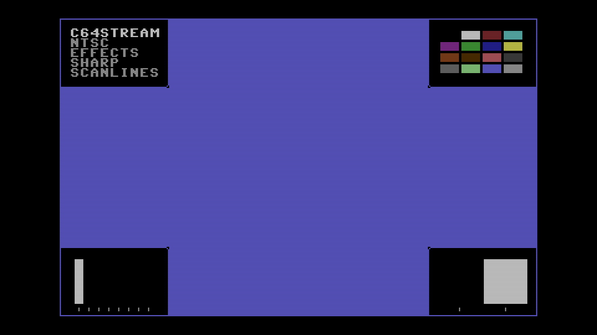

# C64 Stream E2E Test Report

## Scenario: NTSC Effects Sharp Scanlines

- Generated: 2026-01-23 12:44:42 UTC
- Git Branch: doc/improvements
- Git ID: bd15461
- Environment: local

## Test configuration

- Format: NTSC
- Frames: 480
- Duration: 8.0 seconds
- Video Port: 21000
- Audio Port: 21001
- OBS Enabled: true

## Build information

- Project: c64stream
- Version: 1.0.3

## System information

- OS: Ubuntu 24.04.3 LTS (kernel 6.14.0-37-generic)
- OBS: 32.0.2
- CPU: Intel(R) Core(TM) i7-6700K CPU @ 4.00GHz (8 cores)
- RAM: 31Gi total, 26Gi available
- Disk (/): 1.8T total, 962G available

## Test results

### Validation Summary

- ❓ UDP Packet Reception: Media source (no UDP)
- ❓ Network Timing: Media source (no UDP)
- ✅ Frame Processing: 478 frames processed
- ✅ Video Recording: 7.5 MB
- ❓ Content Integrity: Media source (no UDP)

### Resource Usage

During the test's processing window (11.9s, 23 samples) (8 cores):

| Metric | Min | Median | Mean | Max |
|--------|-----|--------|------|-----|
| CPU | 70.6% | 71.5% | 71.94% | 77.2% |
| RAM | 4727.58 MB | 4767.07 MB | 4768.45 MB | 4803.78 MB |
| GPU | 0% | 0% | 3.83% | 31% |

Details: [resource.csv](resource.csv) | [resource.json](resource.json)

### Packet & Network Data

- ✅ Packet Generation: 28800 video, 2003 audio packets
- ✅ UDP Replay: Completed successfully
- Events: [network.csv](network.csv), [obs.csv](obs.csv), [playback.csv](playback.csv)

#### Network Quality (Measured)

- Packet span (first→last): 8068.132 ms
- Total packets analyzed: 21570

| Stream | Packets | Spacing (min) | Spacing (mean) | Spacing (max) | CV | Burst <0.5×P50 | Gaps >2×P50 | P99/P50 |
|--------|---------|---------------|----------------|---------------|----|--------------|------------|--------|
| All | 21570 | 0.001 ms | 0.746 ms | 28.769 ms | 222.07% | 32.35% | 30.46% | 36.825 |
| Video | 19570 | 0.001 ms | 0.412 ms | 8.361 ms | 132.63% | 28.13% | 27.09% | 11.655 |
| Audio | 2000 | 0.001 ms | 4.012 ms | 28.769 ms | 96.29% | 30.45% | 26.25% | 5.809 |

| Stream | Packets | Jitter (median) | Jitter (max) | Out-of-Order |
|--------|---------|-----------------|--------------|--------------|
| Video | 19570 | 0.171 ms | 8.129 ms | 9707 (49.6%) |
| Audio | 2000 | 2.061 ms | 25.973 ms | 943 (47.1%) |

Details: [network.json](network.json)

### A/V Sync

- ✅ Good synchronization (100.0%): avg offset 681.9ms, max 4003.7ms

#### Sync Details

- • Pop #1 [L]: audio=359.0ms, video=4362.7ms (frame 261), diff=4003.7ms
- • Pop #2 [R]: audio=1160.0ms, video=4362.7ms (frame 261), diff=3202.7ms
- • Pop #3 [L]: audio=1965.0ms, video=4362.7ms (frame 261), diff=2397.7ms
- • Pop #4 [R]: audio=2765.0ms, video=4362.7ms (frame 261), diff=1597.7ms
- • Pop #5 [L]: audio=3567.0ms, video=4362.7ms (frame 261), diff=795.7ms
- 🟢 Pop #6 [R]: audio=4372.0ms, video=4379.4ms (frame 262), diff=7.4ms
- 🟢 Pop #7 [L]: audio=5173.0ms, video=5165.0ms (frame 309), diff=8.0ms
- 🟢 Pop #8 [R]: audio=5974.0ms, video=5967.3ms (frame 357), diff=6.7ms
- 🟢 Pop #9 [L]: audio=6779.0ms, video=6786.3ms (frame 406), diff=7.3ms
- 🟢 Pop #10 [L]: audio=8402.0ms, video=8374.3ms (frame 501), diff=27.7ms
- 🟢 Pop #11 [R]: audio=9203.0ms, video=9176.6ms (frame 549), diff=26.4ms
- 🟢 Pop #12 [L]: audio=10008.0ms, video=9978.9ms (frame 597), diff=29.1ms
- 🟢 Pop #13 [R]: audio=10807.0ms, video=10781.3ms (frame 645), diff=25.7ms
- 🟢 Pop #14 [L]: audio=11610.0ms, video=11583.6ms (frame 693), diff=26.4ms
- 🟢 Pop #15 [R]: audio=12415.0ms, video=12385.9ms (frame 741), diff=29.1ms
- 🟢 Pop #16 [L]: audio=13216.0ms, video=13188.2ms (frame 789), diff=27.8ms
- 🟢 Pop #17 [R]: audio=14017.0ms, video=13990.6ms (frame 837), diff=26.4ms
- 🟢 Pop #18 [L]: audio=14822.0ms, video=14792.9ms (frame 885), diff=29.1ms

- Channels: LRLRLRLRLLRLRLRLRL
- 🔁 Channel alternation: MISMATCH

### Frame Progression

- 🟢 Frame sequence verified (478 frames analyzed, 0 colors)

- Settling: 4.0s (pass/fail uses post-settling only)

| Window | Stuck runs (count/min/med/max) | Skips (count/min/med/max) | Back steps | Severe steps |
|--------|------------------------------:|--------------------------:|-----------:|-------------:|
| During settling | 0/0/0/0 | 1/1/1/1 | 0 | 0 |
| After settling | 0/0/0/0 | 0/0/0/0 | 0 | 0 |

See [playback.csv](playback.csv) for frame-by-frame playback timeline with anomaly markers.

#### Playback Jitter Clusters (post-settling)

- Definition: rows with repeated=1 or skipped=1 in playback.csv; clustering uses max gap 0.5s
- Note: this is independent from the Frame Progression (frame-box) check above
- Note: repeated/skipped markers only exist while content is detected (video_s 4.396–12.386).
  The jitter-free tail after content ends is expected and does not indicate steady-state performance.

| # | Events | Center (s) | Std dev (s) | Span (s) | Window (s) |
|---|--------|------------|-------------|----------|------------|
| 1 | 1 | 7.973 | 0.000 | 0.000 | 7.973–7.973 |

### Video

- Download: [c64_recording.mp4](c64_recording.mp4) (Available from local runs or CI build artifacts.)
- Duration: 15.1 s

### Sample Frame

- **Top-left**: Text box with scenario name
- **Top-right**: VIC-II palette reference grid of all C64 colors
- **Center**: Diagonal pattern cycling through all C64 colors
- **Bottom-left**: Frame progression indicator (8-slot moving bar, cycles every 8 frames)
- **Bottom-right**: A/V pop indicator (pops every 48 frames, split left/right for audio channels)
- Taken from frame 262 at 00:04.4 of the 15.1 s video above.
