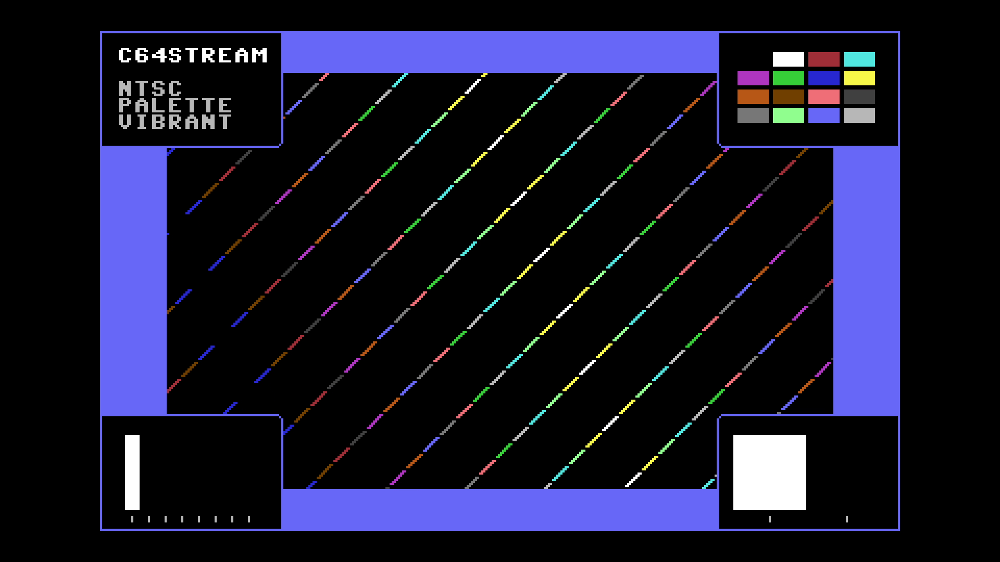

# C64 Stream E2E Test Report

## Scenario: NTSC Vibrant Palette

- Generated: 2026-01-23 12:48:35 UTC
- Git Branch: doc/improvements
- Git ID: bd15461
- Environment: local

## Test configuration

- Format: NTSC
- Frames: 480
- Duration: 8.0 seconds
- Video Port: 21000
- Audio Port: 21001
- OBS Enabled: true

## Build information

- Project: c64stream
- Version: 1.0.3

## System information

- OS: Ubuntu 24.04.3 LTS (kernel 6.14.0-37-generic)
- OBS: 32.0.2
- CPU: Intel(R) Core(TM) i7-6700K CPU @ 4.00GHz (8 cores)
- RAM: 31Gi total, 26Gi available
- Disk (/): 1.8T total, 962G available

## Test results

### Validation Summary

- ✅ UDP Packet Reception: Expected 30803, Received 30754, Missing 49 (0.16%)
- ✅ Network Timing: span=8009.6ms, video_mean=336.3us, audio_mean=4004.9us
- ✅ Frame Processing: 478 frames processed
- ✅ Video Recording: 10.7 MB
- ✅ Content Integrity: Verified

### Resource Usage

During the test's processing window (18.3s, 35 samples) (8 cores):

| Metric | Min | Median | Mean | Max |
|--------|-----|--------|------|-----|
| CPU | 48.2% | 52.2% | 51.81% | 62.5% |
| RAM | 4756.22 MB | 4843.21 MB | 4838.44 MB | 4881.64 MB |
| GPU | 5% | 19% | 22.74% | 63% |

Details: [resource.csv](resource.csv) | [resource.json](resource.json)

### Packet & Network Data

- ✅ Packet Generation: 28800 video, 2003 audio packets
- ✅ UDP Replay: Completed successfully
- Events: [network.csv](network.csv), [obs.csv](obs.csv), [playback.csv](playback.csv)

#### Network Quality (Measured)

- Packet span (first→last): 8009.592 ms
- Total packets analyzed: 25815

| Stream | Packets | Spacing (min) | Spacing (mean) | Spacing (max) | CV | Burst <0.5×P50 | Gaps >2×P50 | P99/P50 |
|--------|---------|---------------|----------------|---------------|----|--------------|------------|--------|
| All | 25815 | 0.001 ms | 0.620 ms | 6.765 ms | 169.52% | 9.05% | 15.19% | 16.511 |
| Video | 23816 | 0.001 ms | 0.336 ms | 3.914 ms | 100.86% | 9.81% | 8.10% | 7.928 |
| Audio | 1999 | 1.249 ms | 4.005 ms | 6.765 ms | 17.57% | 0.45% | 0.00% | 1.514 |

| Stream | Packets | Jitter (median) | Jitter (max) | Out-of-Order |
|--------|---------|-----------------|--------------|--------------|
| Video | 23816 | 0.015 ms | 3.635 ms | 0 |
| Audio | 1999 | 0.090 ms | 2.764 ms | 0 |

Details: [network.json](network.json)

### A/V Sync

- ✅ Good synchronization (100.0%): avg offset 19.9ms, max 22.2ms

#### Sync Details

- 🟢 Pop #1 [L]: audio=9865.0ms, video=9845.2ms (frame 589), diff=19.8ms
- 🟢 Pop #2 [R]: audio=10665.0ms, video=10647.5ms (frame 637), diff=17.5ms
- 🟢 Pop #3 [L]: audio=11471.0ms, video=11449.9ms (frame 685), diff=21.1ms
- 🟢 Pop #4 [R]: audio=12272.0ms, video=12252.2ms (frame 733), diff=19.8ms
- 🟢 Pop #5 [L]: audio=13073.0ms, video=13054.5ms (frame 781), diff=18.5ms
- 🟢 Pop #6 [R]: audio=13878.0ms, video=13856.9ms (frame 829), diff=21.1ms
- 🟢 Pop #7 [L]: audio=14679.0ms, video=14659.2ms (frame 877), diff=19.8ms
- 🟢 Pop #8 [R]: audio=15481.0ms, video=15461.5ms (frame 925), diff=19.5ms
- 🟢 Pop #9 [L]: audio=16286.0ms, video=16263.8ms (frame 973), diff=22.2ms

- Channels: LRLRLRLRL
- 🔁 Channel alternation: OK (alternating, starts with L)

### Frame Progression

- 🟢 Frame sequence verified (478 frames analyzed, 0 colors)

- Settling: 4.0s (pass/fail uses post-settling only)

| Window | Stuck runs (count/min/med/max) | Skips (count/min/med/max) | Back steps | Severe steps |
|--------|------------------------------:|--------------------------:|-----------:|-------------:|
| During settling | 2/2/2/3 | 2/1/1/2 | 0 | 0 |
| After settling | 1/2/2/2 | 1/1/1/1 | 0 | 0 |

See [playback.csv](playback.csv) for frame-by-frame playback timeline with anomaly markers.

#### Playback Jitter Clusters (post-settling)

- Definition: rows with repeated=1 or skipped=1 in playback.csv; clustering uses max gap 0.5s
- Note: this is independent from the Frame Progression (frame-box) check above
- Note: repeated/skipped markers only exist while content is detected (video_s 9.461–20.459).
  The jitter-free tail after content ends is expected and does not indicate steady-state performance.

| # | Events | Center (s) | Std dev (s) | Span (s) | Window (s) |
|---|--------|------------|-------------|----------|------------|
| 1 | 2 | 11.266 | 0.017 | 0.034 | 11.249–11.283 |
| 2 | 1 | 10.146 | 0.000 | 0.000 | 10.146–10.146 |
| 3 | 1 | 14.776 | 0.000 | 0.000 | 14.776–14.776 |

### Video

- Download: [c64_recording.mp4](c64_recording.mp4) (Available from local runs or CI build artifacts.)
- Duration: 21.5 s

### Sample Frame

- **Top-left**: Text box with scenario name
- **Top-right**: VIC-II palette reference grid of all C64 colors
- **Center**: Diagonal pattern cycling through all C64 colors
- **Bottom-left**: Frame progression indicator (8-slot moving bar, cycles every 8 frames)
- **Bottom-right**: A/V pop indicator (pops every 48 frames, split left/right for audio channels)
- Taken from frame 589 at 00:09.8 of the 21.5 s video above.
