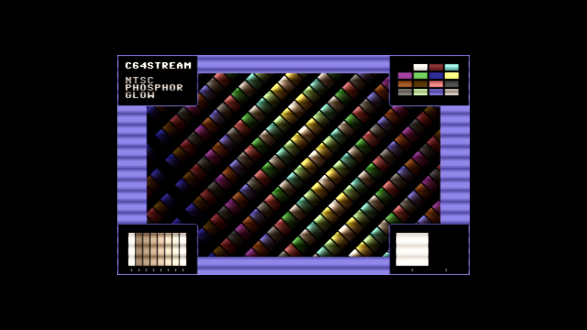

# C64 Stream E2E Test Report

## Scenario: NTSC Phosphor Glow

- Generated: 2026-01-23 12:49:51 UTC
- Git Branch: doc/improvements
- Git ID: bd15461
- Environment: local

## Test configuration

- Format: NTSC
- Frames: 480
- Duration: 8.0 seconds
- Video Port: 21000
- Audio Port: 21001
- OBS Enabled: true

## Build information

- Project: c64stream
- Version: 1.0.3

## System information

- OS: Ubuntu 24.04.3 LTS (kernel 6.14.0-37-generic)
- OBS: 32.0.2
- CPU: Intel(R) Core(TM) i7-6700K CPU @ 4.00GHz (8 cores)
- RAM: 31Gi total, 26Gi available
- Disk (/): 1.8T total, 962G available

## Test results

### Validation Summary

- ✅ UDP Packet Reception: Expected 30803, Received 30746, Missing 57 (0.19%)
- ✅ Network Timing: span=8006.9ms, video_mean=425.8us, audio_mean=4004.4us
- ✅ Frame Processing: 478 frames processed
- ✅ Video Recording: 10.6 MB
- ✅ Content Integrity: Verified

### Resource Usage

During the test's processing window (18.1s, 34 samples) (8 cores):

| Metric | Min | Median | Mean | Max |
|--------|-----|--------|------|-----|
| CPU | 88.2% | 90.7% | 90.44% | 92.5% |
| RAM | 4703.61 MB | 4815.97 MB | 4804.3 MB | 4854.16 MB |
| GPU | 5% | 30% | 32.03% | 62% |

Details: [resource.csv](resource.csv) | [resource.json](resource.json)

### Packet & Network Data

- ✅ Packet Generation: 28800 video, 2003 audio packets
- ✅ UDP Replay: Completed successfully
- Events: [network.csv](network.csv), [obs.csv](obs.csv), [playback.csv](playback.csv)

#### Network Quality (Measured)

- Packet span (first→last): 8006.891 ms
- Total packets analyzed: 20802

| Stream | Packets | Spacing (min) | Spacing (mean) | Spacing (max) | CV | Burst <0.5×P50 | Gaps >2×P50 | P99/P50 |
|--------|---------|---------------|----------------|---------------|----|--------------|------------|--------|
| All | 20802 | 0.001 ms | 0.770 ms | 14.010 ms | 179.85% | 20.07% | 22.40% | 22.158 |
| Video | 18803 | 0.001 ms | 0.426 ms | 10.773 ms | 169.46% | 21.75% | 14.68% | 12.728 |
| Audio | 1999 | 0.001 ms | 4.004 ms | 14.010 ms | 46.51% | 10.31% | 3.50% | 2.685 |

| Stream | Packets | Jitter (median) | Jitter (max) | Out-of-Order |
|--------|---------|-----------------|--------------|--------------|
| Video | 18803 | 0.052 ms | 10.490 ms | 0 |
| Audio | 1999 | 0.602 ms | 10.009 ms | 0 |

Details: [network.json](network.json)

### A/V Sync

- ✅ Good synchronization (100.0%): avg offset 17.7ms, max 34.0ms

#### Sync Details

- 🟢 Pop #1 [L]: audio=9929.0ms, video=9912.1ms (frame 593), diff=16.9ms
- 🟢 Pop #2 [R]: audio=10729.0ms, video=10714.4ms (frame 641), diff=14.6ms
- 🟢 Pop #3 [L]: audio=11534.0ms, video=11516.7ms (frame 689), diff=17.3ms
- 🟢 Pop #4 [R]: audio=12335.0ms, video=12319.1ms (frame 737), diff=15.9ms
- 🟢 Pop #5 [L]: audio=13135.0ms, video=13121.4ms (frame 785), diff=13.6ms
- 🟢 Pop #6 [R]: audio=13940.0ms, video=13923.7ms (frame 833), diff=16.3ms
- 🟢 Pop #7 [L]: audio=14742.0ms, video=14726.0ms (frame 881), diff=16.0ms
- 🟢 Pop #8 [R]: audio=15543.0ms, video=15528.4ms (frame 929), diff=14.6ms
- 🟢 Pop #9 [L]: audio=16348.0ms, video=16314.0ms (frame 976), diff=34.0ms

- Channels: LRLRLRLRL
- 🔁 Channel alternation: OK (alternating, starts with L)

### Frame Progression

- 🟢 Frame sequence verified (478 frames analyzed, 0 colors)

- Settling: 4.0s (pass/fail uses post-settling only)

| Window | Stuck runs (count/min/med/max) | Skips (count/min/med/max) | Back steps | Severe steps |
|--------|------------------------------:|--------------------------:|-----------:|-------------:|
| During settling | 9/2/6/421 | 5/1/4/5 | 2 | 0 |
| After settling | 0/0/0/0 | 0/0/0/0 | 0 | 0 |

See [playback.csv](playback.csv) for frame-by-frame playback timeline with anomaly markers.

#### Playback Jitter Clusters (post-settling)

- No post-settling repeated/skipped markers detected in playback timeline.

### Video

- Download: [c64_recording.mp4](c64_recording.mp4) (Available from local runs or CI build artifacts.)
- Duration: 21.4 s

### Sample Frame

- **Top-left**: Text box with scenario name
- **Top-right**: VIC-II palette reference grid of all C64 colors
- **Center**: Diagonal pattern cycling through all C64 colors
- **Bottom-left**: Frame progression indicator (8-slot moving bar, cycles every 8 frames)
- **Bottom-right**: A/V pop indicator (pops every 48 frames, split left/right for audio channels)
- Taken from frame 593 at 00:09.9 of the 21.4 s video above.
