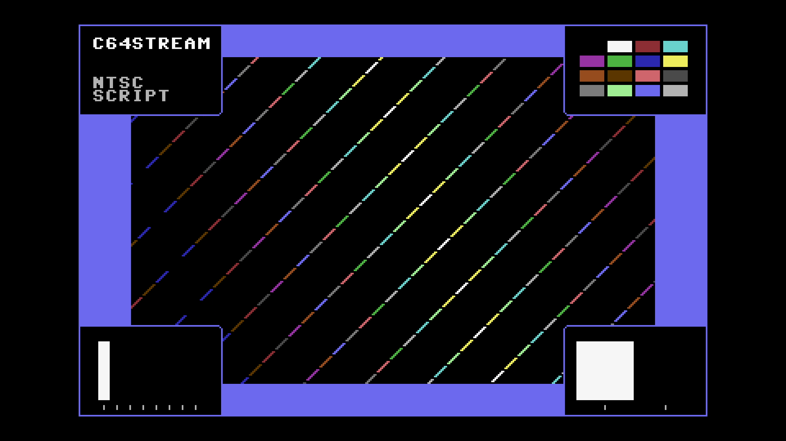

# C64 Stream E2E Test Report

## Scenario: NTSC Script

- Generated: 2026-01-23 12:51:06 UTC
- Git Branch: doc/improvements
- Git ID: bd15461
- Environment: local

## Test configuration

- Format: NTSC
- Frames: 480
- Duration: 8.0 seconds
- Video Port: 21000
- Audio Port: 21001
- OBS Enabled: true

## Build information

- Project: c64stream
- Version: 1.0.3

## System information

- OS: Ubuntu 24.04.3 LTS (kernel 6.14.0-37-generic)
- OBS: 32.0.2
- CPU: Intel(R) Core(TM) i7-6700K CPU @ 4.00GHz (8 cores)
- RAM: 31Gi total, 26Gi available
- Disk (/): 1.8T total, 962G available

## Test results

### Validation Summary

- ✅ UDP Packet Reception: Expected 30803, Received 30750, Missing 53 (0.17%)
- ✅ Network Timing: span=8009.3ms, video_mean=334.3us, audio_mean=4005.3us
- ✅ Frame Processing: 478 frames processed
- ✅ Video Recording: 10.7 MB
- ✅ Content Integrity: Verified

### Resource Usage

During the test's processing window (18.3s, 35 samples) (8 cores):

| Metric | Min | Median | Mean | Max |
|--------|-----|--------|------|-----|
| CPU | 47.7% | 51.2% | 52% | 66.7% |
| RAM | 4705.62 MB | 4844.6 MB | 4835.72 MB | 4900.78 MB |
| GPU | 0% | 41% | 31.91% | 57% |

Details: [resource.csv](resource.csv) | [resource.json](resource.json)

### Packet & Network Data

- ✅ Packet Generation: 28800 video, 2003 audio packets
- ✅ UDP Replay: Completed successfully
- Events: [network.csv](network.csv), [obs.csv](obs.csv), [playback.csv](playback.csv)

#### Network Quality (Measured)

- Packet span (first→last): 8009.347 ms
- Total packets analyzed: 25957

| Stream | Packets | Spacing (min) | Spacing (mean) | Spacing (max) | CV | Burst <0.5×P50 | Gaps >2×P50 | P99/P50 |
|--------|---------|---------------|----------------|---------------|----|--------------|------------|--------|
| All | 25957 | 0.001 ms | 0.617 ms | 6.484 ms | 169.66% | 8.88% | 14.94% | 16.345 |
| Video | 23958 | 0.001 ms | 0.334 ms | 3.019 ms | 99.26% | 9.60% | 7.88% | 7.910 |
| Audio | 1999 | 1.765 ms | 4.005 ms | 6.484 ms | 17.16% | 0.65% | 0.00% | 1.503 |

| Stream | Packets | Jitter (median) | Jitter (max) | Out-of-Order |
|--------|---------|-----------------|--------------|--------------|
| Video | 23958 | 0.016 ms | 2.740 ms | 0 |
| Audio | 1999 | 0.097 ms | 2.483 ms | 0 |

Details: [network.json](network.json)

### A/V Sync

- ✅ Good synchronization (100.0%): avg offset 18.2ms, max 19.9ms

#### Sync Details

- 🟢 Pop #1 [L]: audio=9847.0ms, video=9828.5ms (frame 588), diff=18.5ms
- 🟢 Pop #2 [R]: audio=10647.0ms, video=10630.8ms (frame 636), diff=16.2ms
- 🟢 Pop #3 [L]: audio=11452.0ms, video=11433.2ms (frame 684), diff=18.8ms
- 🟢 Pop #4 [R]: audio=12255.0ms, video=12235.5ms (frame 732), diff=19.5ms
- 🟢 Pop #5 [L]: audio=13055.0ms, video=13037.8ms (frame 780), diff=17.2ms
- 🟢 Pop #6 [R]: audio=13860.0ms, video=13840.1ms (frame 828), diff=19.9ms
- 🟢 Pop #7 [L]: audio=14660.0ms, video=14642.5ms (frame 876), diff=17.5ms
- 🟢 Pop #8 [R]: audio=15462.0ms, video=15444.8ms (frame 924), diff=17.2ms
- 🟢 Pop #9 [L]: audio=16266.0ms, video=16247.1ms (frame 972), diff=18.9ms

- Channels: LRLRLRLRL
- 🔁 Channel alternation: OK (alternating, starts with L)

### Frame Progression

- 🟢 Frame sequence verified (478 frames analyzed, 0 colors)

- Settling: 4.0s (pass/fail uses post-settling only)

See [playback.csv](playback.csv) for frame-by-frame playback timeline with anomaly markers.

#### Playback Jitter Clusters (post-settling)

- No post-settling repeated/skipped markers detected in playback timeline.

### Video

- Download: [c64_recording.mp4](c64_recording.mp4) (Available from local runs or CI build artifacts.)
- Duration: 21.5 s

### Sample Frame

- **Top-left**: Text box with scenario name
- **Top-right**: VIC-II palette reference grid of all C64 colors
- **Center**: Diagonal pattern cycling through all C64 colors
- **Bottom-left**: Frame progression indicator (8-slot moving bar, cycles every 8 frames)
- **Bottom-right**: A/V pop indicator (pops every 48 frames, split left/right for audio channels)
- Taken from frame 588 at 00:09.8 of the 21.5 s video above.
