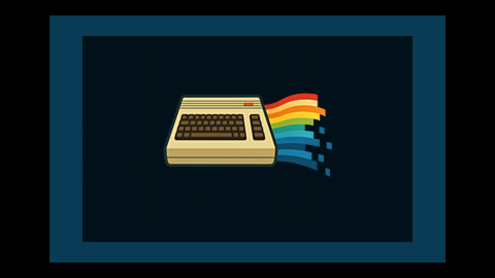

# C64 Stream E2E Test Report

## Scenario: NTSC Script Record

- Generated: 2026-01-23 12:51:42 UTC
- Git Branch: doc/improvements
- Git ID: bd15461
- Environment: local

## Test configuration

- Format: NTSC
- Frames: 480
- Duration: 8.0 seconds
- Video Port: 21000
- Audio Port: 21001
- OBS Enabled: true

## Build information

- Project: c64stream
- Version: 1.0.3

## System information

- OS: Ubuntu 24.04.3 LTS (kernel 6.14.0-37-generic)
- OBS: 32.0.2
- CPU: Intel(R) Core(TM) i7-6700K CPU @ 4.00GHz (8 cores)
- RAM: 31Gi total, 26Gi available
- Disk (/): 1.8T total, 962G available

## Test results

### Validation Summary

- ✅ UDP Packet Reception: Expected 30803, Received 30750, Missing 53 (0.17%)
- ✅ Network Timing: span=8009.0ms, video_mean=326.7us, audio_mean=4005.3us
- ✅ Frame Processing: 479 frames processed
- ✅ Video Recording: 0.3 MB
- ✅ Content Integrity: Verified

### Resource Usage

During the test's processing window (18.2s, 34 samples) (8 cores):

| Metric | Min | Median | Mean | Max |
|--------|-----|--------|------|-----|
| CPU | 41.2% | 49.8% | 51.72% | 61.9% |
| RAM | 4478.8 MB | 4551.58 MB | 4575.49 MB | 4814.04 MB |
| GPU | 0% | 0% | 8.18% | 46% |

Details: [resource.csv](resource.csv) | [resource.json](resource.json)

### Packet & Network Data

- ✅ Packet Generation: 28800 video, 2003 audio packets
- ✅ UDP Replay: Completed successfully
- Events: [network.csv](network.csv), [obs.csv](obs.csv)

#### Network Quality (Measured)

- Packet span (first→last): 8008.986 ms
- Total packets analyzed: 26514

| Stream | Packets | Spacing (min) | Spacing (mean) | Spacing (max) | CV | Burst <0.5×P50 | Gaps >2×P50 | P99/P50 |
|--------|---------|---------------|----------------|---------------|----|--------------|------------|--------|
| All | 26514 | 0.001 ms | 0.604 ms | 8.989 ms | 182.34% | 10.78% | 12.17% | 16.871 |
| Video | 24515 | 0.001 ms | 0.327 ms | 5.598 ms | 134.65% | 11.45% | 5.14% | 11.942 |
| Audio | 1999 | 0.004 ms | 4.005 ms | 8.989 ms | 27.41% | 4.80% | 0.25% | 1.862 |

| Stream | Packets | Jitter (median) | Jitter (max) | Out-of-Order |
|--------|---------|-----------------|--------------|--------------|
| Video | 24515 | 0.030 ms | 5.323 ms | 0 |
| Audio | 1999 | 0.065 ms | 4.988 ms | 0 |

Details: [network.json](network.json)

### A/V Sync

- ❌ Poor synchronization (0.0%): avg offset 0.0ms, max 0.0ms

#### Sync Details

- Channels: 
- 🔁 Channel alternation: MISMATCH

### Video

- Download: [c64_recording.mp4](c64_recording.mp4) (Available from local runs or CI build artifacts.)
- Duration: 0.8 s

### Sample Frame

- **Top-left**: Text box with scenario name
- **Top-right**: VIC-II palette reference grid of all C64 colors
- **Center**: Diagonal pattern cycling through all C64 colors
- **Bottom-left**: Frame progression indicator (8-slot moving bar, cycles every 8 frames)
- **Bottom-right**: A/V pop indicator (pops every 48 frames, split left/right for audio channels)
