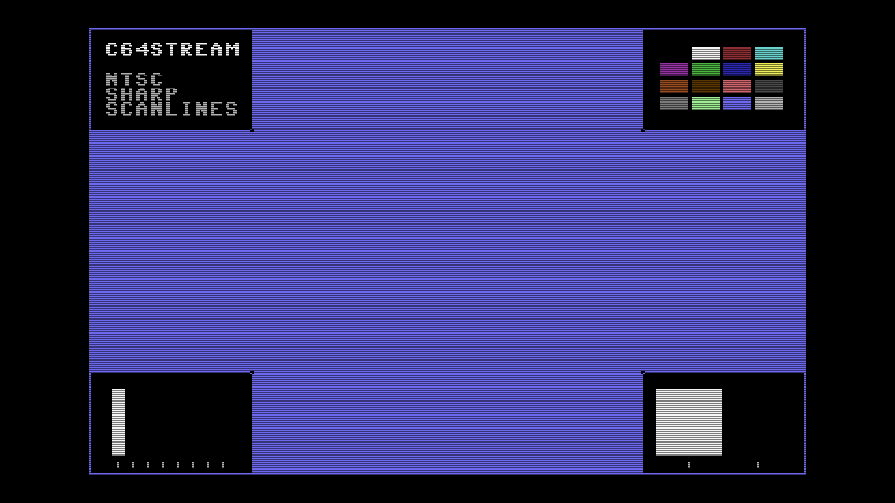

# C64 Stream E2E Test Report

## Scenario: NTSC Sharp Scanlines

- Generated: 2026-01-23 12:54:08 UTC
- Git Branch: doc/improvements
- Git ID: bd15461
- Environment: local

## Test configuration

- Format: NTSC
- Frames: 480
- Duration: 8.0 seconds
- Video Port: 21000
- Audio Port: 21001
- OBS Enabled: true

## Build information

- Project: c64stream
- Version: 1.0.3

## System information

- OS: Ubuntu 24.04.3 LTS (kernel 6.14.0-37-generic)
- OBS: 32.0.2
- CPU: Intel(R) Core(TM) i7-6700K CPU @ 4.00GHz (8 cores)
- RAM: 31Gi total, 26Gi available
- Disk (/): 1.8T total, 962G available

## Test results

### Validation Summary

- ✅ UDP Packet Reception: Expected 30803, Received 30746, Missing 57 (0.19%)
- ✅ Network Timing: span=8007.9ms, video_mean=389.4us, audio_mean=4005.1us
- ✅ Frame Processing: 478 frames processed
- ✅ Video Recording: 10.7 MB
- ✅ Content Integrity: Verified

### Resource Usage

During the test's processing window (18.3s, 35 samples) (8 cores):

| Metric | Min | Median | Mean | Max |
|--------|-----|--------|------|-----|
| CPU | 68.1% | 70.8% | 71.36% | 85.1% |
| RAM | 4697.09 MB | 4840 MB | 4819.28 MB | 4879.84 MB |
| GPU | 0% | 0% | 5.83% | 40% |

Details: [resource.csv](resource.csv) | [resource.json](resource.json)

### Packet & Network Data

- ✅ Packet Generation: 28800 video, 2003 audio packets
- ✅ UDP Replay: Completed successfully
- Events: [network.csv](network.csv), [obs.csv](obs.csv), [playback.csv](playback.csv)

#### Network Quality (Measured)

- Packet span (first→last): 8007.892 ms
- Total packets analyzed: 22565

| Stream | Packets | Spacing (min) | Spacing (mean) | Spacing (max) | CV | Burst <0.5×P50 | Gaps >2×P50 | P99/P50 |
|--------|---------|---------------|----------------|---------------|----|--------------|------------|--------|
| All | 22565 | 0.001 ms | 0.710 ms | 8.143 ms | 167.16% | 15.65% | 19.96% | 18.635 |
| Video | 20566 | 0.001 ms | 0.389 ms | 5.777 ms | 135.80% | 17.14% | 12.27% | 10.679 |
| Audio | 1999 | 0.002 ms | 4.005 ms | 8.143 ms | 26.13% | 2.75% | 0.10% | 1.777 |

| Stream | Packets | Jitter (median) | Jitter (max) | Out-of-Order |
|--------|---------|-----------------|--------------|--------------|
| Video | 20566 | 0.032 ms | 5.497 ms | 1 (0.0%) |
| Audio | 1999 | 0.390 ms | 4.146 ms | 0 |

Details: [network.json](network.json)

### A/V Sync

- ✅ Good synchronization (100.0%): avg offset 11.1ms, max 12.5ms

#### Sync Details

- 🟢 Pop #1 [L]: audio=9873.0ms, video=9861.9ms (frame 590), diff=11.1ms
- 🟢 Pop #2 [R]: audio=10675.0ms, video=10664.3ms (frame 638), diff=10.7ms
- 🟢 Pop #3 [L]: audio=11479.0ms, video=11466.6ms (frame 686), diff=12.4ms
- 🟢 Pop #4 [R]: audio=12279.0ms, video=12268.9ms (frame 734), diff=10.1ms
- 🟢 Pop #5 [L]: audio=13081.0ms, video=13071.2ms (frame 782), diff=9.8ms
- 🟢 Pop #6 [R]: audio=13886.0ms, video=13873.6ms (frame 830), diff=12.4ms
- 🟢 Pop #7 [L]: audio=14687.0ms, video=14675.9ms (frame 878), diff=11.1ms
- 🟢 Pop #8 [R]: audio=15488.0ms, video=15478.2ms (frame 926), diff=9.8ms
- 🟢 Pop #9 [L]: audio=16293.0ms, video=16280.5ms (frame 974), diff=12.5ms

- Channels: LRLRLRLRL
- 🔁 Channel alternation: OK (alternating, starts with L)

### Frame Progression

- 🟢 Frame sequence verified (478 frames analyzed, 0 colors)

- Settling: 4.0s (pass/fail uses post-settling only)

| Window | Stuck runs (count/min/med/max) | Skips (count/min/med/max) | Back steps | Severe steps |
|--------|------------------------------:|--------------------------:|-----------:|-------------:|
| During settling | 7/2/7/397 | 4/1/2/5 | 3 | 0 |
| After settling | 0/0/0/0 | 0/0/0/0 | 0 | 0 |

See [playback.csv](playback.csv) for frame-by-frame playback timeline with anomaly markers.

#### Playback Jitter Clusters (post-settling)

- No post-settling repeated/skipped markers detected in playback timeline.

### Video

- Download: [c64_recording.mp4](c64_recording.mp4) (Available from local runs or CI build artifacts.)
- Duration: 21.5 s

### Sample Frame

- **Top-left**: Text box with scenario name
- **Top-right**: VIC-II palette reference grid of all C64 colors
- **Center**: Diagonal pattern cycling through all C64 colors
- **Bottom-left**: Frame progression indicator (8-slot moving bar, cycles every 8 frames)
- **Bottom-right**: A/V pop indicator (pops every 48 frames, split left/right for audio channels)
- Taken from frame 590 at 00:09.9 of the 21.5 s video above.
