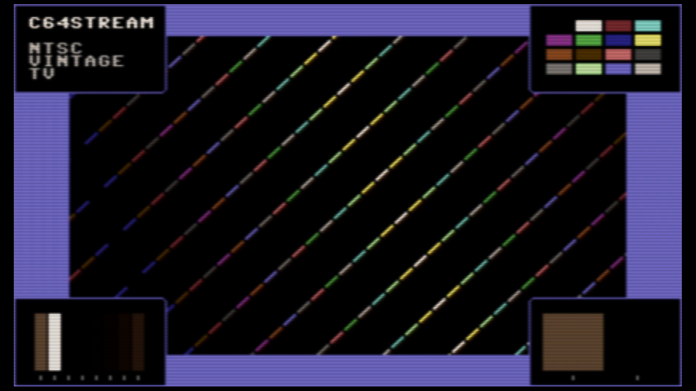

# C64 Stream E2E Test Report

## Scenario: NTSC Vintage TV

Generated: 2025-12-30 17:35:40 UTC

## Test configuration

- Format: NTSC
- Frames: 300
- Duration: 5.0 seconds
- Video Port: 21000
- Audio Port: 21001
- OBS Enabled: true

## Build information

- Project: c64stream
- Version: 1.0.0

## System information

- OS: Ubuntu 24.04.3 LTS (kernel 6.14.0-37-generic)
- OBS: 32.0.2
- CPU: Intel(R) Core(TM) i7-6700K CPU @ 4.00GHz (8 cores)
- RAM: 31Gi total, 25Gi available
- Disk (/): 1.8T total, 1.1T available

## Test results

### Resource Usage

During the test's processing window (4.6s, 10 of 27 samples) (8 cores):

| Metric | Min | Median | Mean | Max |
|--------|-----|--------|------|-----|
| CPU | 94.4% | 95.1% | 95.09% | 95.7% |
| RAM | 4978.43 MB | 5006.26 MB | 5005.47 MB | 5034.23 MB |
| GPU | 23.79% | 24.63% | 31.45% | 89.83% |

Details: [resource.csv](resource.csv) | [resource.json](resource.json)

### Packet & Network Data

- ✅ Packet Generation: 18000 video, 1252 audio packets
- ✅ UDP Replay: Completed successfully
- Events: [network.csv](network.csv), [obs.csv](obs.csv), [playback.csv](playback.csv)

### A/V Sync

- ✅ Good synchronization (100.0%): avg offset 16.8ms, max 36.8ms

#### Sync Details

- 🟢 Pop #1 [L]: audio=2630.0ms, video=2624.3ms (frame 157), diff=5.7ms
- 🟡 Pop #2 [R]: audio=3430.0ms, video=3393.2ms (frame 203), diff=36.8ms
- 🟢 Pop #3 [L]: audio=4230.0ms, video=4212.2ms (frame 252), diff=17.8ms
- 🟢 Pop #4 [R]: audio=5036.0ms, video=5014.5ms (frame 300), diff=21.5ms
- 🟢 Pop #5 [L]: audio=5836.0ms, video=5833.6ms (frame 349), diff=2.4ms

- Channels: LRLRL
- 🔁 Channel alternation: OK (alternating, starts with L)

### Frame Progression

- 🟡 Frame sequence OK with jitter (skips=95, back_steps=0) (post-settling)

- Settling: 4.0s (pass/fail uses post-settling only)

| Window | Stuck runs (count/min/med/max) | Skips (count/min/med/max) | Back steps | Severe steps |
|--------|------------------------------:|--------------------------:|-----------:|-------------:|
| During settling | 57/2/2/125 | 48/1/1/2 | 0 | 0 |
| After settling | 88/2/2/3 | 84/1/1/3 | 0 | 0 |

See [playback.csv](playback.csv) for frame-by-frame playback timeline with anomaly markers.

#### Playback Jitter Clusters (post-settling)

- Definition: rows with repeated=1 or skipped=1 in playback.csv; clustering uses max gap 0.5s
- Note: this is independent from the Frame Progression (frame-box) check above
- Note: repeated/skipped markers only exist while content is detected (video_s 0.134–7.188).
  The jitter-free tail after content ends is expected and does not indicate steady-state performance.

| # | Events | Center (s) | Std dev (s) | Span (s) | Window (s) |
|---|--------|------------|-------------|----------|------------|
| 1 | 106 | 5.595 | 0.922 | 3.176 | 4.012–7.188 |

### Video

- Download: [c64_recording.mp4](c64_recording.mp4) (Available from local runs or CI build artifacts.)
- Duration: 10.7 s

### Sample Frame

- **Top-left**: Text box with scenario name
- **Top-right**: VIC-II palette reference grid of all C64 colors
- **Center**: Diagonal pattern cycling through all C64 colors
- **Bottom-left**: Frame progression indicator (8-slot moving bar, cycles every 8 frames)
- **Bottom-right**: A/V pop indicator (pops every 48 frames, split left/right for audio channels)
- Taken from frame 157 at 00:02.6 of the 10.7 s video above.
