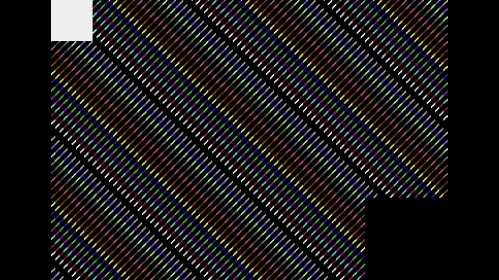

# C64 Stream E2E Test Report

Generated: 2025-10-18 12:16:04 UTC

## Test configuration

- Format: PAL
- Frames: 250
- Duration: 5.0 seconds
- Video Port: 11000
- Audio Port: 11001
- OBS Enabled: true

## Build information

- Project: c64stream
- Version: 0.8.0

## Test results
- ✅ Packet Generation: 17000 video, 1246 audio packets
- ✅ UDP Replay: Completed successfully

### Recording

- Download: [c64_recording.mp4](c64_recording.mp4)

### Data

- Network CSV: [network.csv](network.csv)
- OBS CSV: [obs.csv](obs.csv)

### Pop synchronization

- ✅ Good synchronization (100.0%): avg offset 6.7ms, max 10.0ms
- ⬜ Detected video pop(s): [7460.0, 8460.0, 9460.0] ms

#### Per-pop synchronization

- 🟢 Pop #1 [L]: audio=7450.0ms, video=7460.0ms, diff=10.0ms
- 🟢 Pop #2 [R]: audio=8450.0ms, video=8460.0ms, diff=10.0ms
- 🟢 Pop #3 [L]: audio=9460.0ms, video=9460.0ms, diff=0.0ms

- Channels: LRL
- 🔁 Channel alternation: OK (alternating, starts with L)

### Sample POP frame

*Figure: First detected video POP frame.*
