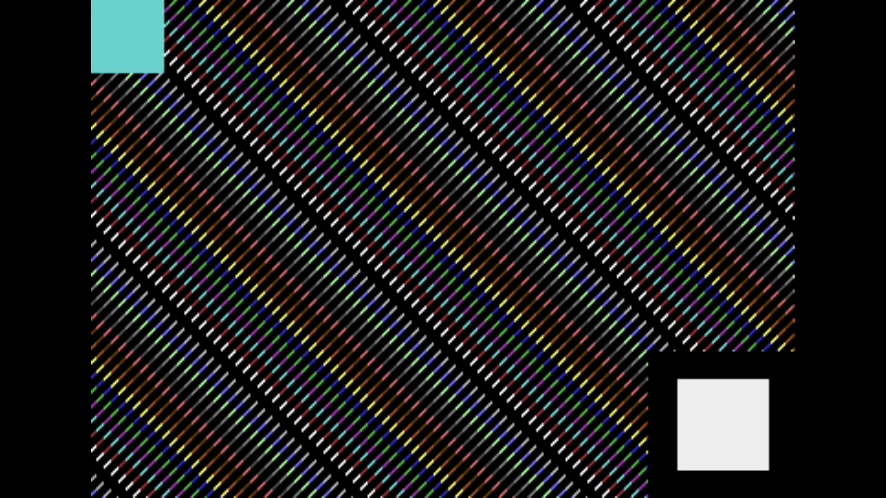

# C64 Stream E2E Test Report

Generated: 2025-10-18 16:53:03 UTC

## Test configuration

- Format: PAL
- Frames: 250
- Duration: 5.0 seconds
- Video Port: 11000
- Audio Port: 11001
- OBS Enabled: true

## Build information

- Project: c64stream
- Version: 0.8.0

## Test results

Overview:
- ✅ Packet Generation: 17000 video, 1246 audio packets
- ✅ UDP Replay: Completed successfully
- Events: [network.csv](network.csv), [obs.csv](obs.csv)

### A/V Sync

- ✅ Good synchronization (100.0%): avg offset 0.0ms, max 0.0ms

#### Sync Details

- 🟢 Pop #1 [L]: audio=7520.0ms, video=7520.0ms (frame 376), diff=0.0ms
- 🟢 Pop #2 [R]: audio=8520.0ms, video=8520.0ms (frame 426), diff=0.0ms
- 🟢 Pop #3 [L]: audio=9520.0ms, video=9520.0ms (frame 476), diff=0.0ms

- Channels: LRL
- 🔁 Channel alternation: OK (alternating, starts with L)

### Sample Frame

Top-left shows frame progression. Center shows slow C64 colour bars for smooth playback and colour rendering checks. Bottom-right flashes with the pop sound for A/V sync.
Taken from frame 376 at 00:07.5 of the video above.
