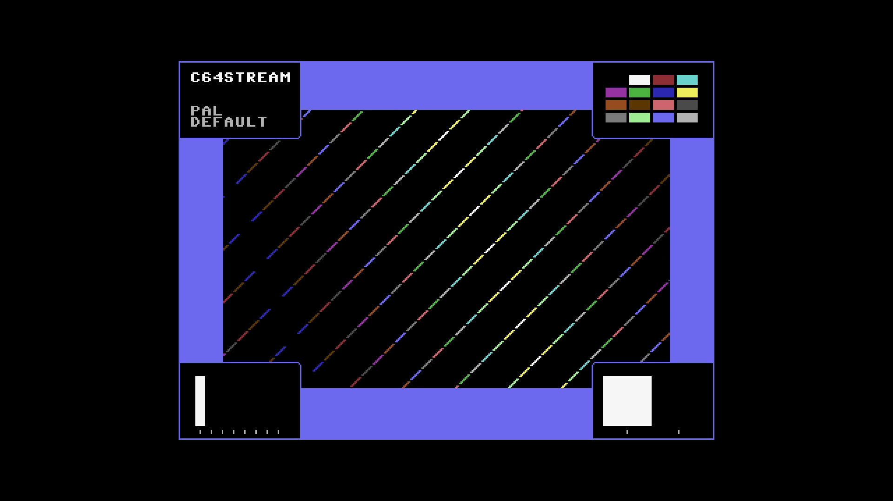

# C64 Stream E2E Test Report

## Scenario: PAL Default

- Generated: 2026-01-22 23:16:56 UTC
- Git Branch: cursor/c64-stream-effects-filter-4ac5
- Git ID: 912712e
- Environment: local

## Test configuration

- Format: PAL
- Frames: 400
- Duration: 8.0 seconds
- Video Port: 21000
- Audio Port: 21001
- OBS Enabled: true

## Build information

- Project: c64stream
- Version: 1.0.3

## System information

- OS: Ubuntu 24.04.3 LTS (kernel 6.14.0-37-generic)
- OBS: 32.0.2
- CPU: Intel(R) Core(TM) i7-6700K CPU @ 4.00GHz (8 cores)
- RAM: 31Gi total, 20Gi available
- Disk (/): 1.8T total, 964G available

## Test results

### Validation Summary

- ✅ UDP Packet Reception: Expected 29194, Received 29145, Missing 49 (0.17%)
- ✅ Network Timing: span=7966.0ms, video_mean=365.4us, audio_mean=4001.9us
- ✅ Frame Processing: 400 frames processed
- ✅ Video Recording: 10.4 MB
- ✅ Content Integrity: Verified

### Resource Usage

During the test's processing window (17.9s, 34 samples) (8 cores):

| Metric | Min | Median | Mean | Max |
|--------|-----|--------|------|-----|
| CPU | 59.7% | 68.65% | 69.85% | 97.9% |
| RAM | 10150.81 MB | 10318.26 MB | 10309.3 MB | 10367.33 MB |
| GPU | 0% | 28% | 27.21% | 53% |

Details: [resource.csv](resource.csv) | [resource.json](resource.json)

### Packet & Network Data

- ✅ Packet Generation: 27200 video, 1994 audio packets
- ✅ UDP Replay: Completed successfully
- Events: [network.csv](network.csv), [obs.csv](obs.csv), [playback.csv](playback.csv)

#### Network Quality (Measured)

- Packet span (first→last): 7965.996 ms
- Total packets analyzed: 23791

| Stream | Packets | Spacing (min) | Spacing (mean) | Spacing (max) | CV | Burst <0.5×P50 | Gaps >2×P50 | P99/P50 |
|--------|---------|---------------|----------------|---------------|----|--------------|------------|--------|
| All | 23791 | 0.001 ms | 0.670 ms | 14.999 ms | 167.94% | 13.53% | 17.06% | 16.606 |
| Video | 21801 | 0.001 ms | 0.365 ms | 9.061 ms | 118.55% | 14.69% | 9.63% | 7.966 |
| Audio | 1990 | 0.001 ms | 4.002 ms | 14.999 ms | 24.26% | 2.71% | 0.50% | 1.653 |

| Stream | Packets | Jitter (median) | Jitter (max) | Out-of-Order |
|--------|---------|-----------------|--------------|--------------|
| Video | 21801 | 0.034 ms | 8.771 ms | 0 |
| Audio | 1990 | 0.183 ms | 10.999 ms | 0 |

Details: [network.json](network.json)

### A/V Sync

- ✅ Good synchronization (100.0%): avg offset 13.8ms, max 16.3ms

#### Sync Details

- 🟢 Pop #1 [L]: audio=9969.0ms, video=9955.1ms (frame 499), diff=13.9ms
- 🟢 Pop #2 [R]: audio=10926.0ms, video=10912.7ms (frame 547), diff=13.3ms
- 🟢 Pop #3 [L]: audio=11882.0ms, video=11870.3ms (frame 595), diff=11.7ms
- 🟢 Pop #4 [R]: audio=12842.0ms, video=12827.9ms (frame 643), diff=14.1ms
- 🟢 Pop #5 [L]: audio=13800.0ms, video=13785.5ms (frame 691), diff=14.5ms
- 🟢 Pop #6 [R]: audio=14756.0ms, video=14743.1ms (frame 739), diff=12.9ms
- 🟢 Pop #7 [L]: audio=15717.0ms, video=15700.7ms (frame 787), diff=16.3ms

- Channels: LRLRLRL
- 🔁 Channel alternation: OK (alternating, starts with L)

### Frame Progression

- 🟢 Frame sequence verified (400 frames analyzed, 0 colors)

- Settling: 4.0s (pass/fail uses post-settling only)

| Window | Stuck runs (count/min/med/max) | Skips (count/min/med/max) | Back steps | Severe steps |
|--------|------------------------------:|--------------------------:|-----------:|-------------:|
| During settling | 10/2/2/2 | 10/1/1/1 | 0 | 0 |
| After settling | 0/0/0/0 | 0/0/0/0 | 0 | 0 |

See [playback.csv](playback.csv) for frame-by-frame playback timeline with anomaly markers.

#### Playback Jitter Clusters (post-settling)

- Definition: rows with repeated=1 or skipped=1 in playback.csv; clustering uses max gap 0.5s
- Note: this is independent from the Frame Progression (frame-box) check above
- Note: repeated/skipped markers only exist while content is detected (video_s 9.520–20.500).
  The jitter-free tail after content ends is expected and does not indicate steady-state performance.

| # | Events | Center (s) | Std dev (s) | Span (s) | Window (s) |
|---|--------|------------|-------------|----------|------------|
| 1 | 15 | 10.649 | 0.165 | 0.520 | 10.400–10.920 |

### Video

- Download: [c64_recording.mp4](c64_recording.mp4) (Available from local runs or CI build artifacts.)
- Duration: 21.0 s

### Sample Frame

- **Top-left**: Text box with scenario name
- **Top-right**: VIC-II palette reference grid of all C64 colors
- **Center**: Diagonal pattern cycling through all C64 colors
- **Bottom-left**: Frame progression indicator (8-slot moving bar, cycles every 8 frames)
- **Bottom-right**: A/V pop indicator (pops every 48 frames, split left/right for audio channels)
- Taken from frame 499 at 00:10.0 of the 21.0 s video above.
